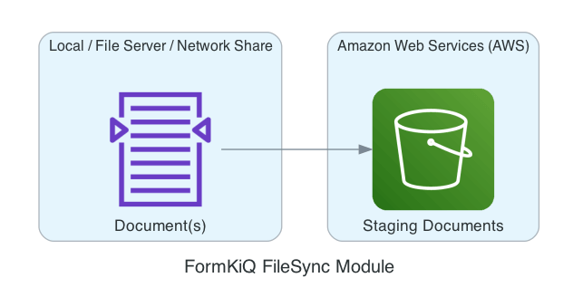
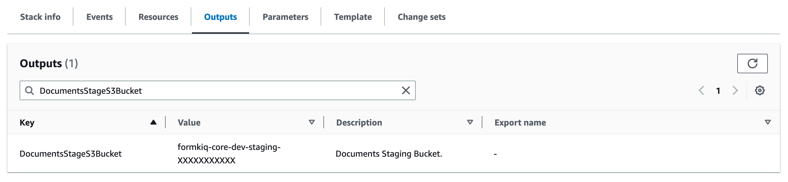
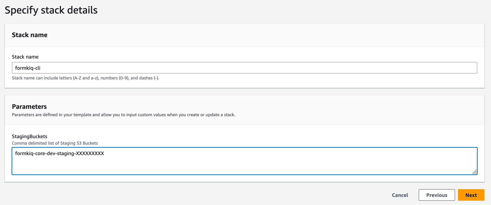
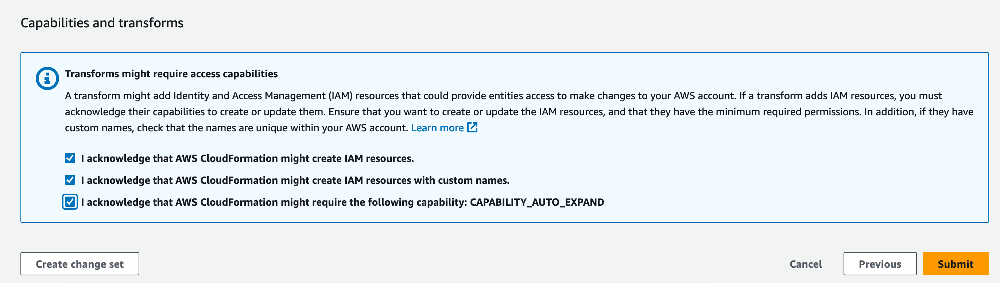

# FileSync CLI



FileSync CLI is a FormKiQ Enterprise Add-On Module (for the FormKiQ Core Headless Document Management System) that enables syncing of documents from a local file system to FormKiQ installation.

## Installation

The following are the steps for installing the FormKiQ FileSync CLI.

### Prerequisite

Before you begin the installation you need to:

* https://console.aws.amazon.com/cloudformation[Visit CloudFormation in your AWS console]
* Click on the FormKiQ installation you would like to sync documents to; make a note of the name of the DocumentsStageS3Bucket from the Stack's Outputs, as you will need this information during the FileSync's CloudFormation installation.



:::note
The FileSync CLI can support multiple FormKiQ installations, so you can repeat the above process for each installation.
:::

### CloudFormation Installation

Before you can use the FileSync CLI, you need to install the FileSync CLI's [CloudFormation](https://aws.amazon.com/cloudformation) script. This script will provide access for the FileSync CLI to your FormKiQ installation.

The FileSync CLI CloudFormation script will be found on your FormKiQ's GitHub page, as shown below.

| AWS Description    | Install Link |
| -------- | ------- |
| FormKiQ FileSync CLI | Install FormKiQ FileSync CLI

Clicking on the `Install FormKiQ FileSync CLI` link (from your FormKiQ's GitHub page), will bring you to your AWS CloudFormation console.


Click `Next` and enter the parameter for the CloudFormation stack.

Enter the:

* Stack Name
* A comma delimited list of FormKiQ Staging S3 buckets, created from the previous step.



Continue clicking `Next` through the next screens until you can click `Submit` to create the CloudFormation stack.



After installation, open the `Outputs` tab of the CloudFormation Stack and make note of `AccessKey`` and `SecretKey``. You will need these keys when configuring the FileSync CLI.


### FileSync CLI Download

The FileSync CLI can be found on its [GitHub Releases](https://github.com/formkiq/formkiq-module-filesync-cli/releases) page. 

It is available for:

* Windows
* Linux
* Mac

## Usage

```
usage: fk
    --configure   configure AWS credentials
    --show        show sync profiles
    --sync        sync files with FormKiQ
    --watch       watch directories (one or more) for file changes and syncs with
                  FormKiQ
```

### Configure

To use the FileSync CLI, you will need to first use the "--configure" option to connect the CLI to your FormKiQ installation.

To configure, you will need:

* Access Key / Secret Key from the `Outputs` tab of the FileSync CLI CloudFormation stack
* The name of the DocumentsStageS3Bucket from the `Outputs` tab of your FormKiQ CloudFormation installation stack
* The AWS Region of your FormKiQ installation (e.g. us-east-1, us-east-2, etc)

Run configure:

```
fk --configure --access-key ACCESS_KEY --secret-key ACCESS_SECRET --region AWS_REGION --s3-staging-bucket S3_STAGING_BUCKET
```

Optionally you can specify a `--profile` name if you are syncing with multiple FormKiQ installations

```
fk --configure --access-key ACCESS_KEY --secret-key ACCESS_SECRET --region AWS_REGION --s3-staging-bucket S3_STAGING_BUCKET --profile dev
```

To list the FormKiQ installations that are configured:

```
fk --show
```

### Sync

The "--sync" option can be used to sync a directory with a FormKiQ installation.

```
usage: fk --sync
    --actions <arg>    Actions to perform on file (OCR / FULLTEXT)
 -d,--dir <arg>        transfer directories without recursing (required)
    --dry-run          show what would have been transferred
    --include <arg>    include files matching PATTERN
    --max-file-queue   maximum number of files to queue (default: 500)
    --mtime <arg>      file modification time subtracted from the initialization time (IE: --mtime -5 find files modified last 5 minutes to sync)
 -p,--profile <arg>    FormKiQ Profile to use
    --pre-hook <arg>   webhook url to call before sending file
 -r,--recursive        recurse into directories
 -s,--siteId <arg>     FormKiQ Site Id
 -v,--verbose          increase verbosity
```

### Watch

The "--watch" option can be used to watch a directory for changes and sync those changes with a FormKiQ installation.

```
usage: fk --watch
    --actions <arg>     Actions to perform on file (OCR / FULLTEXT)
 -d,--dir <arg>         transfer directories without recursing (required)
    --dry-run           show what would have been transferred
    --include <arg>     include files matching PATTERN
    --max-file-queue    maximum number of files to queue (default: 500)
 -p,--profile <arg>     FormKiQ Profile to use
 -r,--recursive         recurse into directories
    --siteId <arg>      FormKiQ Site Id
    --syncDelay <arg>   Number of minutes to wait between file creation/modified before syncing (used with --watch)
 -v,--verbose           increase verbosity
```

### Examples

The following are example commands of fk usage.

#### Basic Directory Syncing

```
fk --sync -d /documents --verbose
```

#### Amazon S3 Directory Syncing

```
fk --sync -d s3://myBucket/documents --verbose
```

#### Sync files modified in the last 24 hours

```
fk --sync -d /documents --verbose --mtime 0
```

#### Sync files modified more than 7 days ago

```
fk --sync -d /documents --verbose --mtime 7
```

#### Sync files modified in the last 30 days

```
fk --sync -d /documents --verbose --mtime -30
```

#### Sync the /documents directory and performs the OCR & Fulltext & WebHook actions to all documents

The "--actions" parameter follows the same format as the AddDocumentAction: https://docs.formkiq.com/docs/latest/api/index.html#tag/Document-Actions/operation/AddDocumentActions

```
fk --sync --actions [{"type": "OCR","parameters":{"ocrParseTypes": "TABLES"}},{"type": "FULLTEXT"},{"type": "WEBHOOK","parameters":{"url": "https://pipedream.com/12345"}}] -d /documents --verbose
```

#### Basic Directory Watching

```
fk --watch -d /documents --verbose
```

### Pre-Hook

The `--pre-hook` parameter is useful for situations where you need to add document specific tag(s)/metadata based on a file's path. During the file sync, a POST request is sent to the `--pre-hook` URL with the following payload:

```
{
    "path" : "<filename>",
    "config" : {
        "directory" : "<directory>"
        "actions" : "<actions>",
        "siteId" : "<siteId>",
        "stagebucket" : "<stagingbucket>"
    }
}
```

The expected response is a status of 200 and a response body that follows the <a href="/docs/platform/document_storage#fkb64-file-format">FKB64 File Format</a>.

The following example response will add two tags and a metadata key.

```
{
  "tags": [
    {
      "key": "category",
      "value": "document"
    },
    {
      "key": "user",
      "values": ["1", "2"]
    }
  ],
  "metadata": [
    {
      "key": "property1",
      "value": "value1"
    }
  ]
}
```

