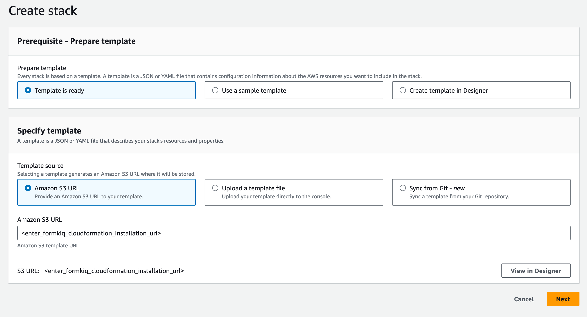
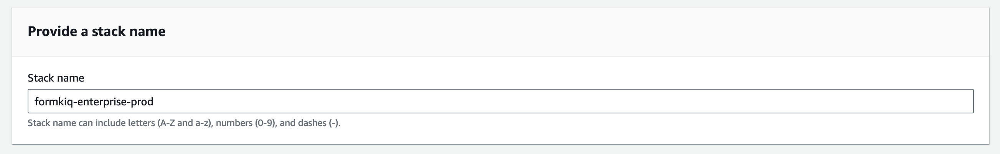
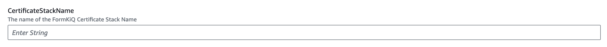

# FormKiQ Pro/Enterprise

**A guide for deploying FormKiQ Pro/Enterprise into your AWS account.**

## Prerequisites

Before installing FormKiQ Pro/Enterprise make you to review the [FormKiQ prerequisites](/docs/getting-started/quick-start#prerequisites).

## Installation

The FormKiQ installation process uses [AWS CloudFormation](https://docs.aws.amazon.com/cloudformation). AWS CloudFormation is a service that automates the process of creating and managing cloud resources. It allows you to easily install and update FormKiQ using a single url.

To install FormKiQ, select the AWS region you want to deploy FormKiQ into below:

| AWS Region    | Install Link |
| -------- | ------- |
| us-east-1 | https://console.aws.amazon.com/cloudformation/home?region=us-east-1#/stacks/new|
| us-east-2 | https://console.aws.amazon.com/cloudformation/home?region=us-east-2#/stacks/new|
| us-west-2 | https://console.aws.amazon.com/cloudformation/home?region=us-west-2#/stacks/new|
| ca-central-1 | https://console.aws.amazon.com/cloudformation/home?region=ca-central-1#/stacks/new|
| eu-central-1 | https://console.aws.amazon.com/cloudformation/home?region=eu-central-1#/stacks/new|
| ap-south-1 | https://console.aws.amazon.com/cloudformation/home?region=ap-south-1#/stacks/new|
| ap-southeast-2 | https://console.aws.amazon.com/cloudformation/home?region=ap-southeast-2#/stacks/new|
| ap-northeast-2 | https://console.aws.amazon.com/cloudformation/home?region=ap-northeast-2#/stacks/new|
| sa-east-1 | https://console.aws.amazon.com/cloudformation/home?region=sa-east-1#/stacks/new|

## CloudFormation

Clicking the installation link will bring you to the AWS Console Login if you are not already logged in. Once you are logged in, you will be taken to the `CloudFormation Create Stack` page. 

### Create Stack

On the `Create stack` page, enter the FormKiQ installation S3 Url provided to you, or can be found on your Enterprise Github page.

Clicking the `Next` button will take you to the stack details page. On this page we can configure FormKiQ.

### Stack Name

The first thing you will need to set is the CloudFormation Stack Name. The Stack name can include letters (A-Z and a-z), numbers (0-9), and dashes (-). We recommended to use the naming convention `formkiq-enterprise-<app_environment>`, ie: formkiq-enterprise-prod, formkiq-enterprise-dev, etc. The <app_environment> allows you to differentiate between multiple installations of FormKiQ. This will give context to each FormKiQ installation and prevent accidentally deleting the wrong FormKiQ installation stack.

:::note
For production installations, we recommend using [AWS Organizations](https://aws.amazon.com/organizations) to create a separate account to run your production version of FormKiQ. AWS makes it easy to switch between accounts within an organization, and best practice is to keep your production environment in a separate account from any non-production resources. This not only helps with security, but also to help organize your costs. Ideally, you would have a new AWS account within your AWS organization for each environment (e.g., dev, test/qa, staging/pre-prod, and production).
:::

### Core Parameters

Most installation parameters are the same between Core, Pro, and Enterprise. A description of the similar parameters can be found [here](/docs/getting-started/quick-start#set-admin-email).

### Pro/Enterprise Parameters

The following are Pro/Enterprise specific parameters.

#### OpenSearchStackName

After the Amazon OpenSearch Service is deployed following the [FormKiQ OpenSearch Installation guide](/pro-and-enterprise/installation/opensearch), the name of the CloudFormation stack deployed can be enter here, to connect the OpenSearch installation with the FormKiQ installation.

#### CertificateStackName

After the deploying the FormKiQ Certificate stack, the name of the CloudFormation stack deployed can be enter here, to connect the SSL certificates with the FormKiQ installation.

### Complete Installation

Keep selecting Next until you get to the last Submit Create Stack page. Once you've checked the checkboxes, you can click Submit to being the stack creation.

