# OpenSearch

**A guide for deploying [Amazon OpenSearch Service](https://aws.amazon.com/opensearch-service/) into your AWS account.**

## Prerequisites

Before you can install the OpenSearch module, you need to have installed FormKiQ Pro/Enterprise and the VPC. The installation links can be found below:

* [FormKiQ Pro/Enterprise](/docs/pro-and-enterprise/installation/formkiq)
* [VPC](/docs/getting-started/quick-start#create-vpc)

## CloudFormation

The FormKiQ installation process uses [AWS CloudFormation](https://docs.aws.amazon.com/cloudformation). AWS CloudFormation is a service that automates the process of creating and managing cloud resources. It allows you to easily install and update FormKiQ using a single url.

To install OpenSearch, select the same AWS region that FormKiQ is installed into:

| AWS Region    | Install Link |
| -------- | ------- |
| us-east-1 | https://console.aws.amazon.com/cloudformation/home?region=us-east-1#/stacks/new|
| us-east-2 | https://console.aws.amazon.com/cloudformation/home?region=us-east-2#/stacks/new|
| us-west-2 | https://console.aws.amazon.com/cloudformation/home?region=us-west-2#/stacks/new|
| ca-central-1 | https://console.aws.amazon.com/cloudformation/home?region=ca-central-1#/stacks/new|
| eu-central-1 | https://console.aws.amazon.com/cloudformation/home?region=eu-central-1#/stacks/new|
| ap-south-1 | https://console.aws.amazon.com/cloudformation/home?region=ap-south-1#/stacks/new|
| ap-southeast-2 | https://console.aws.amazon.com/cloudformation/home?region=ap-southeast-2#/stacks/new|
| ap-northeast-2 | https://console.aws.amazon.com/cloudformation/home?region=ap-northeast-2#/stacks/new|
| sa-east-1 | https://console.aws.amazon.com/cloudformation/home?region=sa-east-1#/stacks/new|

## Installation

Clicking the installation link will bring you to the AWS Console Login if you are not already logged in. Once you are logged in, you will be taken to the `CloudFormation Create Stack` page. 

### Create Stack

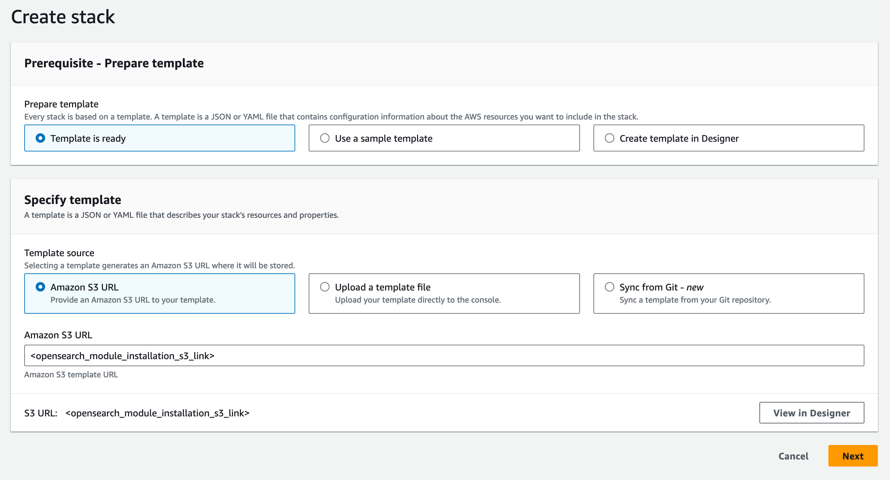

On the `Create stack` page, enter the OpenSearch module installation S3 Url provided to you, or can be found on your Enterprise Github page.

Clicking the `Next` button will take you to the stack details page. On this page we can configure OpenSearch.

### Stack Name

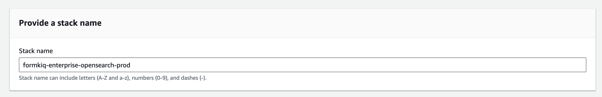

The first thing you will need to set is the CloudFormation Stack Name. The Stack name can include letters (A-Z and a-z), numbers (0-9), and dashes (-). We recommended to use the naming convention `fformkiq-enterprise-opensearch-<app_environment>`, ie: formkiq-enterprise-opensearch-prod-prod, formkiq-enterprise-opensearch-dev, etc. The <app_environment> should match the <app_environment> name used during the FormKiQ installation.

### Parameters

The following are descriptions of the CloudFormation paramaters.

#### AppEnvironment

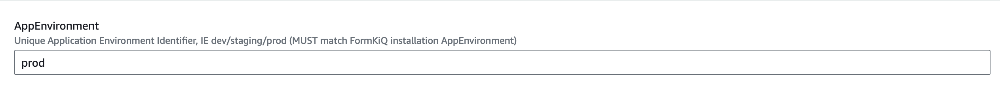

The AppEnvironment is a unique Application Environment Identifier, IE dev/staging/prod

:::note
It MUST match the AppEnvironment set during the  FormKiQ installation
:::

#### DataInstanceCount

The number of data nodes (instances) to use in the OpenSearch Service domain.

For a development instance, a value of "1" is suggested.

#### DataInstanceType

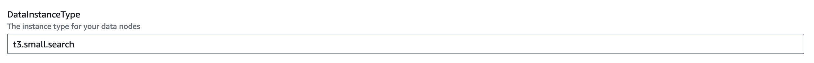

The instance type for your data nodes, such as m3.medium.search. For valid values, see Supported instance types in Amazon OpenSearch Service .

For a development instance, a value of "t3.small.search" is suggested.

Allowed values: m3.medium.search | m3.large.search | m3.xlarge.search | m3.2xlarge.search | m4.large.search | m4.xlarge.search | m4.2xlarge.search | m4.4xlarge.search | m4.10xlarge.search | m5.large.search | m5.xlarge.search | m5.2xlarge.search | m5.4xlarge.search | m5.12xlarge.search | m5.24xlarge.search | r5.large.search | r5.xlarge.search | r5.2xlarge.search | r5.4xlarge.search | r5.12xlarge.search | r5.24xlarge.search | c5.large.search | c5.xlarge.search | c5.2xlarge.search | c5.4xlarge.search | c5.9xlarge.search | c5.18xlarge.search | t3.nano.search | t3.micro.search | t3.small.search | t3.medium.search | t3.large.search | t3.xlarge.search | t3.2xlarge.search | ultrawarm1.medium.search | ultrawarm1.large.search | ultrawarm1.xlarge.search | t2.micro.search | t2.small.search | t2.medium.search | r3.large.search | r3.xlarge.search | r3.2xlarge.search | r3.4xlarge.search | r3.8xlarge.search | i2.xlarge.search | i2.2xlarge.search | d2.xlarge.search | d2.2xlarge.search | d2.4xlarge.search | d2.8xlarge.search | c4.large.search | c4.xlarge.search | c4.2xlarge.search | c4.4xlarge.search | c4.8xlarge.search | r4.large.search | r4.xlarge.search | r4.2xlarge.search | r4.4xlarge.search | r4.8xlarge.search | r4.16xlarge.search | i3.large.search | i3.xlarge.search | i3.2xlarge.search | i3.4xlarge.search | i3.8xlarge.search | i3.16xlarge.search | r6g.large.search | r6g.xlarge.search | r6g.2xlarge.search | r6g.4xlarge.search | r6g.8xlarge.search | r6g.12xlarge.search | m6g.large.search | m6g.xlarge.search | m6g.2xlarge.search | m6g.4xlarge.search | m6g.8xlarge.search | m6g.12xlarge.search | c6g.large.search | c6g.xlarge.search | c6g.2xlarge.search | c6g.4xlarge.search | c6g.8xlarge.search | c6g.12xlarge.search | r6gd.large.search | r6gd.xlarge.search | r6gd.2xlarge.search | r6gd.4xlarge.search | r6gd.8xlarge.search | r6gd.12xlarge.search | r6gd.16xlarge.search | t4g.small.search | t4g.medium.search

#### DataNodeVolumeSize

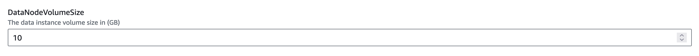

The size (in GiB) of the EBS volume for each data node. The minimum and maximum size of an EBS volume depends on the EBS volume type and the instance type to which it is attached.

For a development instance, a value of "10" GB is suggested.

#### DedicatedMasterCount

The number of instances to use for the master node.

For a development instance, a value of "0" is suggested because a Master Node is not required for development.

#### DedicatedMasterEnabled

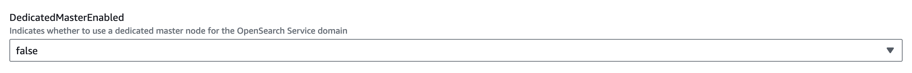

Indicates whether to use a dedicated master node for the OpenSearch Service domain. A dedicated master node is a cluster node that performs cluster management tasks, but doesn't hold data or respond to data upload requests. Dedicated master nodes offload cluster management tasks to increase the stability of your search clusters. See Dedicated master nodes in Amazon OpenSearch Service.

For a development instance, a value of "false" is suggested because a Master Node is not required for development.

#### DedicatedMasterType

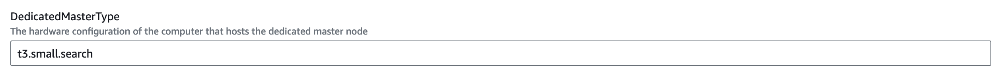

The hardware configuration of the computer that hosts the dedicated master node, such as m3.medium.search. If you specify this property, you must specify true for the DedicatedMasterEnabled property. For valid values, see Supported instance types in Amazon OpenSearch Service.

For a development instance, a value of "t3.small.search" is suggested. NOTE: This value will not be used if DedicatedMasterEnabled is "false", but is requried.

Allowed values: 
| m3.medium.search | m3.large.search | m3.xlarge.search | m3.2xlarge.search | m4.large.search | m4.xlarge.search | m4.2xlarge.search | m4.4xlarge.search | m4.10xlarge.search | m5.large.search | m5.xlarge.search | m5.2xlarge.search | m5.4xlarge.search | m5.12xlarge.search | m5.24xlarge.search | r5.large.search | r5.xlarge.search | r5.2xlarge.search | r5.4xlarge.search | r5.12xlarge.search | r5.24xlarge.search | c5.large.search | c5.xlarge.search | c5.2xlarge.search | c5.4xlarge.search | c5.9xlarge.search | c5.18xlarge.search | t3.nano.search | t3.micro.search | t3.small.search | t3.medium.search | t3.large.search | t3.xlarge.search | t3.2xlarge.search | ultrawarm1.medium.search | ultrawarm1.large.search | ultrawarm1.xlarge.search | t2.micro.search | t2.small.search | t2.medium.search | r3.large.search | r3.xlarge.search | r3.2xlarge.search | r3.4xlarge.search | r3.8xlarge.search | i2.xlarge.search | i2.2xlarge.search | d2.xlarge.search | d2.2xlarge.search | d2.4xlarge.search | d2.8xlarge.search | c4.large.search | c4.xlarge.search | c4.2xlarge.search | c4.4xlarge.search | c4.8xlarge.search | r4.large.search | r4.xlarge.search | r4.2xlarge.search | r4.4xlarge.search | r4.8xlarge.search | r4.16xlarge.search | i3.large.search | i3.xlarge.search | i3.2xlarge.search | i3.4xlarge.search | i3.8xlarge.search | i3.16xlarge.search | r6g.large.search | r6g.xlarge.search | r6g.2xlarge.search | r6g.4xlarge.search | r6g.8xlarge.search | r6g.12xlarge.search | m6g.large.search | m6g.xlarge.search | m6g.2xlarge.search | m6g.4xlarge.search | m6g.8xlarge.search | m6g.12xlarge.search | c6g.large.search | c6g.xlarge.search | c6g.2xlarge.search | c6g.4xlarge.search | c6g.8xlarge.search | c6g.12xlarge.search | r6gd.large.search | r6gd.xlarge.search | r6gd.2xlarge.search | r6gd.4xlarge.search | r6gd.8xlarge.search | r6gd.12xlarge.search | r6gd.16xlarge.search | t4g.small.search | t4g.medium.search

#### EBSVolumeType

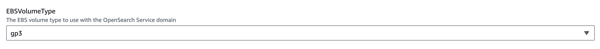

The EBS volume type to use with the OpenSearch Service domain. If you choose gp3, you must also specify values for Iops and Throughput. For more information about each type, see Amazon EBS volume types in the Amazon EC2 User Guide for Linux Instances.

For all instances, a value of "gp3" is suggested.

Allowed values: standard | gp2 | io1 | gp3

#### Name

A name for the OpenSearch Service domain. The name must have a minimum length of 3 and a maximum length of 28. If you don't specify a name, AWS CloudFormation generates a unique physical ID and uses that ID for the domain name.

Suggested name format "formkiq-enterprise-<app_environment>"

#### OpenSearchVersion

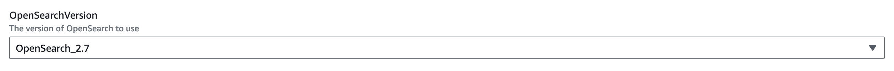

The version of OpenSearch to use.

#### VpcStackName

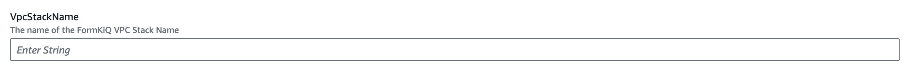

The name of the CloudFormation VPC stack name.

#### VpcSubnets

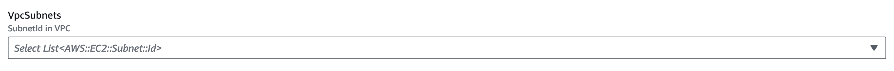

The subnet(s) to deploy OpenSearch nodes to. The number of subnets selected must be less than or equal to the number of data nodes deployed.

For a development instance, if only 1 data node is being deployed, only 1 subnet can be selected.

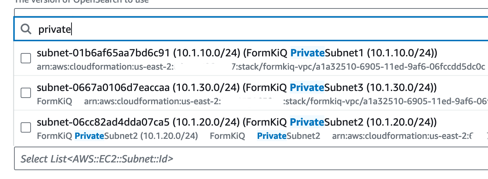

OpenSearch nodes should ONLY be deployed to private subnets. The FormKiQ VPC Cloudformation template creates 3 private subnets.

#### ZoneAwarenessConfig

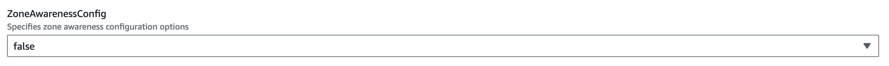

Indicates whether to enable zone awareness for the OpenSearch Service domain. When you enable zone awareness, OpenSearch Service allocates the nodes and replica index shards that belong to a cluster across two Availability Zones (AZs) in the same region to prevent data loss and minimize downtime in the event of node or data center failure. Don't enable zone awareness if your cluster has no replica index shards or is a single-node cluster. For more information, see Configuring a multi-AZ domain in Amazon OpenSearch Service.

### Complete Installation

Keep selecting Next until you get to the last Submit Create Stack page. Once you've checked the checkboxes, you can click Submit to being the stack creation.

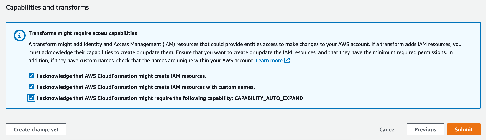

## Update FormKiQ

After the OpenSearch module is deployed, the name of OpenSearch Cloudformation stack must be connected to the FormKiQ installation.

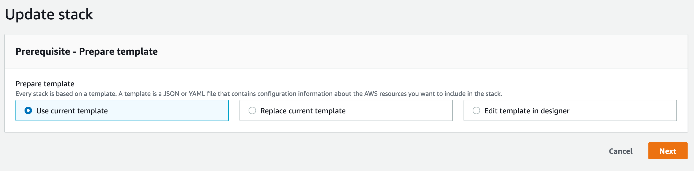

Select the FormKiQ CloudFormation stack and then click the `Update` button.

When updating the stack you will want to choose `Use current template`.

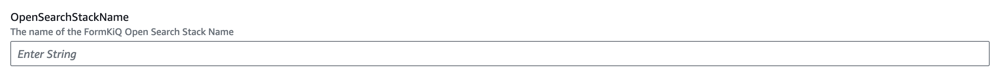

For the `OpenSearchStackName` parameter, set the value to the name of the OpenSearch stack name you created above.

Keep selecting `Next` until you get to the last `Submit Create Stack` page. Once you've checked the checkboxes, you can click `Submit` to being the stack creation.

Once the stack is updated, data added to FormKiQ will be automatically synced with OpenSearch.
