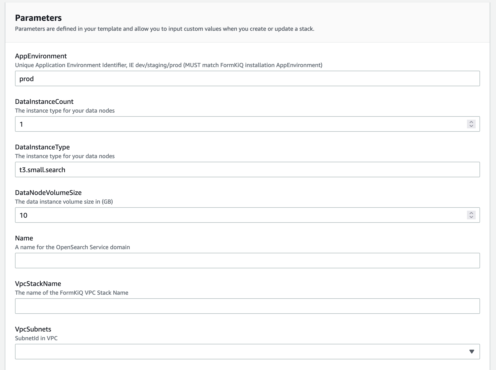
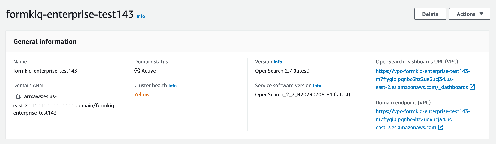

# Enhanced Fulltext Document Search


## Overview

Enhanced Fulltext Document Search is a FormKiQ Enterprise Add-On Module that enhances built-in search functionality by integrating OpenSearch.

✅ Extend Search Functionality, including multiple tag parameters and fulltext queries, through OpenSearch

✅ Optionally Include OCR Results in fulltext queries

## Installation

<iframe width="560" height="315" src="https://www.youtube.com/embed/brvHNrICnXE" title="YouTube video player" frameborder="0" allow="accelerometer; autoplay; clipboard-write; encrypted-media; gyroscope; picture-in-picture; web-share" allowfullscreen></iframe>

On your customized FormKiQ Enterprise repository page, you'll find your CloudFormation single-click installation links.


The Enhanced Fulltext Document Search module uses the AWS OpenSearch service. The OpenSearch service can be inside of a VPC or outside of a VPC. FormKiQ provides methods for doing either type of installation.

If you are NOT using a VPC, you can skip the `Install VPC` section.

### Install VPC (recommended)

To install OpenSearch inside of a VPC, the first step is to use the provided `VPC Creation Script` link to create a VPC preconfigure to work with FormKiQ.


The VPC CloudFormation script, will create a AWS VPC specifically designed to work with FormKiQ. Multiple Public / Private Subnets will be created across multiple availability zones to provide the best reliability possible.

You can customize the CIDR ranges to meet your network requirements.


:::note
Remember the Stack Name you used to install the VPC, as you'll need it in the next section.
:::


### Install OpenSearch

On your customized FormKiQ Enterprise repository page, you'll find your CloudFormation single-click installation links.



When configurating the OpenSearch **WITH VPC**, you'll need to enter the VpcStackName which is the name of the VPC Stack you created above. The script will use outputs from the previous script in its configuration. You'll also need to select the same private subnet CIDRs used during the creation of the VPC.

It is also important that your `AppEnvironment` match exactly the same string used in your FormKiQ installation.

:::note
Remember the Stack Name you used to install OpenSearch, as you'll need it in the next section.
:::

### Update FormKiQ

After installing OpenSearch, you'll need to enable the OpenSearch module in FormKiQ. This is done by selecting your FormKiQ Stack from the CloudFormation console and click the `Update Stack`.

On the CloudFormation configuration page, enter the Stack Names of the OpenSearch installation and optionally the VPC installation.


CloudFormation will then update FormKiQ installation to enable OpenSearch.

## [Amazon OpenSearch Service](https://aws.amazon.com/opensearch-service)

FormKiQ uses [Amazon OpenSearch Service](https://aws.amazon.com/opensearch-service) to provide advanced document searching ability. The costs for [Amazon OpenSearch Service](https://aws.amazon.com/opensearch-service) can vary greatly depending on requirements and whether you are using On-Demand or Reserved Instances.

Best practices for availability

* Deploy to three Availability Zones
* Use a minimum of three data nodes and use three dedicated master nodes

Below are different common scenarios and how to size your cluster based on your requirements.

:::note
Consider purchasing Reserved Instances (RIs) after you have a good baseline on your performance and compute consumption. Discounts start at around 30% for no-upfront, 1-year reservations and can increase up to 50% for all-upfront, 3-year commitments.

After you observe stable operation for at least 14 days, review Reserved Instance recommendations in Cost Explorer. The Amazon OpenSearch Service heading displays specific RI purchase recommendations and projected savings.
:::

### Sizing Cluster

Sizing an OpenSearch cluster involves a careful balance of various factors to ensure optimal performance, scalability, and cost-effectiveness. Firstly, understanding the workload is essential - factors such as the volume of data, and query complexity.

The factors considers are described below.

### Number of Replicas

Each replica is a full copy of an index and needs the same amount of disk space. By default, each OpenSearch index has one replica. We recommend at least one to prevent data loss. Replicas also improve search performance, so you might want more if you have a read-heavy workload.

The number of replicas is used in the calculation for the storage requirements.

OpenSearch Limits
https://docs.aws.amazon.com/opensearch-service/latest/developerguide/limits.html


### Storage Requirements

To calculate storage requirements for OpenSearch, one must consider the volume size to be indexed, the desired retention period, the anticipated growth rate and the number of replicas.

A general formula for calculating the storage requirements can be:

```
<data size> * (1 + number of replicas) * 1.45 = minimum storage requirement
```
For example:

The minimum storage requirement for 100GB of storage with 1 replica would be:

```
100 * (1 + 1) * 1.45 = 290GB
```

### Number of Shards

The default configuration, of OpenSearch, allocates each index into five primary shards accompanied by one replica, totaling to ten shards. The primary objective in determining the number of shards is to ensure an equitable distribution of the index across all data nodes within the cluster. 

It's important to strike a balance, avoiding excessively large or numerous shards. A common recommendation is to maintain shard sizes within the range of 10–30 GiB to optimize performance for various workloads.

A general formula for calculating the number of shards can be:

```  
<storage requirements> * 1.1 / <share size>
```

For example:

The number of shards for 100GB of storage with a desired shard size of 25GB.
```
100 * 1.1 / 25 = 5 shards
```

### Instance Types

Once you've assessed your storage needs and determined the necessary number of shards, you can begin looking at hardware choices. Hardware demands change significantly depending on the workload, here are some recommendations.

#### Data Nodes

OpenSearch data nodes are responsible for storing and indexing data within the cluster. They handle various tasks related to data management, including indexing new documents, updating existing ones, and executing search queries against the indexed data.

Below is a table of recommended data nodes instance types. We typically recommend the Memory Optimized. 

The full list can be found [here](https://aws.amazon.com/opensearch-service/pricing/#On-Demand_Instance_pricing). 

| Memory Optimized    | vCPU | Memory (GiB) | Price Per hour |
| -------- | ------- | ------- | ------- |
| r6g.large.search | 2 | 16 | $0.167 |
| r6g.xlarge.search | 4 | 32 | $0.335 |
| r6g.2xlarge.search | 8 | 64 | $0.669 |

| General Purpose    | vCPU | Memory (GiB) | Price Per hour |
| -------- | ------- | ------- | ------- |
| t3.small.search	| 2 |	2 |	$0.036 |
| t3.medium.search |	2	| 4 |    $0.073 |
| m6g.large.search | 2 | 8 | $0.128 |
| m6g.xlarge.search | 4 | 16 | $0.256 |
| m6g.2xlarge.search | 8 | 32 | $0.511 |

| Compute Optimized    | vCPU | Memory (GiB) | Price Per hour |
| -------- | ------- | ------- | ------- |
| c6g.large.search | 2 | 4 | $0.113 |
| c6g.xlarge.search | 4 | 8 | $0.226 |
| c6g.2xlarge.search | 8 | 16 | $0.452 |

#### Dedicated Master Node

OpenSearch dedicated master nodes are specialized components within an OpenSearch cluster that serve the primary function of managing cluster metadata and coordinating administrative tasks. Unlike data nodes, which primarily handle data storage and search operations, dedicated master nodes are optimized for cluster management tasks and do not handle indexing or search queries.

Below is a table of recommended dedicated master nodes instance types based on the number data nodes managed. See [here](https://docs.aws.amazon.com/opensearch-service/latest/developerguide/managedomains-dedicatedmasternodes.html#dedicatedmasternodes-instance) for the latest table.

| Instance count | Master node RAM size | Maximum supported shard count | Recommended minimum dedicated master instance type |
| -------- | ------- | ------- | ------- |
| 1 – 10 | 8 GiB | 10K | m5.large.search or m6g.large.search |
| 11 – 30 | 16 GiB | 30K | 5.2xlarge.search or c6g.2xlarge.search |
| 31 – 75 | 32 GiB | 40K | r5.xlarge.search or r6g.xlarge.search | 
| 76 – 125 | 64 GiB | 75K | r5.2xlarge.search or r6g.2xlarge.search |
| 126 – 200 | 128 GiB | 75K | r5.4xlarge.search or r6g.4xlarge.search |

## Kibana


Kibana is a powerful data visualization and exploration tool designed to work seamlessly with OpenSearch. It allows users to transform large volumes of data into interactive, visually appealing dashboards, graphs, and charts. Kibana is useful for organizations seeking to gain actionable insights from their data, as it enables real-time monitoring, data analysis, and the detection of trends and patterns.

### Authentication

Kibana access is securely controlled through AWS IAM (Identity and Access Management) roles, ensuring that only authorized users and services can interact with the Kibana environment within an AWS infrastructure. 

#### Users

By default the FormKiQ `Admins` group is the only group that has the IAM role/policy access to Kibana. The role is configured on the Cognito group as shown below.


:::warning
The IAM role attached to the `Admins` group should NOT be attached to a new role unless you intend for them to have full admin access to FormKiQ. A new role should be created and only the Kibana policy on the `Admins` IAM role is needed.
:::

#### System

For the FormKiQ application to have access to OpenSearch / Kibana, an `opensearch_lambda_role` role is created.


The `opensearch_lambda_role` is given OpenSearch permissions.


The `opensearch_lambda_role` is then mapped back to AWS IAM roles.


### OpenSearch Dashboards URL



The URL to access the Kibana console can be found on the `AWS OpenSearch Console page` under the `OpenSearch Dashboards URL`. This URL will not be publicly accessible as OpenSearch should be deployed to a private subnet to ensure not anyone can get access.

Clicking the `OpenSearch Dashboards URL` will open the Kibana login dialog.


:::note
To access the URL, a VPN or an SSH tunnel needs to be set up. Links for examples on how to set these up can be found below.

#### AWS Client VPN

See https://docs.aws.amazon.com/vpn/latest/clientvpn-admin/what-is.html

#### SSH tunnel 

See https://repost.aws/knowledge-center/opensearch-outside-vpc-ssh
:::

## API

The Enhanced Fulltext Document Search Module adds several new endpoints, including the following API endpoint to the Documents section of the API:

* `PUT /documents/{documentId}/fulltext` - Replaces the specified document's fulltext metadata for OpenSearch (if exists)

:::note
all FormKiQ API endpoints are case-sensitive
:::

