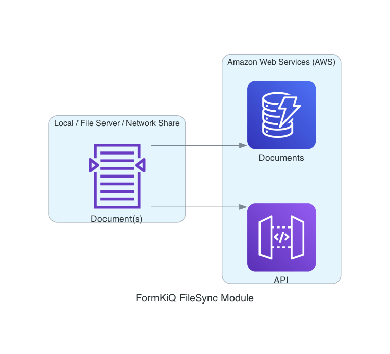
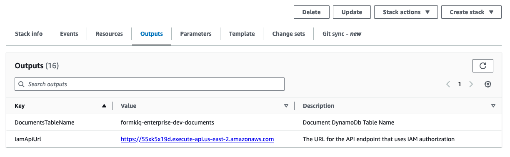
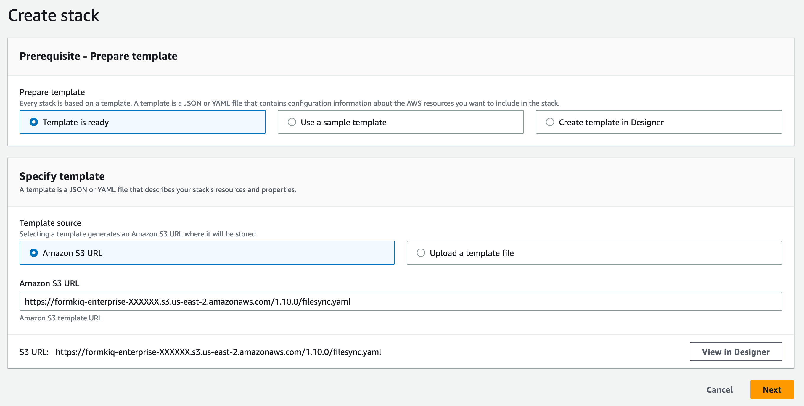
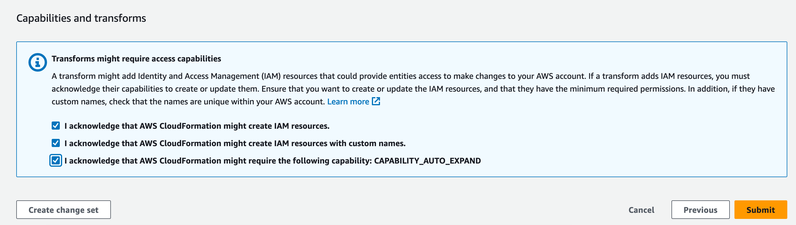
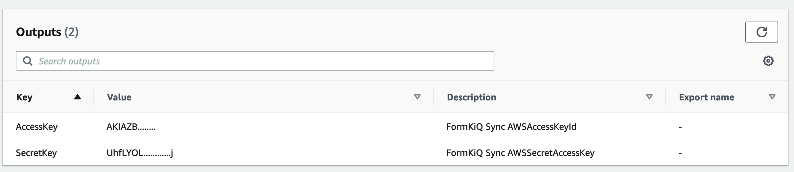

# FileSync CLI



FileSync CLI is a FormKiQ Enterprise Add-On Module (for the FormKiQ Core Headless Document Management System) that enables:

* Syncing of documents from a local file system to FormKiQ
* Syncing of documents to [Opensearch](https://opensearch.org/)

## Installation

The following are the steps for installing the FormKiQ FileSync CLI.

### Prerequisite

Before you begin the installation you need to:

* [Visit CloudFormation in your AWS console](https://console.aws.amazon.com/cloudformation)
* Click on the FormKiQ installation you would like to sync documents to; make a note of the name of the `IamApiUrl` and `DocumentsTableName` from the Stack's Outputs, as you will need this information during the FileSync's configuration.



:::note
The FileSync CLI can support multiple FormKiQ installations, so you can get the Outputs for each installation.
:::

### CloudFormation Installation

Before you can use the FileSync CLI, you need to install the FileSync CLI's CloudFormation script. This script will provide access for the FileSync CLI to your FormKiQ installation.

The FileSync CLI CloudFormation script will be found on your FormKiQ's GitHub page, as shown below.

| AWS Description    | Install Link |
| -------- | ------- |
| FormKiQ FileSync CLI | Install FormKiQ FileSync CLI

Clicking on the `Install FormKiQ FileSync CLI` link (from your FormKiQ's GitHub page), will bring you to your AWS CloudFormation console.



Click `Next` and enter the parameter for the CloudFormation stack.

Enter the:

* Stack Name
* A comma delimited list of FormKiQ DocumentsTableName(s)


Continue clicking `Next` through the next screens until you can click `Submit` to create the CloudFormation stack.



After installation, open the `Outputs` tab of the CloudFormation Stack and make note of `AccessKey`` and `SecretKey``. You will need these keys when configuring the FileSync CLI.



### FileSync CLI Download

The FileSync CLI can be found on its [GitHub Releases](https://github.com/formkiq/formkiq-module-filesync-cli/releases) page. 

It is available for:

* Windows
* Linux
* Mac

## Usage

```
usage: fk
    --configure          configure AWS credentials
    --delete-documents   Delete documents
    --import             Import csv file
    --list               list document ids
    --show               show sync profiles
    --sync               sync files with FormKiQ
    --sync-dynamodb      sync documents from one dynamodb table to another
    --sync-opensearch    sync documents with Opensearch
    --watch              watch directorie(s) for file changes and
                         automatically syncs
```

### Configure

To use the FileSync CLI, you will need to first use the "--configure" option to connect the CLI to your FormKiQ installation.

To configure, you will need:

* Access Key / Secret Key from the `Outputs` tab of the FileSync CLI CloudFormation stack
* The name of the DocumentsStageS3Bucket from the `Outputs` tab of your FormKiQ CloudFormation installation stack
* The AWS Region of your FormKiQ installation (e.g. us-east-1, us-east-2, etc)

Run configure:

```
fk --configure --access-key ACCESS_KEY \
               --secret-key ACCESS_SECRET \
               --region AWS_REGION \
               --iam-api-url IAM_API_URL \
               --documents-dynamodb-tablename DOCUMENTS_TABLE_NAME
```

Optionally you can specify a `--profile` name if you are syncing with multiple FormKiQ installations

```
fk --configure --access-key ACCESS_KEY \
               --secret-key ACCESS_SECRET \
               --region AWS_REGION \
               --iam-api-url IAM_API_URL \
               --documents-dynamodb-tablename DOCUMENTS_TABLE_NAME \
               --profile dev
```

To list the FormKiQ installations that are configured:

```
fk --show
```

### Import

The "--import" option allows for the importing of data into FormKiQ.

The format of the import comand is:

```
usage: fk --import
    --limit <arg>          Limit the records processed
 -s,--site-id <arg>        FormKiQ Site Id
    --thread-count <arg>   Number of Threads
    --type <arg>           Type of import
    --dry-run          show what would have been transferred
 -v,--verbose          increase verbosity
```

#### CSV Import Format (--csv)

The CSV import format allows for the importing of data using a CSV format.

Usage:

```
fk --import --type csv --attributes <filename>
fk --import --type csv --documents <filename>
fk --import --type csv --document-attributes <filename>
```

Below lists the different supported data record types and the file format.

##### Attributes Record Type (--attributes)

| AttributeKey   | DataType   | Type   |
|------------|------------|------------|
| attribute_key_name | Enum: STRING, NUMBER, BOOLEAN, KEY_ONLY | Enum: STANDARD, OPA |

Example:

The following example creates a string attribute called "DocumentType".

| AttributeKey   | DataType   | Type   |
|------------|------------|------------|
| DocumentType | STRING | STANDARD |


##### Documents Record Type (--documents)

| DocumentId   | Path   | DeepLink   | ContentType   |
|------------|------------|------------|------------|
| UUID | string | string | string |

Example:

| DocumentId   | Path   | DeepLink   | ContentType   |
|------------|------------|------------|------------|
| 1fb1441a-caa0-46d8-af8b-1d6d186f9b4c | document1.txt |  | text/plain |
| 788a2b32-0279-4ead-91d1-4d21244d2038 | app.pdf | https://server/app.pdf | application/pdf |

##### Document Attributes Record Type (--document-attributes)

| DocumentId   | AttributeKey   | StringValue   | NumberValue   | BooleanValue |
|------------|------------|------------|------------|------------|
| UUID | string  | string | number | boolean |

Example:

| DocumentId   | AttributeKey   | StringValue   | NumberValue   | BooleanValue |
|------------|------------|------------|------------|------------|
| 1fb1441a-caa0-46d8-af8b-1d6d186f9b4c | DocumentType | Contract |  | |
| 788a2b32-0279-4ead-91d1-4d21244d2038 | DocumentType | Invoice |  | |

### Sync

The "--sync" option can be used to sync a directory with a FormKiQ installation.

```
usage: fk --sync
    --actions <arg>    Actions to perform on file (OCR / FULLTEXT)
 -d,--dir <arg>        transfer directories without recursing (required)
    --dry-run          show what would have been transferred
    --include <arg>    include files matching PATTERN
    --max-file-queue   maximum number of files to queue (default: 500)
    --mtime <arg>      file modification time subtracted from the initialization time (IE: --mtime -5 find files modified last 5 minutes to sync)
 -p,--profile <arg>    FormKiQ Profile to use
    --pre-hook <arg>   webhook url to call before sending file
 -r,--recursive        recurse into directories
 -s,--siteId <arg>     FormKiQ Site Id
 -v,--verbose          increase verbosity
```

#### Examples

The following are example commands of fk usage.

##### Basic Directory Syncing

```
fk --sync -d /documents --verbose
```

##### Amazon S3 Directory Syncing

```
fk --sync -d s3://myBucket/documents --verbose
```

##### Sync files modified in the last 24 hours

```
fk --sync -d /documents --verbose --mtime 0
```

##### Sync files modified more than 7 days ago

```
fk --sync -d /documents --verbose --mtime 7
```

##### Sync files modified in the last 30 days

```
fk --sync -d /documents --verbose --mtime -30
```

##### Sync the /documents directory and performs the OCR & Fulltext & WebHook actions to all documents

The "--actions" parameter follows the same format as the AddDocumentAction: https://docs.formkiq.com/docs/latest/api/index.html#tag/Document-Actions/operation/AddDocumentActions

```
fk --sync --actions [{"type": "OCR","parameters":{"ocrParseTypes": "TABLES"}},{"type": "FULLTEXT"},{"type": "WEBHOOK","parameters":{"url": "https://pipedream.com/12345"}}] -d /documents --verbose
```

### Watch

The "--watch" option can be used to watch a directory for changes and sync those changes with a FormKiQ installation.

```
usage: fk --watch
    --actions <arg>     Actions to perform on file (OCR / FULLTEXT)
 -d,--dir <arg>         transfer directories without recursing (required)
    --dry-run           show what would have been transferred
    --include <arg>     include files matching PATTERN
    --max-file-queue    maximum number of files to queue (default: 500)
 -p,--profile <arg>     FormKiQ Profile to use
 -r,--recursive         recurse into directories
    --siteId <arg>      FormKiQ Site Id
    --syncDelay <arg>   Number of minutes to wait between file creation/modified before syncing (used with --watch)
 -v,--verbose           increase verbosity
```

#### Example

```
fk --watch -d /documents --verbose
```

### Sync DynamoDb

The "--sync-dynamodb" option can be used to sync FormKiQ dyanmodb data from one installation to another.

```
usage: fk --sync-dynamodb
    --destination <arg>   dynamodb destination table (required)
    --dry-run             show what would have been transferred
    --source <arg>        dynamodb source table (required)
 -v,--verbose             increase verbosity
```

:::note
Make sure the CloudFormation FileSync CLI template DynamoDbTableNames parameter includes both the source and destination DynamoDb table arns
:::

#### Example

The following example syncs the data from DynamoDb **formkiq-enterprise-dev1-documents** to **formkiq-enterprise-dev2-documents**.

```
fk --sync-dynamodb --source formkiq-enterprise-dev1-documents --destintation formkiq-enterprise-dev2-documents
```


### Sync Opensearch

The "--sync-opensearch" option can be used to sync existing documents to [Opensearch](https://aws.amazon.com/opensearch-service).

```
usage: fk --sync-opensearch
    --content              Sync document content
    --document-ids <arg>   document ids to sync or 'all' for all documents
                           (required)
    --dry-run              show what would have been transferred
 -s,--site-id <arg>        FormKiQ Site Id
 -v,--verbose              increase verbosity
```

#### Examples

The following are example commands of fk usage.

##### Sync select documents with Opensearch
```
fk --sync-opensearch --document-ids 2def5ec0-0d6e-4912-916d-cdfca99575c9 -v
```

##### Sync all documents with Opensearch
```
fk --sync-opensearch --document-ids all -v
```

##### Sync all documents and content with Opensearch
```
fk --sync-opensearch --document-ids all --content -v
```

### List documents

The "--list" option can be used to list existing document ids.

```
usage: fk --list
    --limit                Limit number of results
 -s,--site-id <arg>        FormKiQ Site Id
```

#### Example

```
fk --list --limit 100
```

### Delete documents

The "--delete-documents" option can be used to remove all documents from a site-id. The "--list" command is first used to generate a list of document ids to be deleted. Then the generateed file can be used with the "--delete-documents" command to remove all documents.

```
usage: fk --delete-documents
    --file <arg>           File with list of Document Ids
    --limit <arg>          Limit the records processed
 -s,--site-id <arg>        FormKiQ Site Id
    --thread-count <arg>   Number of Threads
```

#### Example

First list all the documents and record all the document id

```
fk --list > documents.txt
```

Delete all the document ids listed in the documents.txt file.

```
fk --delete-documents --file documents.txt
```

### Pre-Hook

The `--pre-hook` parameter is useful for situations where you need to add document specific tag(s)/metadata based on a file's path. During the file sync, a POST request is sent to the `--pre-hook` URL with the following payload:

```
{
    "path" : "<filename>",
    "config" : {
        "directory" : "<directory>"
        "actions" : "<actions>",
        "siteId" : "<siteId>",
        "stagebucket" : "<stagingbucket>"
    }
}
```

The expected response is a status of 200 and a response body that follows the <a href="/docs/platform/document_storage#fkb64-file-format">FKB64 File Format</a>.

The following example response will add two tags and a metadata key.

```
{
  "tags": [
    {
      "key": "category",
      "value": "document"
    },
    {
      "key": "user",
      "values": ["1", "2"]
    }
  ],
  "metadata": [
    {
      "key": "property1",
      "value": "value1"
    }
  ]
}
```

