# Single Sign-On and Custom JWT Authorizer

Single Sign-On and Custom JWT Authorizer is a FormKiQ Enterprise Add-On Module (for the FormKiQ Core Headless Document Management System) that enables the ability to customize the authorizer used for FormKiQ console, and API endpoints.

FormKiQ by default uses https://aws.amazon.com/cognito as the JWT authorizer.

Using this module the authorizer can be changed to another authorizer such as:

* Another JWT authorizer such as https://auth0.com

* SAML identity providers through Security Assertion Markup Language 2.0 (SAML 2.0)

* Public providers: [FaceBook](https://docs.aws.amazon.com/cognito/latest/developerguide/facebook.html), [Google](https://docs.aws.amazon.com/cognito/latest/developerguide/google.html), or [Apple](https://docs.aws.amazon.com/cognito/latest/developerguide/apple.html)

* OpenID Connect provider

## Use Case
* If you would like to maintain your ActiveDirectory or Google Apps login from your organization into the FormKiQ API or Console, this module allows that with minimal configuration

## Integration Instructions - Microsoft Active Directory Federation Services

### Retrieve Your Amazon Cognito Info

In order to configure your Windows Server AD FS, you will need to retrieve your FormKiQ Pool ID and Amazon Cognito Domain.

Go to Amazon Cognito in your AWS Management Console. Under "Settings", you can retrieve your User Pool ID:

You can then retrieve your Cognito Domain under "App Integration >> Domain Name":

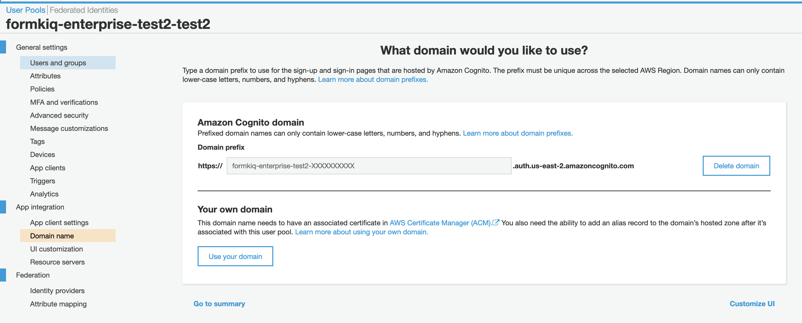

### Open AD FS Management in Windows Server Manager

:::note
Ensure that
- AD FS server(s) has https network access to `amazoncognito.com`

- When using multiple AD FS servers, apply the following changes to all servers 
:::

Go to "Server Manager" and select "AD FS":

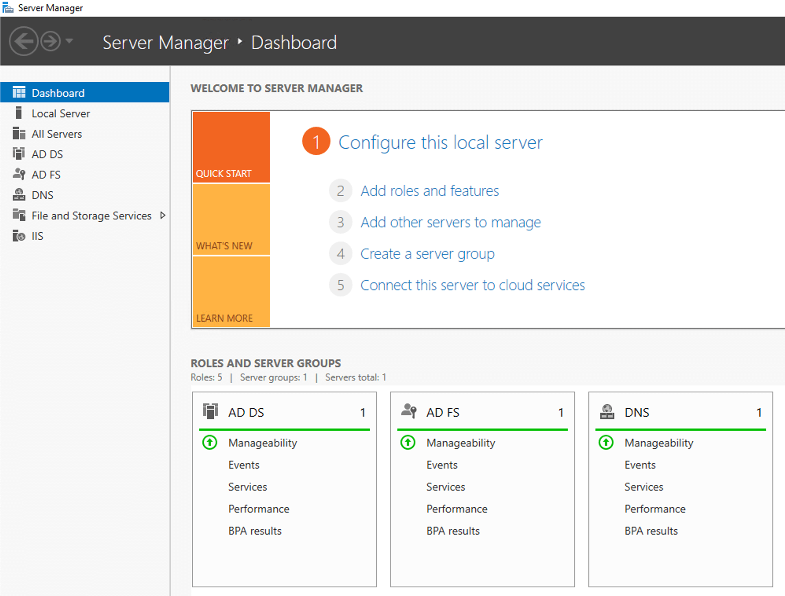

Choose the "Tools" menu, and select "AD FS Management":

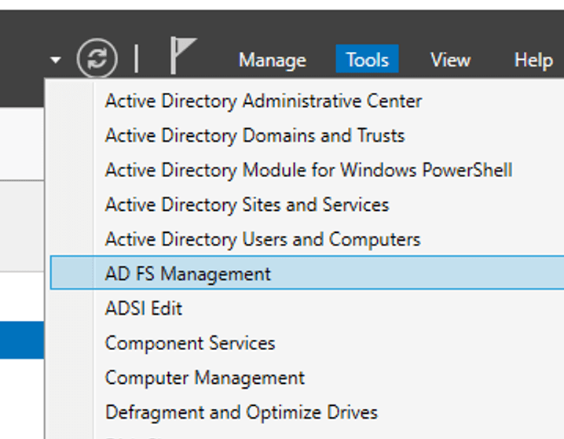

### Adding Relying Party Trust Management

Select "Relying Party Trusts" and choose the "Add Relying Party Trust Wizard". Choose the default "Claims aware" option:

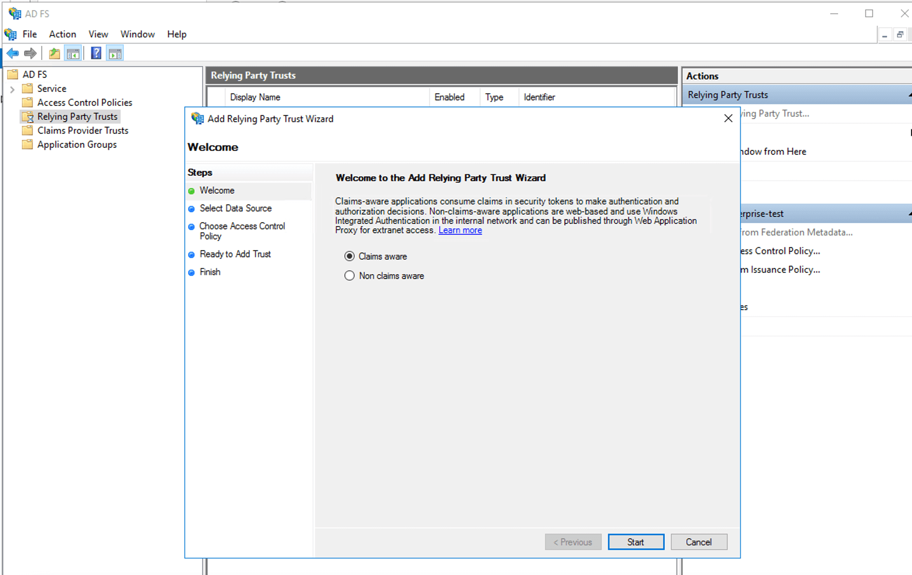

For "Select Data Source", choose the option "Enter data about the relying party manually":

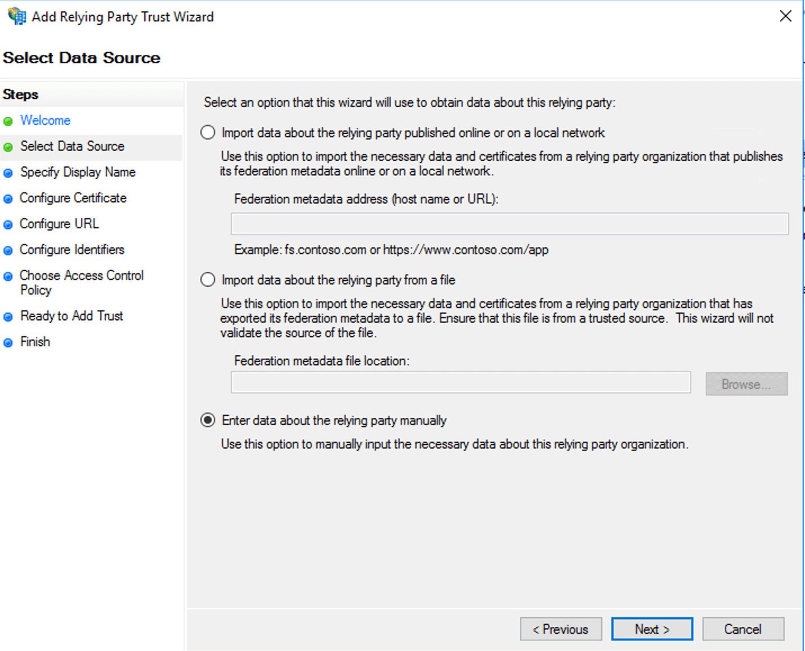

For "Specify Display Name", enter a descriptive name, such as "FormKiQ ADFS Login":

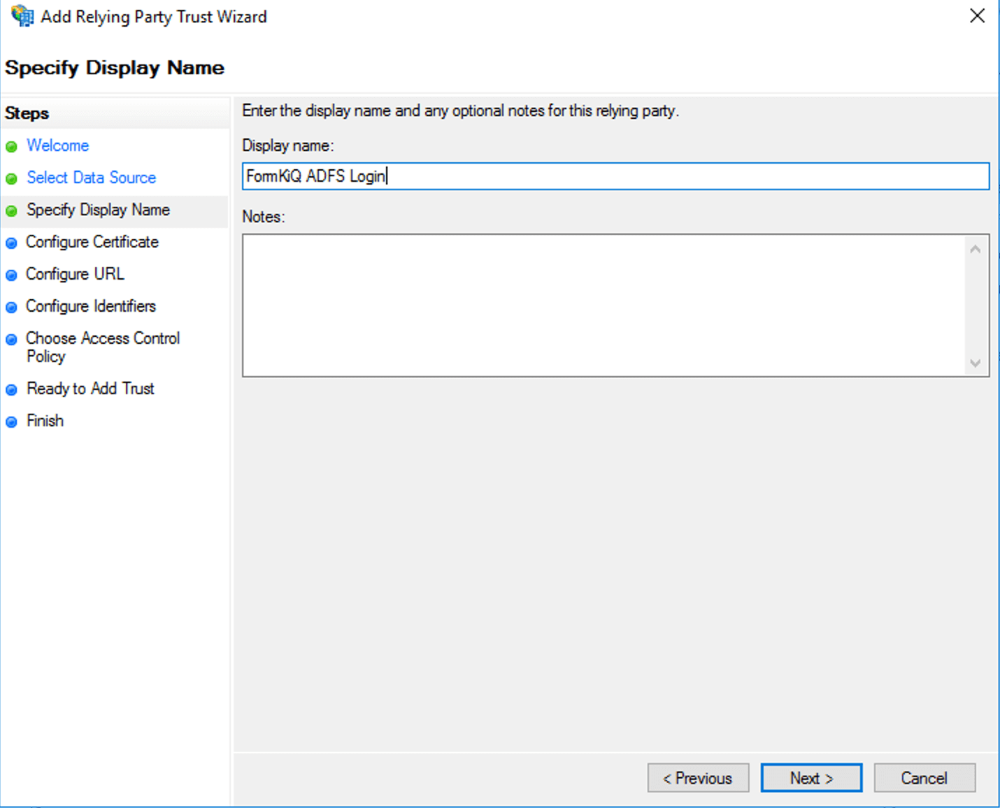

For "Configure URL", choose "Enable support for the SAML 2.0 WebSSO protocol", and for the form field below, replace "yourDomainPrefix" with your Amazon Cognito User Pool's Domain Prefix (retrieved as the first step), and replace region with the User Pool's AWS Region (for example, "us-east-1"):

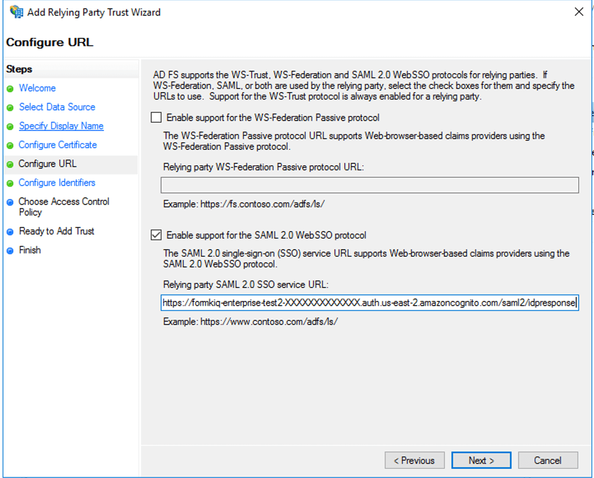

For "Configure Identifiers", you need to supply the "Relying party trust identifier". Enter "urn:amazon:cognito:sp:*yourUserPoolID*" as the URN, but with your Cognito User Pool (e.g., "us-east-1_g2zxiEbac"), instead of "*yourUserPoolId*":

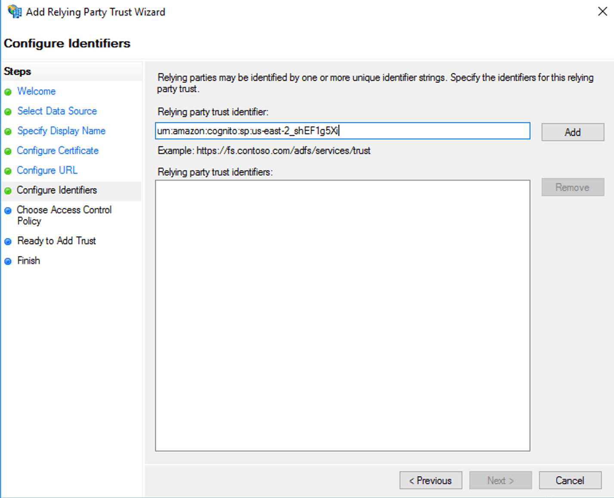

You can now click through the default options for the remainder of the Wizard and click "Finish".

### Editing the Relying Party Trust Claim Issuance Policy

You should now see your new Relying Party Trust listed with the Display Name that you provided. You can select this trust:

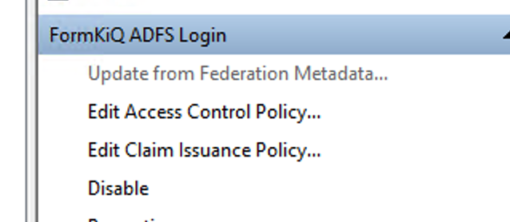

Choose "Edit Claim Issuance Policy":

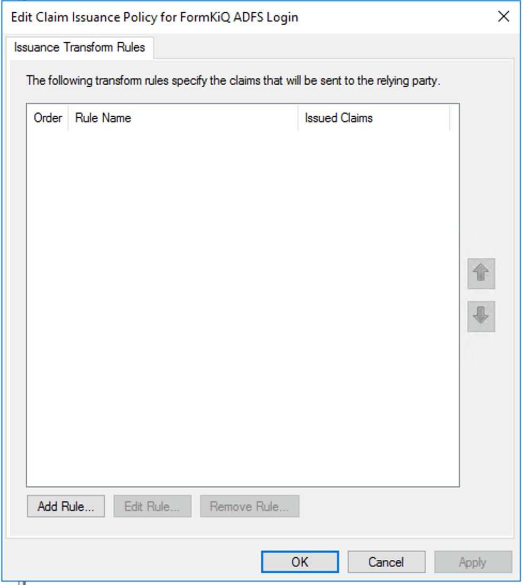

You can now add a new Claim Issuance Policy Rule for the Windows account name:

Next, create a rule for the email:

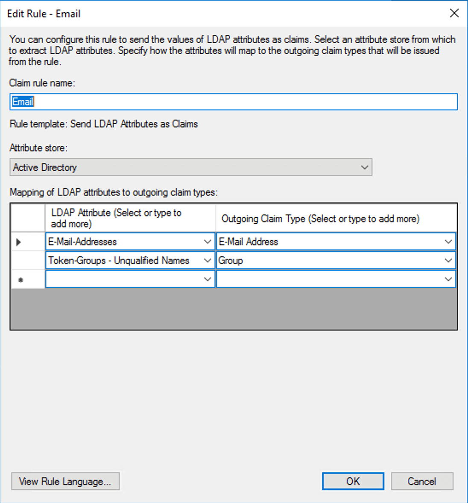

### Signing in with AD FS

You can test out your AD sign in with the FormKiQ Console:

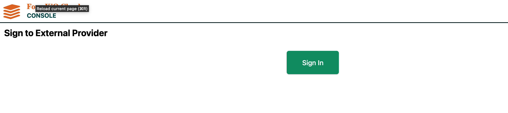

You will then be redirected to an Active Directory server and prompted to choose your Corporate ID:

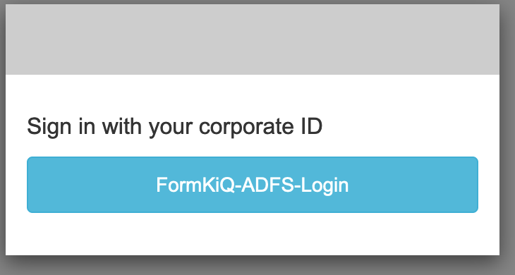

You can then securely sign in with your Active Directory credentials:

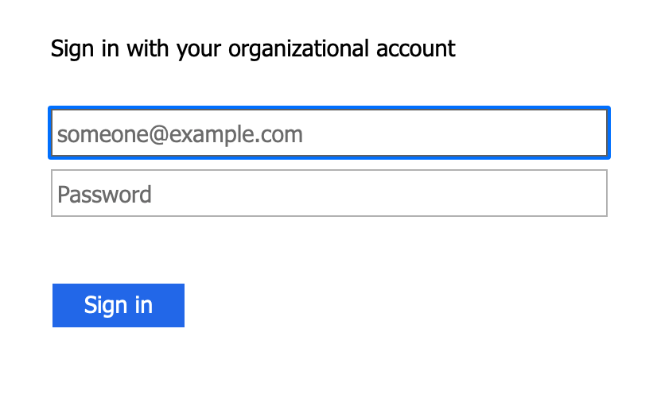

## User Group Access

FormKiQ access is determined by the group(s) the user belongs to, see <a href="/docs/platform/multi-tenant-vs-multi-instance">Multi-Tenant</a>.

The only difference is all user groups need to be prefixed with `formkiq_`.

At a minimum you need to create a group called `formkiq_default` which will give users read / write access to the default siteId.

## OpenSearch Dashboards/Kibana using SAML Authentication

SAML authentication for OpenSearch Dashboards lets you use your existing identity provider to offer single sign-on (SSO) for Dashboards/Kibana on Amazon OpenSearch Service.

Start by visiting the https://us-east-2.console.aws.amazon.com/opensearch/domains[AWS OpenSearch Console] and selecting the domain to change the authentication source.

Select the `Security configuration` tab and then the `Edit` button.

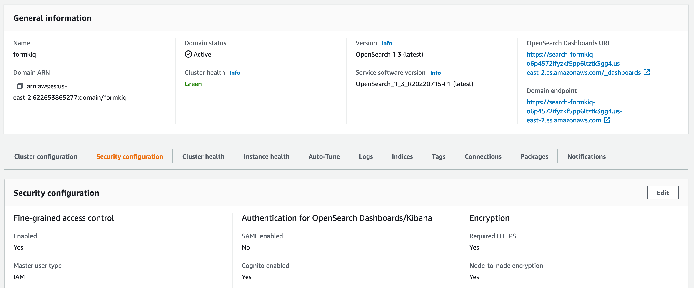

First, Disable Cognito Authentication

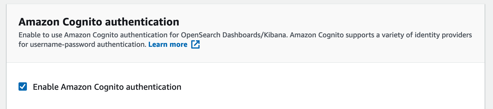

Next, Enable SAML authentication

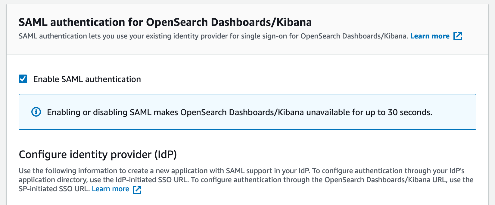

After enabling SAML authentication, you are provided the following configuration urls:

* Service provider entity ID

* IdP-initiated SSO URL

* SP-initiated SSO URL

Using the above urls to create a new application with SAML support in your IdP. To configure authentication through your IdP's application directory, use the IdP-initiated SSO URL. To configure authentication through the OpenSearch Dashboards/Kibana URL, use the SP-initiated SSO URL.

The following link provides additional information on configuring [SAML authentication for OpenSearch Dashboards](https://docs.aws.amazon.com/opensearch-service/latest/developerguide/saml.html).

