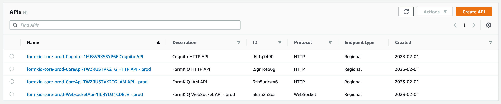
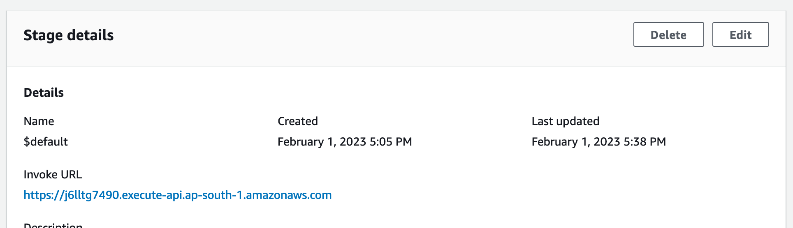
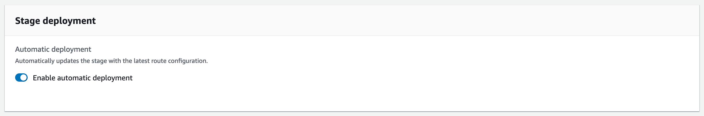

# `{"message":"Internal Server Error"}`

After installing FormKiQ, the API returns an "Internal server error" and a 500 status code. How do I resolve the error?

## Short description

In rare circumstances, API Gateway's auto deployment silently fails, this causes https://aws.amazon.com/api-gateway[AWS API Gateway] to be disconnected from the FormKiQ backend.

## Resolution

There are two solutions:

1. Delete the FormKiQ CloudFormation Stack and run the installation process again.

*OR*

2. Force the API Gateway to redeploy, using the following steps:

Open the [API Gateway Console](https://console.aws.amazon.com/apigateway) from your [AWS Console](https://console.aws.amazon.com) (make sure you switch to the correct AWS Region).

Click on each FormKiQ API and do the following:

* Select `Stages` under the `Deploy` from the left menu
* Select `$default` Stage
* Click `Edit` to edit the `Stage Details`

* Turn `OFF` Enable automatic deployment
* Scroll down to the Bottom and click `Save`

* Click `Edit` to edit the `Stage Details`, again
* Turn `ON` Enable automatic deployment
* Scroll down to the Bottom and click `Save`

