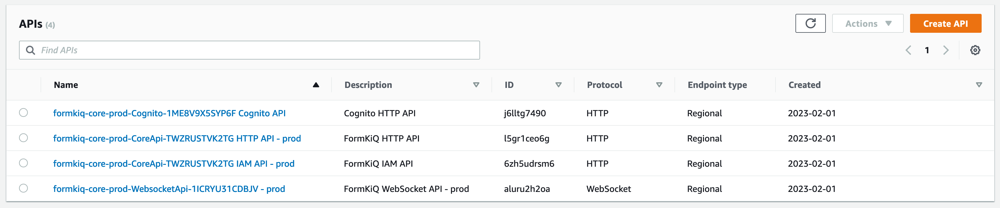
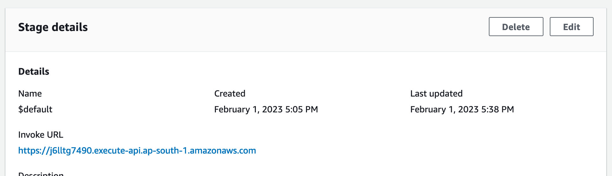
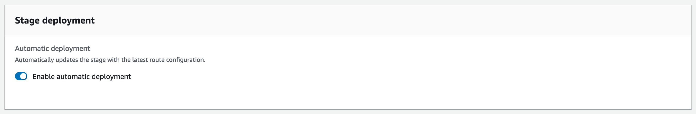

# `{"message":"Internal Server Error"}`

Use this guide when a FormKiQ API request returns HTTP `500` with:

```json
{"message":"Internal Server Error"}
```

This error means API Gateway received the request but the backend integration did not complete successfully. After a new installation, one known cause is an API Gateway deployment or stage issue where the API is not correctly connected to the FormKiQ backend.

## Before You Start

Confirm these basics first:

- The FormKiQ CloudFormation stack is in `CREATE_COMPLETE` or `UPDATE_COMPLETE`.
- You are using the API endpoint from the correct stack output and AWS Region.
- The request path is correct.
- If the endpoint requires authentication, the request includes the expected authorization header.
- The error is reproducible, not a one-time transient failure.

For a quick unauthenticated endpoint check, run:

```bash
curl -i https://<your-formkiq-endpoint>/version
```

If `/version` also returns a `500`, start with the backend log and API Gateway checks below.

## Check CloudFormation Status

If the deployment has not completed successfully, do not troubleshoot API Gateway first. Open the CloudFormation stack and inspect the failed resource.

For stack event inspection, see [CloudFormation Stack Failed](/docs/getting-started/cloudformation-troubleshooting).

## Check Backend Logs

If the API still returns `500`, inspect the backend logs in CloudWatch.

FormKiQ Core creates both API Gateway access log groups and Lambda log groups through CloudFormation. Start with the API Gateway access log for the API that returned the `500`, then follow the request into the Lambda log group.

### API Gateway Access Logs

The FormKiQ API CloudFormation template creates API Gateway vended log groups using the API stack name:

| API | CloudWatch log group |
| --- | --- |
| Cognito/JWT document API | `/aws/vendedlogs/<api-stack-name>/APIDocumentsHttpAccessLogs` |
| IAM document API | `/aws/vendedlogs/<api-stack-name>/APIDocumentsIamAccessLogs` |
| API key document API | `/aws/vendedlogs/<api-stack-name>/APIDocumentsKeyAccessLogs` |
| User authentication API | `/aws/vendedlogs/<api-stack-name>/APIAuthAccessLogs` |

These access logs include fields such as `requestId`, `routeKey`, `status`, `integrationStatus`, `integrationLatency`, and `responseLength`. They are useful for confirming whether the `500` is coming from API Gateway itself or from the Lambda integration.

Example CloudWatch Logs Insights query:

```sql
fields @timestamp, requestId, routeKey, status, integrationStatus, integrationLatency
| filter status >= 500 or integrationStatus >= 500
| sort @timestamp desc
| limit 50
```

If the log event is stored as raw text rather than parsed JSON, use:

```sql
fields @timestamp, @message
| filter @message like /"status":"5|"status":5|integrationStatus/
| sort @timestamp desc
| limit 50
```

### Lambda Logs

The main API handler is the `DocumentsApiRequests` Lambda function. FormKiQ stores the function name in Systems Manager Parameter Store:

```text
/formkiq/<app-environment>/lambda/DocumentsApiRequests
```

The Lambda log group is created by the `DocumentsApiRequestsLogGroup` CloudFormation resource and attached to the Lambda through its logging configuration.

To find the function name:

```bash
aws ssm get-parameter \
  --name "/formkiq/<app-environment>/lambda/DocumentsApiRequests" \
  --query "Parameter.Value" \
  --output text
```

Then open the Lambda function in the AWS Console and follow **Monitor** -> **View CloudWatch logs**, or search CloudWatch log groups for the CloudFormation resource `DocumentsApiRequestsLogGroup`.

Other useful FormKiQ Lambda identifiers stored in Parameter Store include:

| SSM parameter | Used for |
| --- | --- |
| `/formkiq/<app-environment>/lambda/DocumentsApiRequests` | API requests and `/version` responses. |
| `/formkiq/<app-environment>/lambda/StagingCreateObject` | Documents added through the staging bucket. |
| `/formkiq/<app-environment>/lambda/DocumentsUpdateObject` | Document content update events. |
| `/formkiq/<app-environment>/lambda/DocumentActionsProcessor` | Document actions, workflows, OCR/full-text style processing, and other async action handling. |

Look for:

- Lambda errors or exceptions
- Lambda timeouts
- Access denied errors
- DynamoDB throttling or validation errors
- KMS, S3, OpenSearch, or SNS permission failures
- Missing environment variables or configuration values

Useful CloudWatch Logs Insights query:

```sql
fields @timestamp, @logStream, @message
| filter @message like /ERROR|Exception|Task timed out|AccessDenied|Internal Server Error/
| sort @timestamp desc
| limit 50
```

If the error happens only for one document or action, search by `documentId`, `queueId`, or the related request identifier when available.

## Check API Gateway Stage Deployment

In rare cases, API Gateway automatic deployment can fail or become disconnected from the backend integration. Toggling automatic deployment on the `$default` stage can force API Gateway to redeploy the stage.

1. Open the [API Gateway Console](https://console.aws.amazon.com/apigateway).
2. Switch to the AWS Region where FormKiQ is deployed.
3. Open each FormKiQ API.



4. Select **Stages** under **Deploy**.
5. Select the `$default` stage.
6. Click **Edit** in the stage details.



7. Turn **Enable automatic deployment** off.
8. Save the stage.



9. Edit the `$default` stage again.
10. Turn **Enable automatic deployment** on.
11. Save the stage.


Retest the failing API request after the stage redeploys.

## Check Authorization and Request Shape

Some failures appear as backend errors when the request reaches the API but contains unexpected values.

Check:

- The request uses the correct authentication method for the deployment.
- The token or IAM credentials are for the same AWS account, Region, and FormKiQ environment.
- Required request body fields are present.
- Path parameters such as `documentId`, `siteId`, `workflowId`, or `queueId` are valid.
- Uploaded content type and file size are supported for the operation.

For API setup and request examples, see [API Walkthrough](/docs/getting-started/api-walkthrough).

## Last Resort: Recreate the Stack

If this is a brand-new installation, no production data exists, and API Gateway redeployment does not resolve the issue, deleting and reinstalling the FormKiQ CloudFormation stack may be faster than deeper repair.

Do not delete a stack that contains production documents or configuration unless you have a tested backup and recovery plan. Review [Backup and Recovery](/docs/platform/backup_and_recovery) first.

## Where to Go Next

- [CloudFormation Stack Failed](/docs/getting-started/cloudformation-troubleshooting)
- [API Walkthrough](/docs/getting-started/api-walkthrough)
- [Status Monitoring and Alerting](/docs/how-tos/set-up-status-monitoring-and-alerting)
- [Dead-Letter Queue (DLQ)](/docs/platform/error_handling/dlq)
- [Backup and Recovery](/docs/platform/backup_and_recovery)
