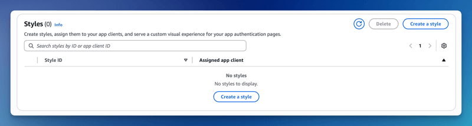
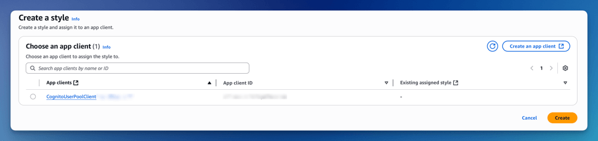
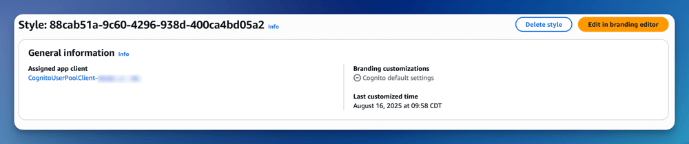
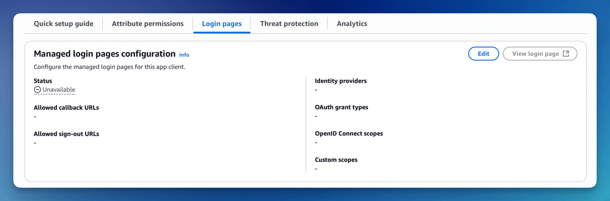
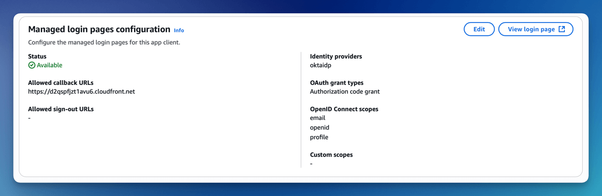
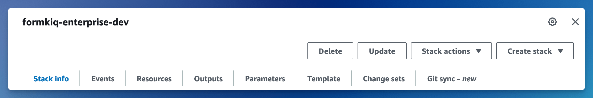
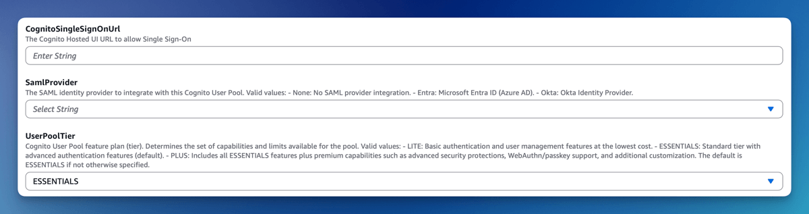
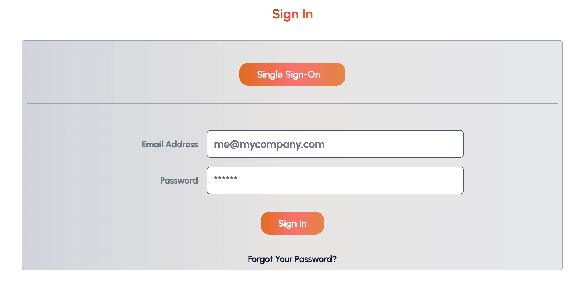

# Amazon Managed Login

This tutorial shows how to connect [Amazon Cognito](https://aws.amazon.com/pm/cognito) managed login to a SAML provider such as Microsoft Entra ID, Okta, or Google Workspace.

## What You Will Build

You will configure an Amazon Cognito managed login page, assign it to a Cognito app client, enable your SAML identity provider, and update the FormKiQ CloudFormation stack so users can sign in through SSO.

## Before You Begin

- A SAML provider already configured for your Amazon Cognito User Pool.
- Administrative access to the AWS account that hosts the FormKiQ stack.
- The FormKiQ console URL.

Related identity provider tutorials:

- [Microsoft Entra ID](/docs/tutorials/Identity%20Management/microsoft-entra-id)
- [Okta](/docs/tutorials/Identity%20Management/okta)
- [Google Workspace](/docs/tutorials/Identity%20Management/google-workspace)

## Workflow Overview

1. Collect the FormKiQ console URL.
2. Create a Cognito managed login style.
3. Assign the managed login page to the app client.
4. Enable the SAML identity provider and OAuth settings.
5. Update the FormKiQ CloudFormation stack.
6. Verify the FormKiQ SSO button.

## Step 1: Collect FormKiQ Values

You will need these specific configuration values:

* FormKiQ Console URL

The CognitoUserPoolId and Console URL can be found in the **Outputs** tab of your FormKiQ [CloudFormation](https://console.aws.amazon.com/cloudformation) installation.

## Step 2: Configure Cognito Managed Login

Amazon Cognito Managed login provides a URL connection between Amazon Cognito and SAML provider.

To configure Cognito Managed login, select the **Managed login** link under the **Branding** tab on the Cognito console.

Scroll down to the Styles section and click **Create a style**.

Select the listed **App Client** and click **Create** or create a NEW custom app client.

The Managed login is created. Next, you will need to connect the Managed login to your App Client. Under **Assigned app client**, click the link to take you to your app client configuration.

The next step is to configure your App client to your Identity provider. On the **Login pages** tab, click the **Edit** button.

On the **Edit managed login pages configuration** page, set the following configuration:

**Allowed callback URLs**

* Set the **FormKiQ Console Url** as an allowed callback. This will allow the user to be redirected to the FormKiQ console after a successful login.

**Identity providers**

* Choose **Azure** or **Okta** or the identify provider you created

**OAuth 2.0 grant types**

* Set the OAuth grant type to **Authorization code grant**

**OpenID Connect scopes**

* Select **OpenID, Email, Profile**

Once you save the configuration, you'll see the **View login page** button is now available. This is the link to login to FormKiQ. Make note of the url and you will need to add it to the FormKiQ CloudFormation stack.

## Step 3: Update the FormKiQ Stack Configuration

Once you have the Cognito login page Url, you will need to update your FormKiQ installation to complete the setup.

Visit the CloudFormation console and select to **Update** your FormKiQ installation stack.

When updating the CloudFormation, you will update the following parameters:

**Cognito Single Sign On Url**

* Set the value to be the **Cognito login page Url**

**SAML Provider**

* Select your SAML Provider, ie: Okta / Entra

**UserPool Tier**

* Cognito requires you to use either **ESSENTIALS** or **PLUS** tier. Select **ESSENTIALS** unless you know you need **PLUS**.

Continue through the stack update process. After it completes, you will see the **Single Sign-On** login button on the FormKiQ console login page, this link will allow you to login through your SSO provider.

## Verify the Result

Open the FormKiQ console login page and confirm the Single Sign-On button appears. Click it and verify that Cognito redirects to your SAML provider and then back to the FormKiQ console.

## Clean Up

Remove test app clients, test styles, or temporary SAML providers that are no longer needed.

## Troubleshooting

| Problem | Likely cause | What to check |
| --- | --- | --- |
| SSO button does not appear | FormKiQ stack was not updated with the Cognito login URL. | Check the `Cognito Single Sign On Url` CloudFormation parameter. |
| Login redirects fail | Callback URL or app client login settings are incomplete. | Confirm allowed callback URLs, identity providers, grant type, and scopes. |
| Cognito says provider is unavailable | SAML provider is not assigned to the app client. | Edit the app client login page configuration and enable the provider. |

## Next Steps

- [Microsoft Entra ID](/docs/tutorials/Identity%20Management/microsoft-entra-id)
- [Okta](/docs/tutorials/Identity%20Management/okta)
- [Google Workspace](/docs/tutorials/Identity%20Management/google-workspace)
