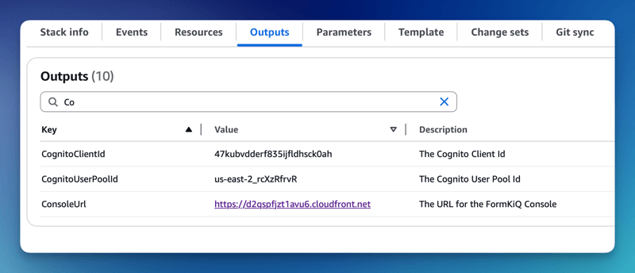
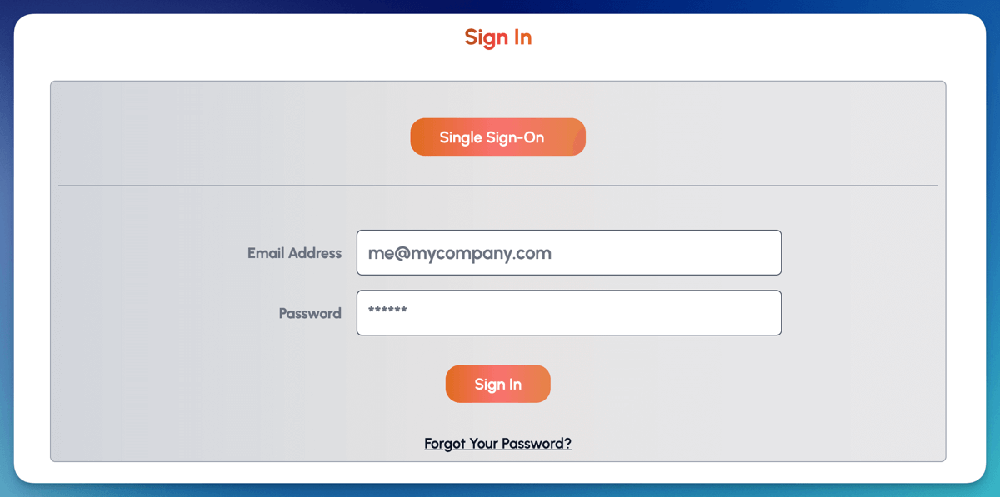

# Amazon Managed Login

This tutorial show you how to connect [Amazon Cognito](https://aws.amazon.com/pm/cognito) to a SAML provider, IE: Microsoft Entra, Okta, etc.

We will be:

* Adding an Identify Provider into [Amazon Cognito](https://aws.amazon.com/pm/cognito)

* Configuring a Cognito Managed login page

## What you’ll need

* A SAML provider (Cognito Identity Provider) already configured for your Amazon Cognito User Pool. 

See tutorials:

* [Microsoft Entra](/docs/tutorials/Identity%20Management/microsoft-entra-id)
* [Okta](/docs/tutorials/Identity%20Management/microsoft-entra-id)

## Pre-requisite

You will need these specific configuration values:

* FormKiQ Console URL

The CognitoUserPoolId and Console URL can be found in the **Outputs** tab of your FormKiQ [CloudFormation](https://console.aws.amazon.com/cloudformation) installation.

## Cognito Managed login

Amazon Cognito Managed login provides a URL connection between Amazon Cognito and SAML provider.

To configure Cognito Managed login, select the **Managed login** link under the **Branding** tab on the Cognito console.

Scroll down to the Styles section and click **Create a style**.

Select the listed **App Client** and click **Create** or create a NEW custom app client.

The Managed login is created. Next, you will need to connect the Managed login to your App Client. Under **Assigned app client**, click the link to take you to your app client configuration.

The next step is to configure your App client to your Identity provider. On the **Login pages** tab, click the **Edit** button.

On the **Edit managed login pages configuration** page, set the following configuration:

**Allowed callback URLs**

* Set the **FormKiQ Console Url** as an allowed callback. This will allow the user to be redirected to the FormKiQ console after a successful login.

**Identity providers**

* Choose **Azure** or **Okta** or the identify provider you created

**OAuth 2.0 grant types**

* Set the OAuth grant type to **Authorization code grant**

**OpenID Connect scopes**

* Select **OpenID, Email, Profile**

Once you save the configuration, you'll see the **View login page** button is now available. This is the link to login to FormKiQ. Make note of the url and you will need to add it to the FormKiQ CloudFormation stack.

## FormKiQ Stack Configuration

Once you have the Cognito login page Url, you will need to update your FormKiQ installation to complete the setup.

Visit the CloudFormation console and select to **Update** your FormKiQ installation stack.

When updating the CloudFormation, you will update the following parameters:

**Cognito Single Sign On Url**

* Set the value to be the **Cognito login page Url**

**SAML Provider**

* Select your SAML Provider, ie: Okta / Entra

**UserPool Tier**

* Cognito requires you to use either **ESSENTIALS** or **PLUS** tier. Select **ESSENTIALS** unless you know you need **PLUS**.

Continue through the stack update process. After it completes, you will see the **Single Sign-On** login button on the FormKiQ console login page, this link will allow you to login through your SSO provider.

## Summary

And there you have it! We have shown how easy it is to connect Cognito Managed login to your SAML provider.

This is just the tip of the iceberg when it comes to working with the FormKiQ APIs.

If you have any questions, reach out to us on our https://github.com/formkiq/formkiq-core or https://formkiq.com.
