# Google Workload Identity Federation

This tutorial shows how to set up [Google Workload Identity Federation](https://cloud.google.com/iam/docs/workload-identity-federation) and connect it to your FormKiQ installation so FormKiQ can access documents in Google Drive.

## What You Will Build

You will create a Google Cloud project, enable the Google Drive API, configure Workload Identity Federation for your AWS account, create a service account, and download the federation configuration used by FormKiQ.

## Before You Begin

- Access to a FormKiQ Advanced or Enterprise installation, including administrative access.
- Administrative access to Google Cloud.
- Your 12-digit AWS account ID.

## Workflow Overview

1. Create a Google Cloud project.
2. Enable Google Drive and identity federation APIs.
3. Create a Workload Identity Pool and AWS provider.
4. Create a Google service account.
5. Grant the workload identity pool access to the service account.
6. Download the configuration for FormKiQ.

## Step 1: Collect Required Values

You will need these specific configuration values:

* AWS Account Id (12 digit number that uniquely identifies your account)

## Step 2: Create a Google Cloud Project

The following steps will create a FormKiQ Google Cloud project and setup a Workload Identity Federation that will give your FormKiQ installation access to your Google docs.

Visit [Google Cloud](https://console.cloud.google.com) and login as administrator

### Create new Google Cloud Project

At the top of the page select the project window and select **New Project**.

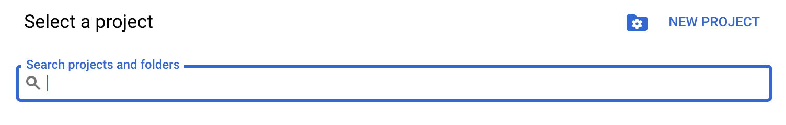

### Configure New Project

Give your project a name and select the organization to place the project in and click **Create**.

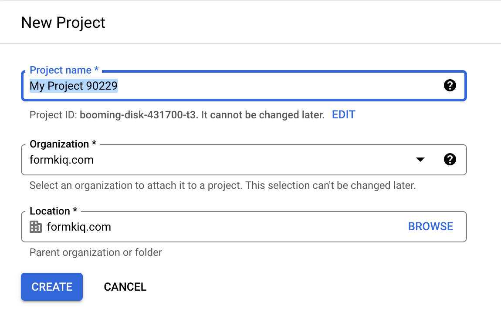

### Select Created Project

Select your project from the notification window.

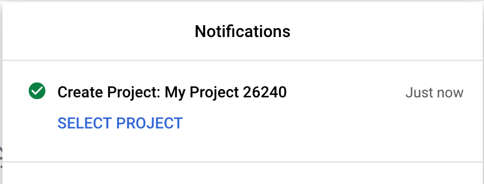

Verify you are in your newly created project from the top menu.

## Step 3: Configure the Google Cloud Project

Now that your project is created, we will now configure the project to allow FormKiQ access usiing Workload Identity Federation.

### Enable API & Services

Using the search menu at the top. Search for **Enable API & Services**.

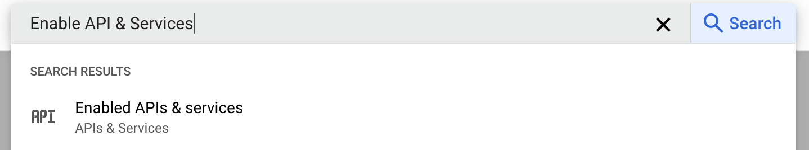

Click the **ENABLE APIS AND SERVICES** button.

Clicking the **ENABLE APIS AND SERVICES** button will bring you to the API Library. Search for the **Google Drive API**.

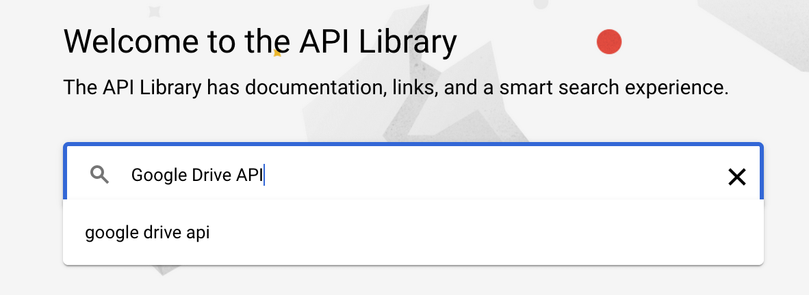

Select the **Google Drive API** search result.

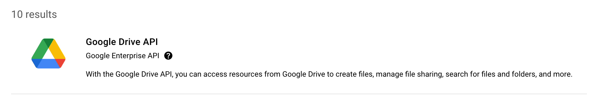

Click the **Enable** button to enable the Google Drive API in this project.

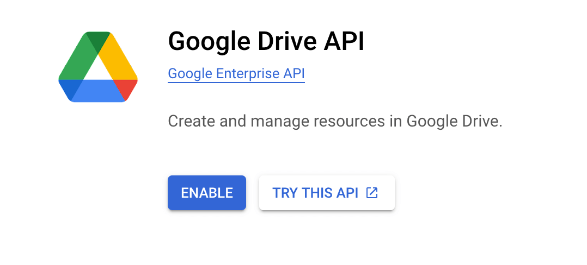

## Step 4: Configure Workload Identity Federation

In this section we will use Google's [workload identity federation with other clouds](https://cloud.google.com/iam/docs/workload-identity-federation-with-other-clouds) to connect the Google Cloud project we created above to our FormKiQ installation.

Start by visiting the [Workload Identity Federation with other clouds](https://cloud.google.com/iam/docs/workload-identity-federation-with-other-clouds) documentation.

### Configure Workload Identity Federation

In the **Configure Workload Identity Federation** part of the documentation:

* Click the **Go to project selector** to make sure the correct project is selected.

* Click the **Enable the APIs** to enable the IAM, Resource Manager, Service Account Credentials, and Security Token Service APIs.

* Scroll down to the [Create the workload identity pool and provider](https://cloud.google.com/iam/docs/workload-identity-federation-with-other-clouds#create_the_workload_identity_pool_and_provider) and click the **Go to New workload provider and pool**.

### New Workload Provider and Pool

To create a new Workload provider, give the workload a name and description and click **Continue**.

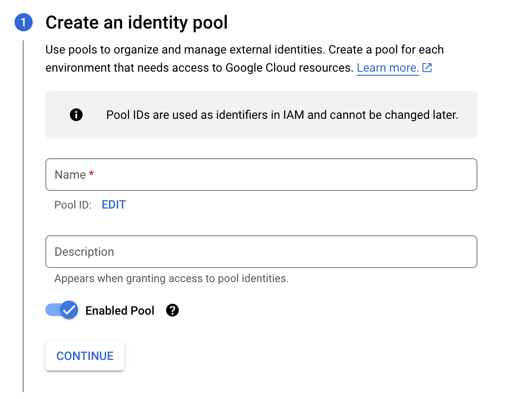

Under Add a provider to pool, select **AWS** provider and give the provider a name and enter in your 12 digit AWS Account Id and click **Continue**.

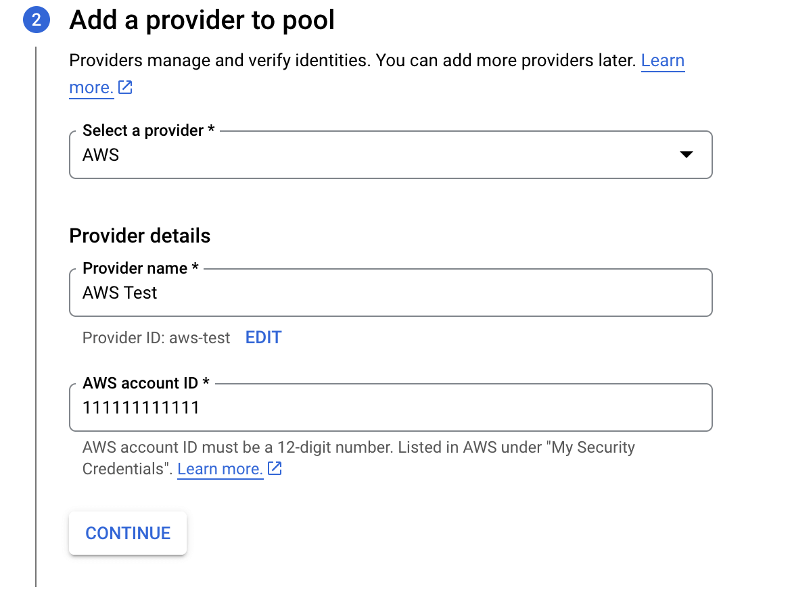

Under **Configure provider attributes**, click the **Edit Mapping**.

The following are the suggested provider attributes configuration to use. The settings below will restrict access to the AWS account configured and to only AWS assumed roles.

| Google 1     | Aws 1  |
|----------|-----|
| google.subject    | assertion.arn     |

| Google 2     | Aws 2  |
|----------|-----|
| attribute.aws_role    | `assertion.arn.extract('assumed-role/{role}/')`     |

| Google 3     | Aws 3  |
|----------|-----|
| attribute.account    | assertion.account     |

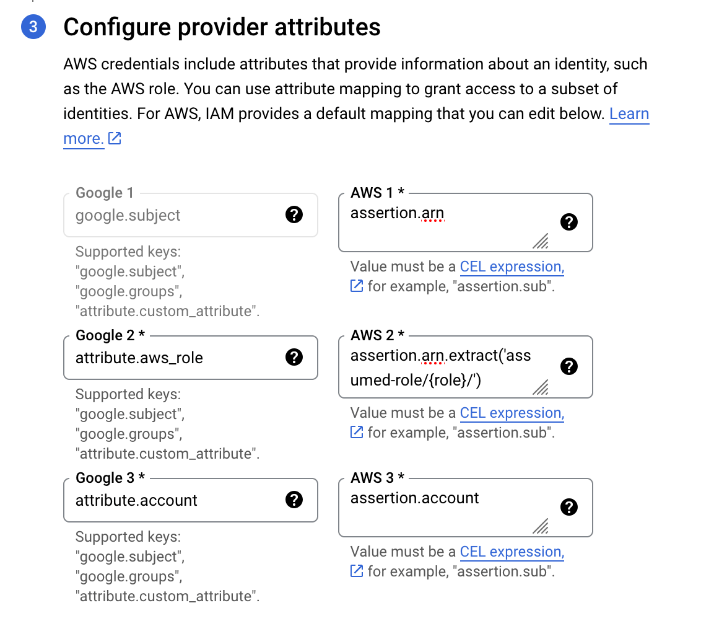

## Step 5: Configure Service Account Impersonation

To provider FormKiQ with access to Google Cloud resources you need to setup a [service account impersonation](https://cloud.google.com/iam/docs/workload-identity-federation-with-other-clouds#impersonation).

Visit the [Service Account Impersonation](https://cloud.google.com/iam/docs/workload-identity-federation-with-other-clouds#impersonation) page.

* Click the **Enable the APIs** to enable the IAM, Security Token Service, and Service Account Credentials APIs.

* Goto the [Create service account](https://console.cloud.google.com/projectselector/iam-admin/serviceaccounts/create?walkthrough_id=iam--create-service-account&_ga=2.242857538.1315701571.1722906016-1293649622.1720794182#step_index=1) page to setup a service account.

### Service account details

From the Service account details page, give the service account a name, account id and description. 

:::note
Record the Email address of the service account as it will be needed later.
:::

Then click **Create and Continue**.

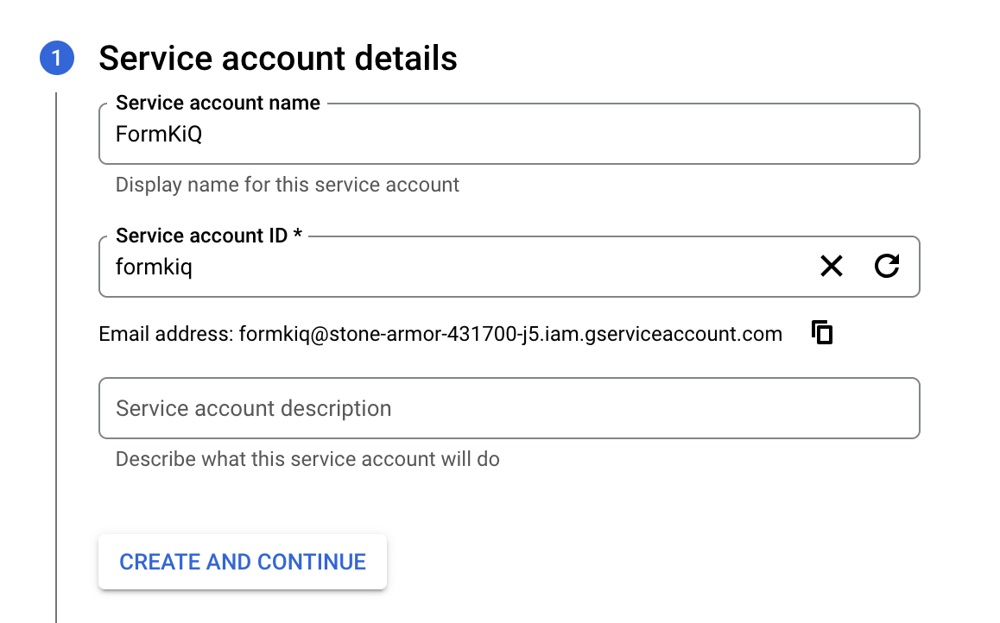

#### Grant this service account access to project

Under the Grant this service account access to project, give the service two roles.

* First role is "Basic" -> "Viewer"

* Second role is "Workload Identity User"

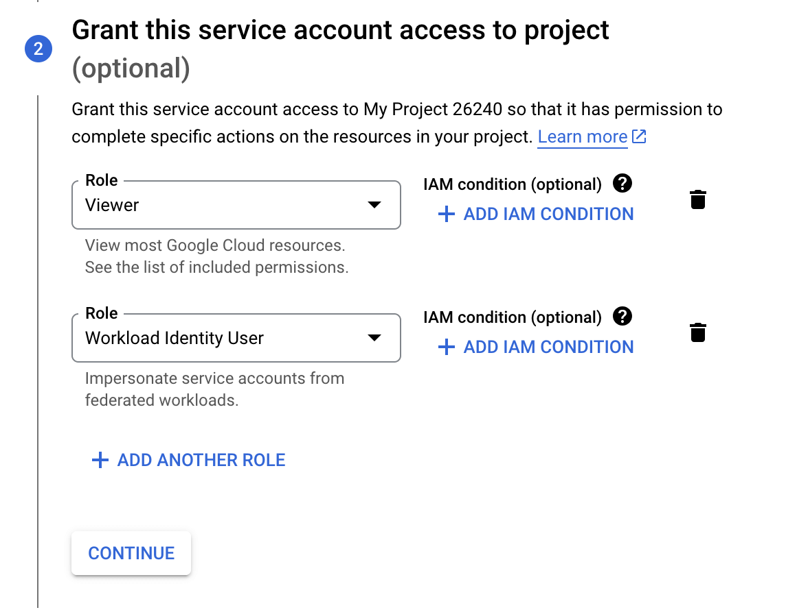

Click **Done** and the service account is configured.

### Workload Identity Federation

Select the **Workload Identity Federation** from the left menu of the IAM & Admin screen.

Select the pool listed and then click the **Grant Access** button.

#### Grant access to service account 

Under the **Grant access to service account**

* Select the **Grant access using Service Account impersonation** option

* Select the Service Account

* Set Attribute Name to **account**

* Set Attribute Value to your 12 digit AWS Account Id.

* Click **SAVE**

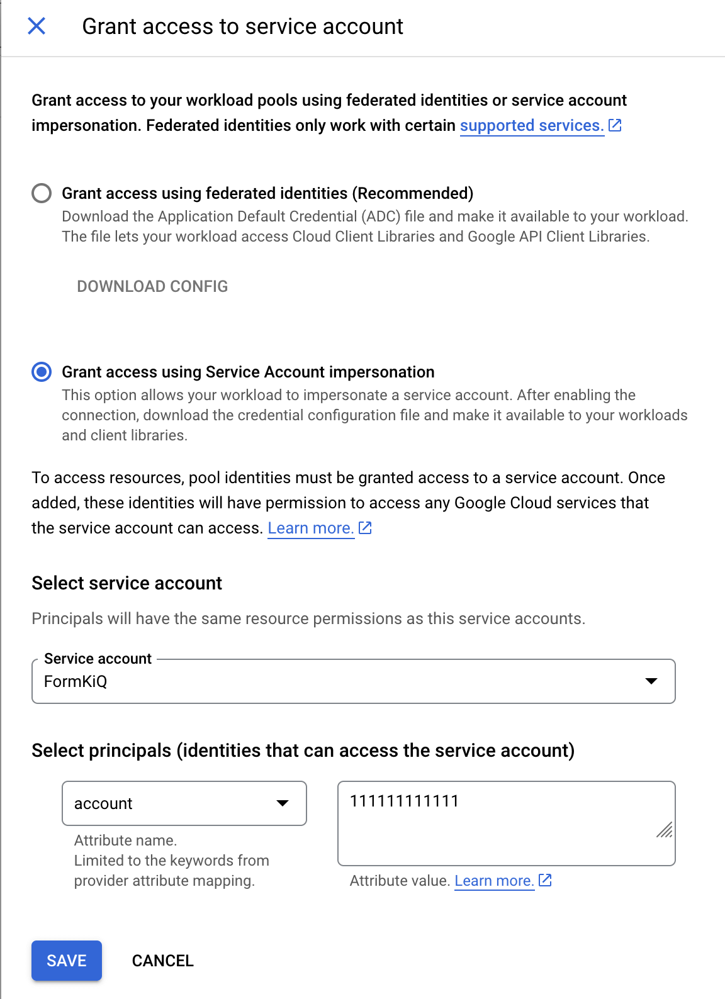

* Finally **Download Config** as this will be used to configure your FormKiQ installation.

## Verify the Result

Confirm that the service account has the expected permissions and that you downloaded the Workload Identity Federation configuration. Use the downloaded configuration when configuring the Google Drive integration in FormKiQ.

## Clean Up

Remove test projects, test service accounts, or temporary identity pools that are no longer needed.

## Troubleshooting

| Problem | Likely cause | What to check |
| --- | --- | --- |
| Google Drive access fails | Google Drive API or required IAM APIs are not enabled. | Confirm all APIs were enabled in the selected project. |
| AWS principal cannot impersonate the service account | Attribute mapping or grant access settings are incorrect. | Confirm AWS account ID, provider attributes, and service account grant. |
| Downloaded config does not work in FormKiQ | Wrong project, pool, provider, or service account was selected. | Re-download the config from the intended Workload Identity Pool. |

## Next Steps

- [Google Workspace](/docs/tutorials/Identity%20Management/google-workspace)
- [Security](/docs/platform/security)
