# Google Workspace

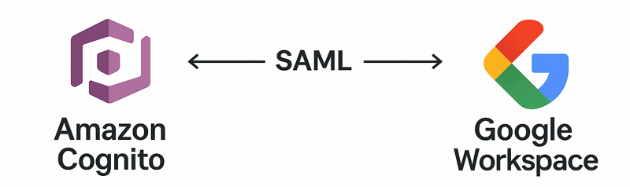

This tutorial shows how to integrate [Google Workspace](https://workspace.google.com) as the identity management provider for your FormKiQ installation.

## What You Will Build

You will create a Google Workspace custom SAML app, map email and group attributes, add the app as an Amazon Cognito SAML identity provider, and prepare Cognito managed login for FormKiQ SSO.

## Before You Begin

- Access to a FormKiQ Advanced or Enterprise installation, including administrative access.
- Administrative access to Google Workspace.
- Access to the AWS account that hosts the FormKiQ Cognito User Pool.
- The FormKiQ `CognitoUserPoolId`, console URL, and Cognito domain.

## Workflow Overview

1. Collect FormKiQ Cognito values.
2. Create a Google Workspace custom SAML app.
3. Configure ACS URL, Entity ID, and SAML attributes.
4. Enable user access and download Google metadata.
5. Add Google Workspace as a Cognito SAML identity provider.
6. Configure Cognito managed login.
7. Verify login from the FormKiQ console.

## Step 1: Collect FormKiQ Cognito Values

You will need these specific configuration values:

* CognitoUserPoolId

* Console URL

* Cognito domain

The CognitoUserPoolId and Console URL can be found in the `Outputs` tab of your FormKiQ [CloudFormation](https://console.aws.amazon.com/cloudformation) installation

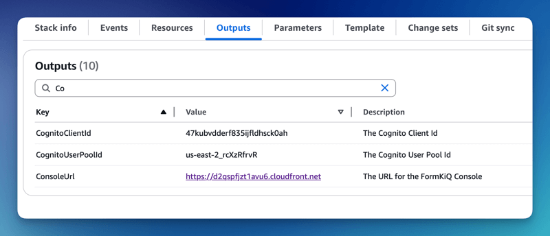

The Cognito domain can be found by clicking on the Cognito User Pool found on the [Cognito Console](https://console.aws.amazon.com/cognito/v2/idp/user-pools).

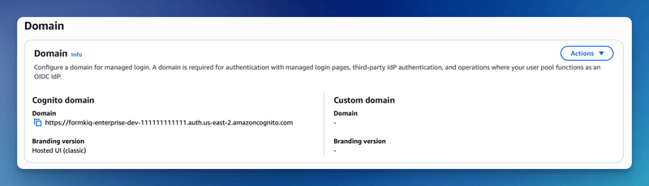

## Step 2: Configure Google Workspace

The next step is to create an Web and mobile apps in Google Workspace. This application will be connected to Amazon Cognito and will provide authentication for the users.

### Add Web and mobile apps

To configure the Web and mobile apps:

* Login into the Google Workspace and select the **Web and Mobile Apps** service

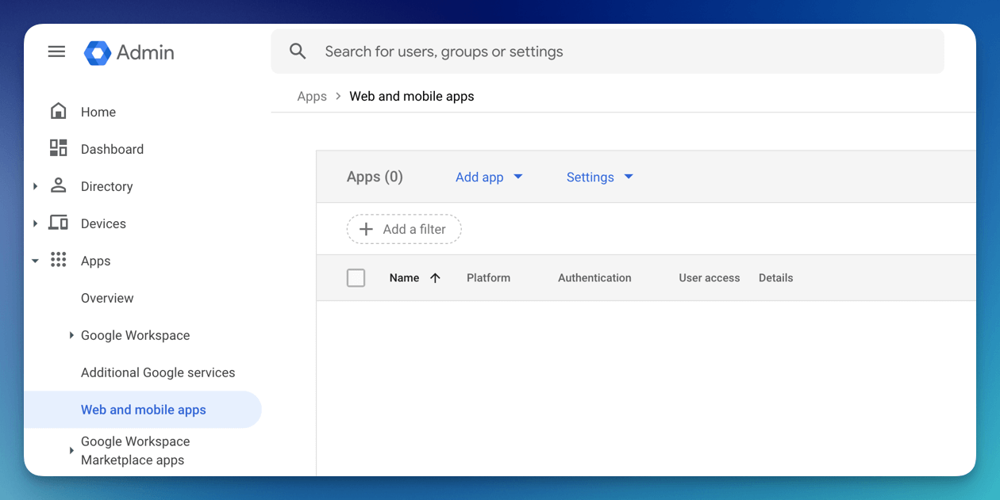

* Select "Add App" from the menu and click **Add custom SAML app**

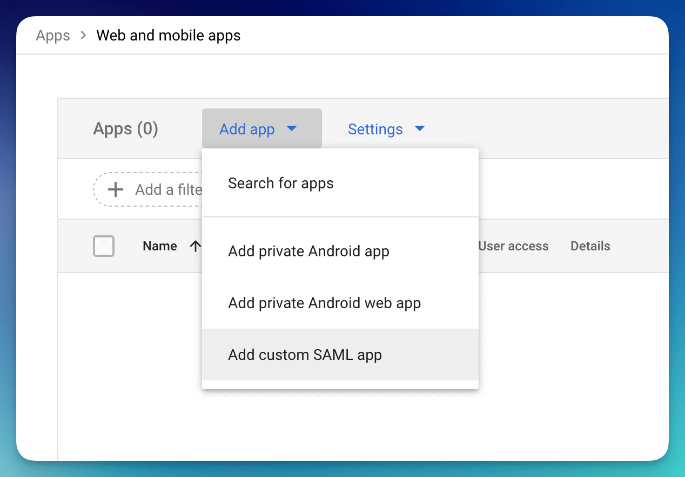

### Single Sign-On configuration

Now configure the SAML application by entering an Application name, description and logo.

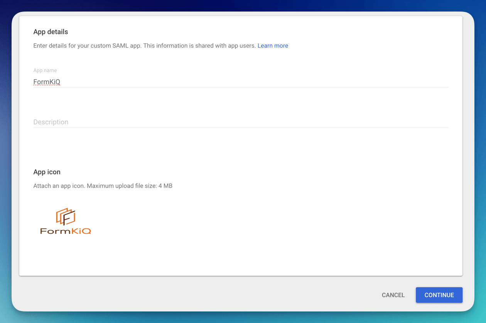

Once the single sign-on is created, you will need to fill in the **ACS URL** and the **Entity ID**.

The ACS URL is: **&lt;Your Cognito Domain&gt;**/saml2/idpresponse, for example:
```
https://formkiq-enterprise-dev-1111111111111.auth.us-east-2.amazoncognito.com/saml2/idpresponse
```

The format of the Identifier (Entity ID) is:

```
urn:amazon:cognito:sp:<CognitoUserPoolId>

eg: urn:amazon:cognito:sp:us-east-2_MEhz4EzAZ
```

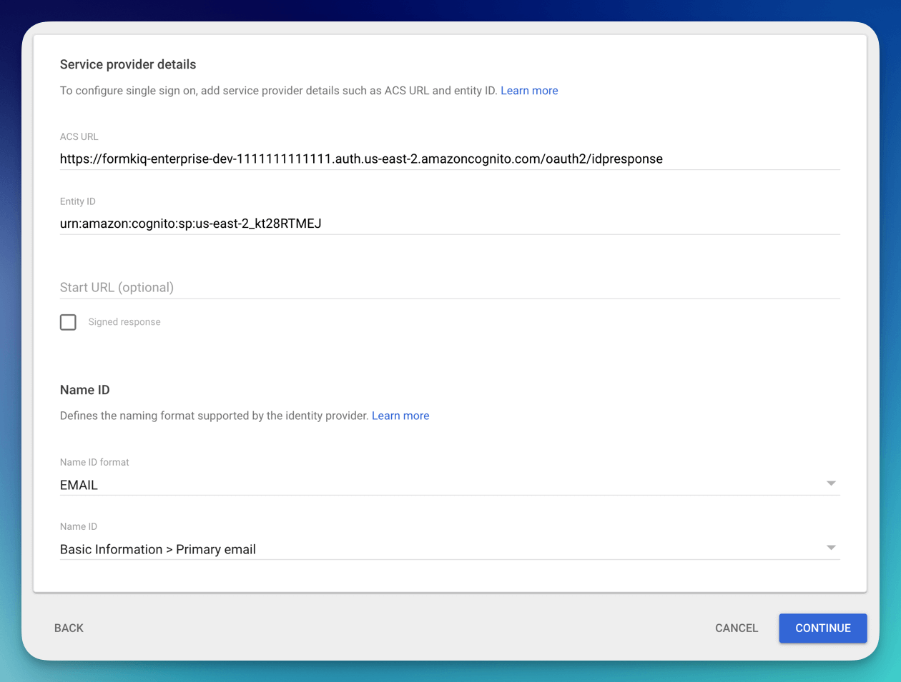

Setup the Primary email with the App attribute of

```
http://schemas.xmlsoap.org/ws/2005/05/identity/claims/emailaddress
```

Under the group membership select all the Group google you want to be part of the access token and set the App attribute to be:

```
http://schemas.microsoft.com/ws/2008/06/identity/claims/groups
```

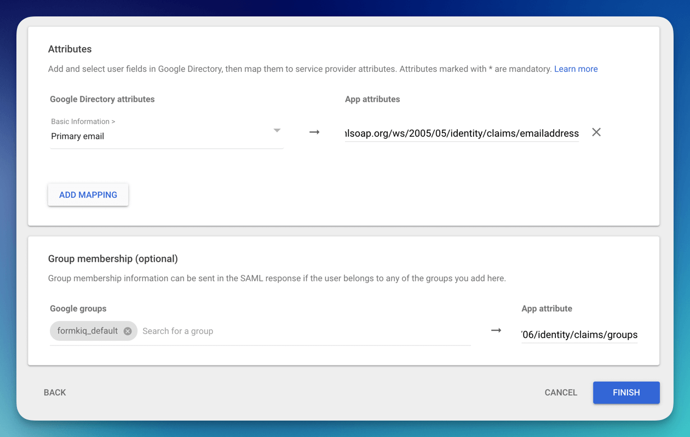

The app is created but **User access** is OFF for everyone. Click the **User access** to enable. Once the **User access** is enabled, make sure to **Download Metadata**, this file will be needed when setting up the Identity Provider in Cognito.

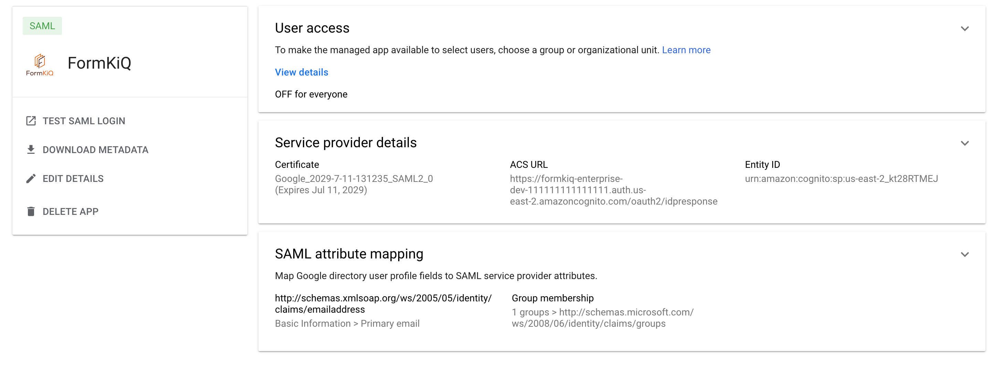

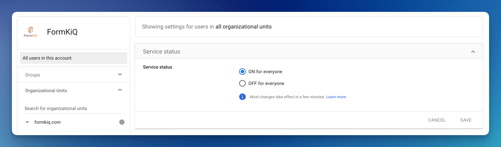

## Step 3: Add the Identity Provider in Amazon Cognito

Now, we will need to configure [Amazon Cognito](https://aws.amazon.com/pm/cognito) to connect to Google Workspace.

### Add Identity Provider 

We need to add [Google Workspace](https://workspace.google.com) as an Identify Provider in [Amazon Cognito](https://aws.amazon.com/pm/cognito).

Open the [AWS Console](https://aws.amazon.com/) and Launch the CloudShell service.

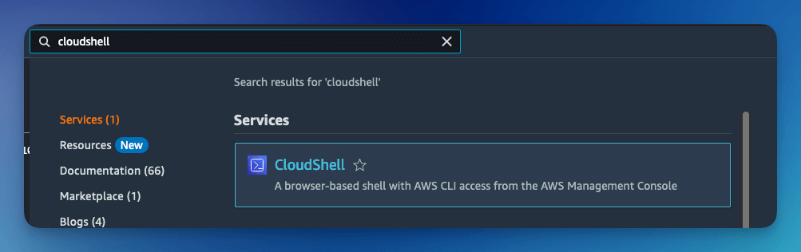

Once the CloudShell command prompt opens, use the AWS CLI to add a custom attribute. This attribute will contain the group claims attribute.

```
aws cognito-idp add-custom-attributes \
--user-pool-id <CognitoUserPoolId> \
--custom-attributes Name=groups,AttributeDataType="String"
```

* Visit the [Amazon Cognito console](https://console.aws.amazon.com/cognito)
* Select the User Pool, and then the **Social and external providers** link
* Click the **Add identity provider**
* Select the **SAML** Identity provider

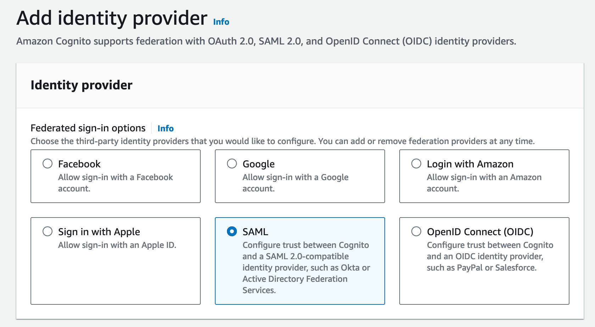

Give the provider a name, such as **googleidp**.

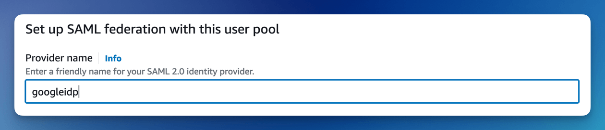

Upload the Metadata document you downloaded from Google Workspace.

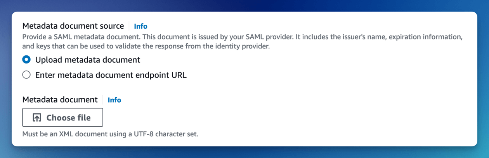

Configure the SAML attributes. 

For the email attribute, set the SAML attribute to

```
http://schemas.xmlsoap.org/ws/2005/05/identity/claims/emailaddress
```

For the custom:groups attribute, set the SAML attribute to

```
http://schemas.microsoft.com/ws/2008/06/identity/claims/groups
```

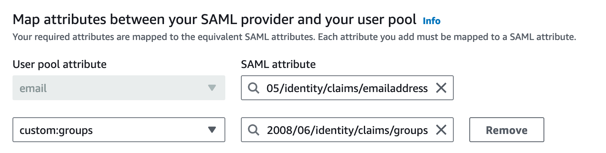

### Cognito Managed login

You now need to configure Amazon Managed login. Amazon Cognito Managed login provides a URL connection between Amazon Cognito and Microsoft Entra ID.

To configure Cognito Managed login, see [Amazon Managed Login](/docs/tutorials/Identity%20Management/cognito-saml-provider) tutorial.

## Verify the Result

Open the FormKiQ console and use the Single Sign-On login option. Confirm the user can authenticate through Google Workspace and receives the expected FormKiQ access based on group membership.

## Clean Up

Remove test users, test group assignments, or temporary SAML applications that are no longer needed.

## Troubleshooting

| Problem | Likely cause | What to check |
| --- | --- | --- |
| Cognito redirects fail | ACS URL or Entity ID is incorrect. | Confirm the ACS URL uses `/saml2/idpresponse` and Entity ID uses the Cognito User Pool ID. |
| User signs in but has wrong access | Group attributes are missing or not enabled. | Confirm group membership attributes and user access for the app. |
| Cognito provider setup fails | Metadata file or user pool ID is incorrect. | Re-download Google metadata and recheck `CognitoUserPoolId`. |

## Next Steps

- [Amazon Managed Login](/docs/tutorials/Identity%20Management/cognito-saml-provider)
- [Security](/docs/platform/security)
