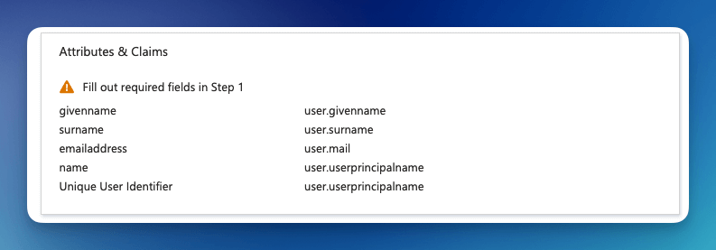
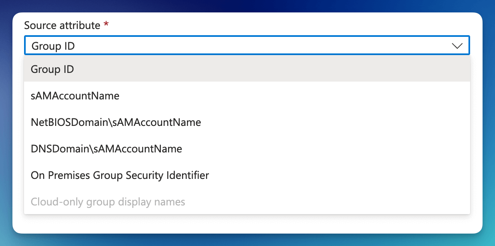
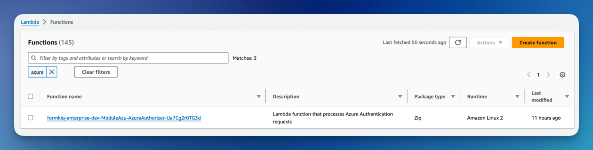
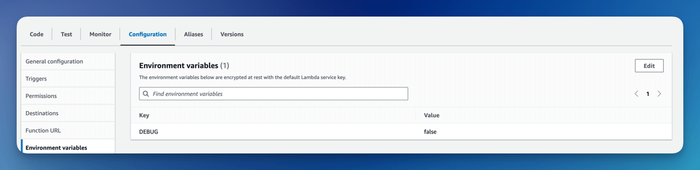

# Microsoft Entra ID


This tutorial show you how to integrate [Microsoft Entra ID](https://www.microsoft.com/en-us/security/business/identity-access/microsoft-entra-id) (formerly known as "Microsoft Azure Active Directory") as the identity management provider for your FormKiQ installation.

We will be:

* Configuring a Enterprise application in Microsoft Entra ID

* Adding an Identify Provider into [Amazon Cognito](https://aws.amazon.com/pm/cognito)

* Mapping Microsoft Entra ID groups to Amazon Cognito groups

## What you’ll need

* Access to a FormKiQ Essentials, Advanced, or Enterprise installation, including administrative access

* Administrative access to a Microsoft Entra ID service

## Pre-requisite

You will need these specific configuration values:

* CognitoUserPoolId

* Console URL

* Cognito domain

The CognitoUserPoolId and Console URL can be found in the **Outputs** tab of your FormKiQ [CloudFormation](https://console.aws.amazon.com/cloudformation) installation


The Cognito domain can be found by clicking on the Cognito User Pool found on the [Cognito Console](https://console.aws.amazon.com/cognito/v2/idp/user-pools). Then under the **Branding** menu, select **Domain**.


## Microsoft Entra ID

The next step is to create an Enterprise application in Microsoft Entra ID. This application will be connected to Amazon Cognito and will provide authentication for the users.

### Add an Azure Enterprise Application

To configure the Enterprise Application:

* Login into the Azure Portal and open the **Microsoft Entra ID** service

* Select **Enterprise applications** from the left menu and click **New application**

* Select **Create your own application**, and give your application a name, and then click **Create**

### Single Sign-On configuration

Now that the application is created, we will be configuring **Single sign-on** using **SAML**.

* Select **Single sign-on** from the menu and then choose the **SAML** single sign-on method


Once the single sign-on is created, you will need to fill in the **Identifier (Entity ID)** and the **Reply URL**.


The format of the Identifier (Entity ID) is:

```
urn:amazon:cognito:sp:<CognitoUserPoolId>

eg: urn:amazon:cognito:sp:us-east-2_MEhz4EzAZ
```

The Reply URL is: **&lt;Your Cognito Domain&gt;**/saml2/idpresponse, for example:
```
https://formkiq-enterprise-dev-1111111111111.auth.us-east-2.amazoncognito.com/saml2/idpresponse
```

### Group Claims

Next, we need to configure the Attributes & Claims for the SAML response. The default attributes will work well, but we will need to add a group claim so FormKiQ knows what access to provide each user.



* Click the **Edit**button

* Click the **Add a group claim**


Here you can configure which groups will be returned with the SAML response.

* Select **Groups assigned to the application**

* Change the Source attribute to **Cloud-only group display names**

:::note
Depending on your Azure subscription level, **Cloud-only group display names** may not be available. If this is the case, see the section [Setup Group ID mapping](/docs/tutorials/Identity%20Management/microsoft-entra-id#manual-group-claims-mapping-optional)
:::

Under the SAML Certificates, make note of the **App Federation Metadata Url**, as that will be needed in the next step.

## Amazon Cognito

Now, we will need to configure [Amazon Cognito](https://aws.amazon.com/pm/cognito) to connect to [Microsoft Entra ID](https://www.microsoft.com/en-us/security/business/identity-access/microsoft-entra-id).

### Add Identity Provider 

We need to add [Microsoft Entra ID](https://www.microsoft.com/en-us/security/business/identity-access/microsoft-entra-id) as an Identify Provider in [Amazon Cognito](https://aws.amazon.com/pm/cognito).


Open the [AWS Console](https://aws.amazon.com/) and Launch the CloudShell service.


Once the CloudShell command prompt opens, use the AWS CLI to add a custom attribute. This attribute will contain the group claims attribute.

```
aws cognito-idp add-custom-attributes \
--user-pool-id <CognitoUserPoolId> \
--custom-attributes Name=groups,AttributeDataType="String"
```

Once again, using the AWS CLI, create the SAML identify provider:

```
aws cognito-idp create-identity-provider \
--user-pool-id <CognitoUserPoolId> \
--provider-name=azureidp \
--provider-type SAML \
--provider-details MetadataURL=<App Federation Metadata Url> \
--attribute-mapping email=http://schemas.xmlsoap.org/ws/2005/05/identity/claims/emailaddress,custom:groups=http://schemas.microsoft.com/ws/2008/06/identity/claims/groups
```

### Cognito Managed login

You now need to configure Amazon Managed login. Amazon Cognito Managed login provides a URL connection between Amazon Cognito and Microsoft Entra ID.

To configure Cognito Managed login, see [Amazon Managed Login](/docs/tutorials/Identity%20Management/cognito-saml-provider) tutorial.


## Manual Group Claims Mapping (optional)

When configuring Group Claims in Entra, if you are unable to select the **Cloud-only group display names** because of your configuration or your account settings, Azure will send the Group ID instead of the Group Name. The FormKiQ Pre token generation trigger can be configured to map the Group ID to the correct Group Name.



The Pre token generation trigger Lambda function supports adding a **ROLE_MAPPING** environment variable that can map the Group ID to Group Name.

To configure the **ROLE_MAPPING** environment variable:

First, find goto the [Lambda console](https://console.aws.amazon.com/lambda/home) and search for the **azure** Lambda function.



Click on the Lambda function and select the **Configuration** tab.



To create the role mapping, add an environment variable named **ROLE_MAPPING**. The value is a JSON map, where the key is the Group Id and the value is the Group Name.

```
{  "aeb95a45-e83f-47a1-b319-717733831892":"student",
   "9bab91c3-4758-41e9-988a-2645c898ffed":"formkiq_default"
}
```

:::note
* (asterisk) can be used as the Group Id to indicate all groups
:::


## Summary

And there you have it! We have shown how easy it is to use Microsoft Entra ID as your authentication provider.

This is just the tip of the iceberg when it comes to working with the FormKiQ APIs.

If you have any questions, reach out to us on our https://github.com/formkiq/formkiq-core or https://formkiq.com.
