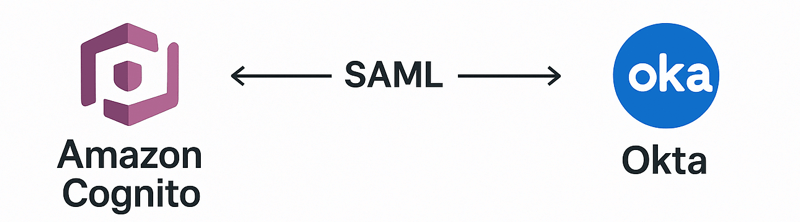
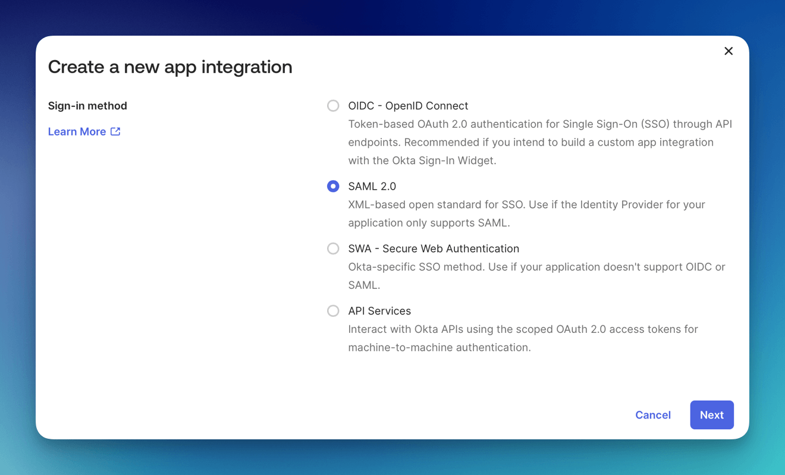
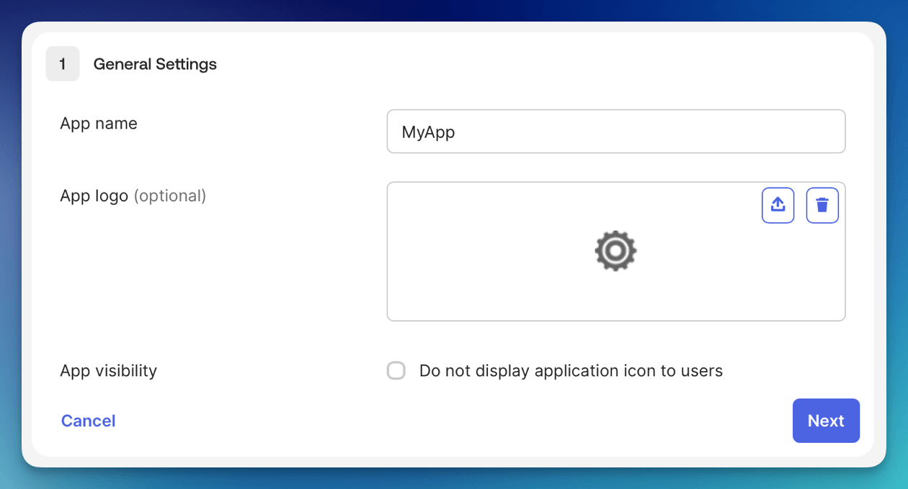
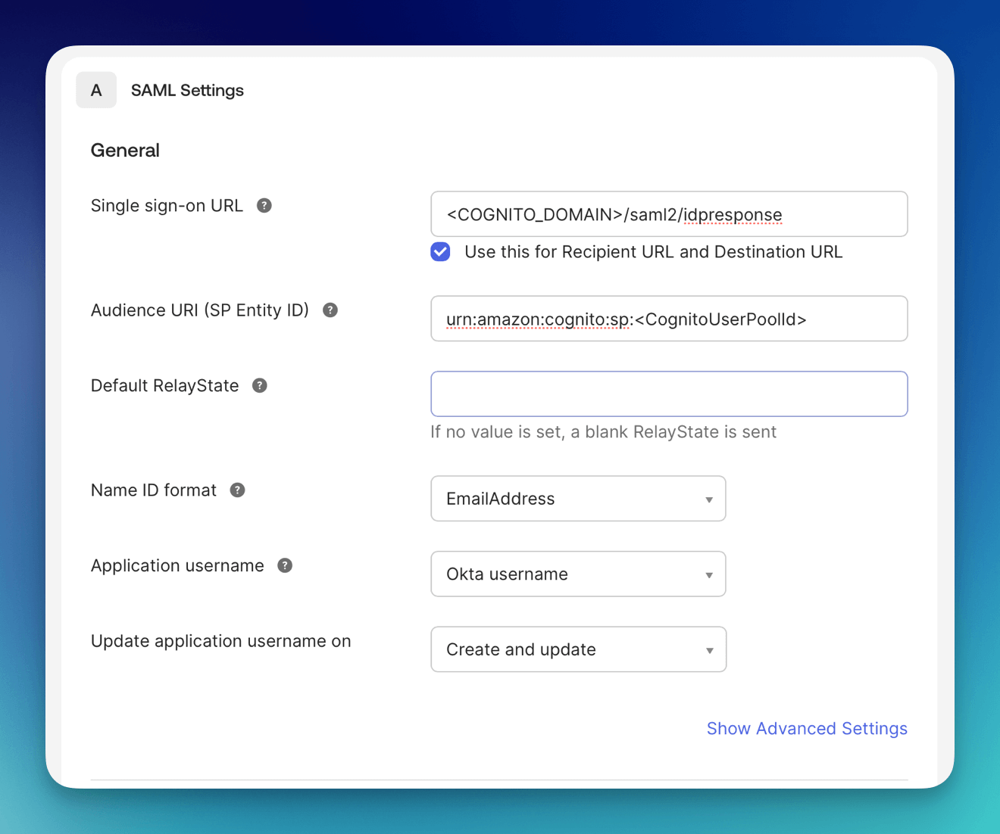
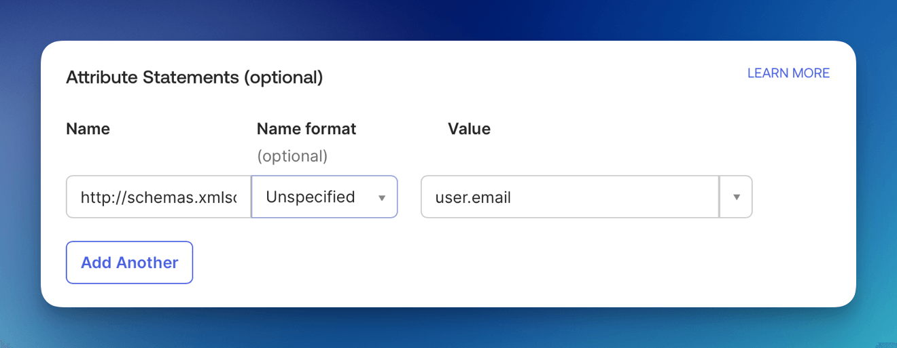
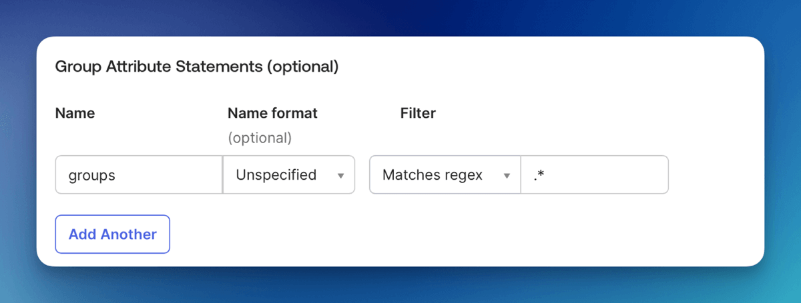
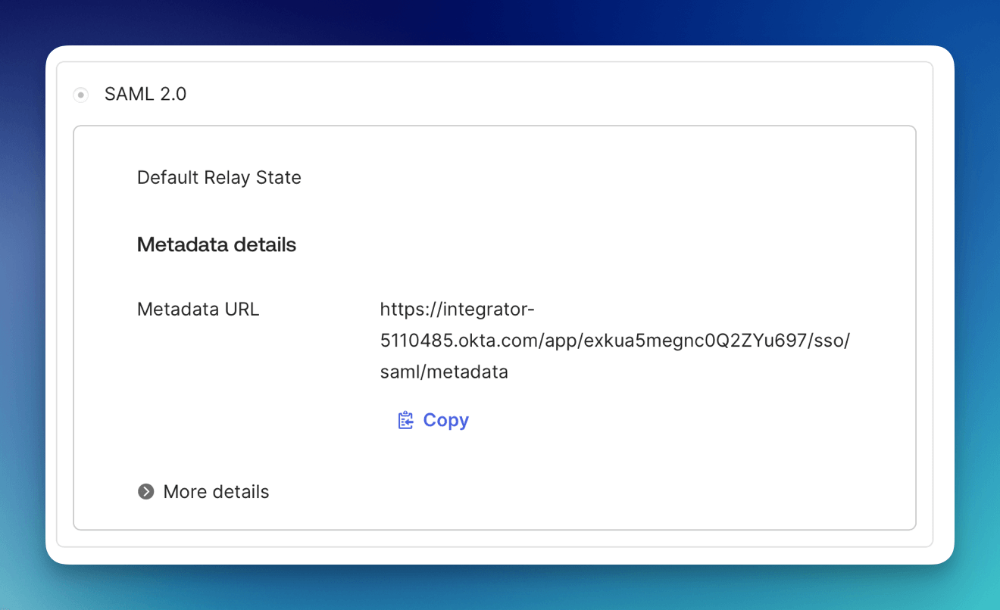
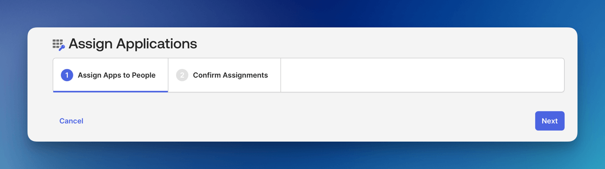

# Okta



This tutorial show you how to integrate [Okta](https://okta.com) as the identity management provider for your FormKiQ installation.

We will be:

* Configuring a Enterprise application in Microsoft Entra ID

* Adding an Identify Provider into [Amazon Cognito](https://aws.amazon.com/pm/cognito)

* Mapping Microsoft Entra ID groups to Amazon Cognito groups

## What you’ll need

* Access to a FormKiQ Essentials, Advanced, or Enterprise installation, including administrative access

* Administrative access to a Microsoft Entra ID service

## Pre-requisite

You will need these specific configuration values:

* CognitoUserPoolId

* Console URL

* Cognito domain

The CognitoUserPoolId and Console URL can be found in the **Outputs** tab of your FormKiQ [CloudFormation](https://console.aws.amazon.com/cloudformation) installation


The Cognito domain can be found by clicking on the Cognito User Pool found on the [Cognito Console](https://console.aws.amazon.com/cognito/v2/idp/user-pools). Then under the **Branding** menu, select **Domain**.


## Add Application

The next step is to create an application in Okta. This application will be connected to Amazon Cognito and will provide authentication for the users.

To add an Application:

* Login into the Okta Portal and click the **Applications** on the left menu

* Select **Create App Integration** button

* Select **SAML 2.0** integration

* Click **Next**



* Set the App Name

* Click **Next**



* Set the Single sign-on URL is: **&lt;Your Cognito Domain&gt;**/saml2/idpresponse, for example:

```
https://formkiq-enterprise-dev-1111111111111.auth.us-east-2.amazoncognito.com/saml2/idpresponse
```

* Set the Audience URI using:

```
urn:amazon:cognito:sp:<CognitoUserPoolId>

eg: urn:amazon:cognito:sp:us-east-2_MEhz4EzAZ
```

* Set Name ID format to **EmailAddress**




* Under Attributes Statements Set

  * **Name**: http://schemas.xmlsoap.org/ws/2005/05/identity/claims/emailaddress

  * **Value**: user.email



* Under Group Attribute Statements Set

  * **Name**: groups

  * **Filter**: Matches regex

  * **Filter Value**: .*



## Metadata URL

Under the **Sign On** tab of the application, you can get the **Metadata URL**. It will be needed to connect Okta to Cognito in the steps below.



## Users / Groups

When you create an Okta Application integration, one of the essential steps is assigning users or groups to the application. By default, new integrations are not accessible to anyone until assignments are explicitly made. To assign users use the **Assign Users To App** button.



## Amazon Cognito

Now, we will need to configure [Amazon Cognito](https://aws.amazon.com/pm/cognito) to connect to Okta.

### Add Identity Provider 

We need to add Okta as an Identify Provider in [Amazon Cognito](https://aws.amazon.com/pm/cognito).

Open the [AWS Console](https://aws.amazon.com/) and Launch the CloudShell service.


Once the CloudShell command prompt opens, use the AWS CLI to add a custom attribute. This attribute will contain the group claims attribute.

```
aws cognito-idp add-custom-attributes \
--user-pool-id <CognitoUserPoolId> \
--custom-attributes Name=groups,AttributeDataType="String"
```

Once again, using the AWS CLI, create the SAML identify provider:

```
aws cognito-idp create-identity-provider \
--user-pool-id <CognitoUserPoolId> \
--provider-name=oktaidp \
--provider-type SAML \
--provider-details MetadataURL=<SAML Metadata Url> \
--attribute-mapping email=http://schemas.xmlsoap.org/ws/2005/05/identity/claims/emailaddress,custom:groups=groups
```

### Cognito Managed login

You now need to configure Amazon Managed login. Amazon Cognito Managed login provides a URL connection between Amazon Cognito and Okta.

To configure Cognito Managed login, see [Amazon Managed Login](/docs/tutorials/Identity%20Management/cognito-saml-provider) tutorial.


## Summary

And there you have it! We have shown how easy it is to use Okta as your authentication provider.

This is just the tip of the iceberg when it comes to working with the FormKiQ APIs.

If you have any questions, reach out to us on our https://github.com/formkiq/formkiq-core or https://formkiq.com.
