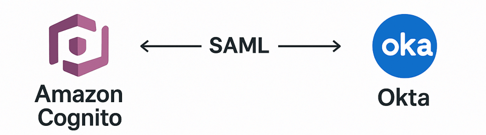
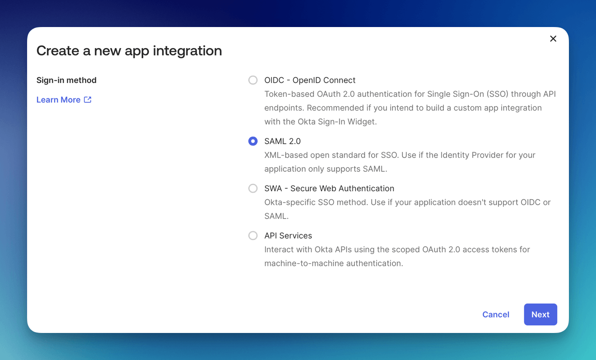
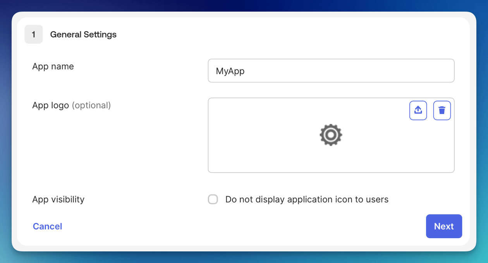
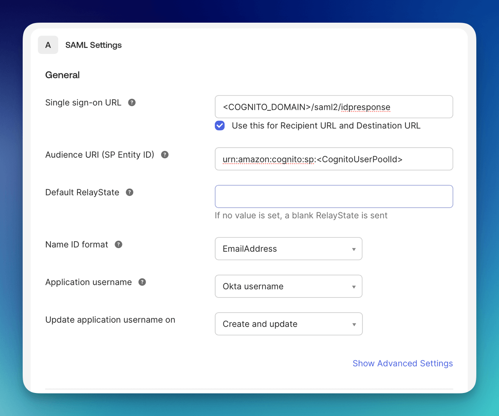
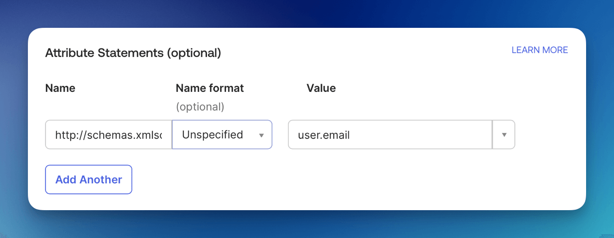
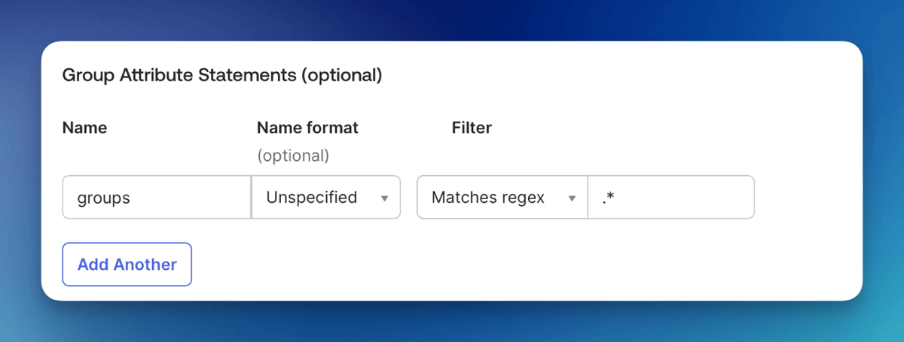
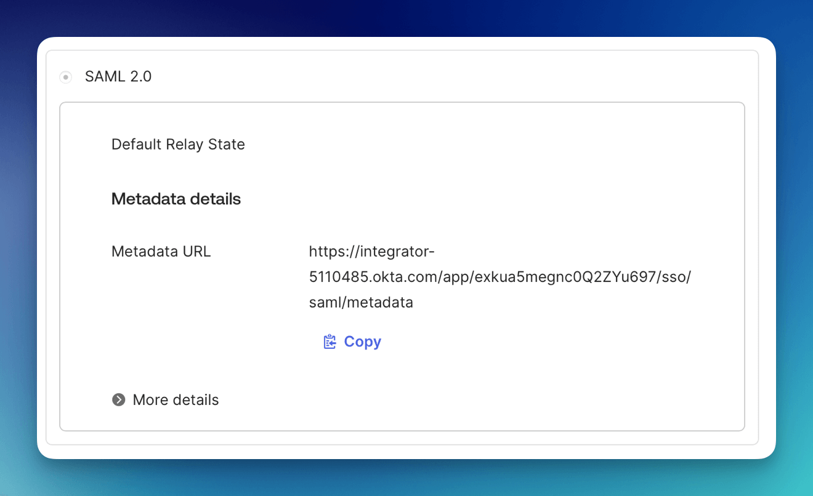
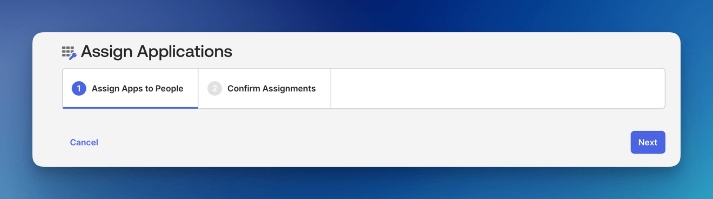

# Okta



This tutorial shows how to integrate [Okta](https://okta.com) as the identity management provider for your FormKiQ installation.

## What You Will Build

You will create an Okta SAML application, configure Amazon Cognito as the service provider, map email and group attributes, and connect Okta to FormKiQ through Cognito.

## Before You Begin

- Access to a FormKiQ Essentials, Advanced, or Enterprise installation, including administrative access.
- Administrative access to Okta.
- Access to the AWS account that hosts the FormKiQ Cognito User Pool.
- The FormKiQ `CognitoUserPoolId`, console URL, and Cognito domain.

## Workflow Overview

1. Collect FormKiQ Cognito values.
2. Create an Okta SAML app integration.
3. Configure SAML URLs and group attributes.
4. Assign users or groups to the Okta app.
5. Add Okta as a Cognito SAML identity provider.
6. Configure Cognito managed login.
7. Verify login from the FormKiQ console.

## Step 1: Collect FormKiQ Cognito Values

You will need these specific configuration values:

* CognitoUserPoolId

* Console URL

* Cognito domain

The CognitoUserPoolId and Console URL can be found in the **Outputs** tab of your FormKiQ [CloudFormation](https://console.aws.amazon.com/cloudformation) installation


The Cognito domain can be found by clicking on the Cognito User Pool found on the [Cognito Console](https://console.aws.amazon.com/cognito/v2/idp/user-pools). Then under the **Branding** menu, select **Domain**.


## Step 2: Add an Okta Application

The next step is to create an application in Okta. This application will be connected to Amazon Cognito and will provide authentication for the users.

To add an Application:

* Login into the Okta Portal and click the **Applications** on the left menu

* Select **Create App Integration** button

* Select **SAML 2.0** integration

* Click **Next**



* Set the App Name

* Click **Next**



* Set the Single sign-on URL is: **&lt;Your Cognito Domain&gt;**/saml2/idpresponse, for example:

```
https://formkiq-enterprise-dev-1111111111111.auth.us-east-2.amazoncognito.com/saml2/idpresponse
```

* Set the Audience URI using:

```
urn:amazon:cognito:sp:<CognitoUserPoolId>

eg: urn:amazon:cognito:sp:us-east-2_MEhz4EzAZ
```

* Set Name ID format to **EmailAddress**




* Under Attributes Statements Set

  * **Name**: http://schemas.xmlsoap.org/ws/2005/05/identity/claims/emailaddress

  * **Value**: user.email



* Under Group Attribute Statements Set

  * **Name**: groups

  * **Filter**: Matches regex

  * **Filter Value**: .*



## Step 3: Copy the Metadata URL

Under the **Sign On** tab of the application, you can get the **Metadata URL**. It will be needed to connect Okta to Cognito in the steps below.



## Step 4: Assign Users or Groups

When you create an Okta Application integration, one of the essential steps is assigning users or groups to the application. By default, new integrations are not accessible to anyone until assignments are explicitly made. To assign users use the **Assign Users To App** button.



## Step 5: Add the Identity Provider in Amazon Cognito

Now, we will need to configure [Amazon Cognito](https://aws.amazon.com/pm/cognito) to connect to Okta.

### Add Identity Provider 

We need to add Okta as an Identify Provider in [Amazon Cognito](https://aws.amazon.com/pm/cognito).

Open the [AWS Console](https://aws.amazon.com/) and Launch the CloudShell service.


Once the CloudShell command prompt opens, use the AWS CLI to add a custom attribute. This attribute will contain the group claims attribute.

```
aws cognito-idp add-custom-attributes \
--user-pool-id <CognitoUserPoolId> \
--custom-attributes Name=groups,AttributeDataType="String"
```

Once again, using the AWS CLI, create the SAML identify provider:

```
aws cognito-idp create-identity-provider \
--user-pool-id <CognitoUserPoolId> \
--provider-name=oktaidp \
--provider-type SAML \
--provider-details MetadataURL=<SAML Metadata Url> \
--attribute-mapping email=http://schemas.xmlsoap.org/ws/2005/05/identity/claims/emailaddress,custom:groups=groups
```

### Cognito Managed login

You now need to configure Amazon Managed login. Amazon Cognito Managed login provides a URL connection between Amazon Cognito and Okta.

To configure Cognito Managed login, see [Amazon Managed Login](/docs/tutorials/Identity%20Management/cognito-saml-provider) tutorial.


## Verify the Result

Open the FormKiQ console and use the Single Sign-On login option. Confirm the user can authenticate through Okta and receives the expected FormKiQ access based on group membership.

## Clean Up

Remove test users, test app assignments, or temporary SAML applications that are no longer needed.

## Troubleshooting

| Problem | Likely cause | What to check |
| --- | --- | --- |
| Cognito redirects fail | Single sign-on URL or Audience URI is incorrect. | Confirm the URL uses `/saml2/idpresponse` and the Audience URI uses the Cognito User Pool ID. |
| User signs in but has wrong access | Okta groups are missing from the SAML assertion. | Confirm group attribute statement `groups` and app assignments. |
| Cognito provider creation fails | Metadata URL or user pool ID is incorrect. | Recheck the Okta Metadata URL and `CognitoUserPoolId`. |

## Next Steps

- [Amazon Managed Login](/docs/tutorials/Identity%20Management/cognito-saml-provider)
- [Security](/docs/platform/security)
