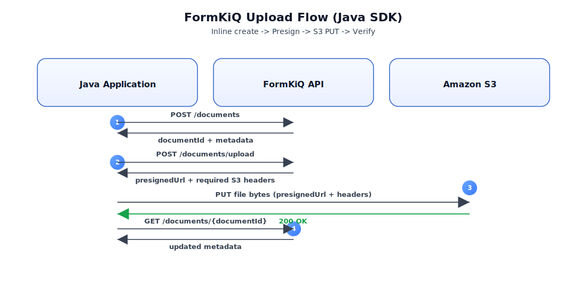

# Java SDK



## What You Will Build

This quickstart shows how to use the [FormKiQ Java Client SDK](https://github.com/formkiq/formkiq-client-sdk-java/) with the FormKiQ Documents API.

You will:

- Configure a Java SDK client
- Create a small inline document
- Retrieve document metadata
- Request a presigned S3 upload URL
- Upload file bytes directly to S3
- Verify the uploaded document

This walkthrough uses JWT authentication. If you need a token, see [JWT Authentication Token](/docs/how-tos/jwt-authentication-token).

## Before You Begin

- Java 8 or later
- Maven 3.8.3 or later, or Gradle 7.2 or later
- A FormKiQ API base URL
- A valid JWT access token, not an ID token
- A `siteId`, or `default` if your deployment does not use multiple sites
- Network access to the FormKiQ API and Amazon S3

## Workflow Overview

1. Install the Java SDK.
2. Configure the SDK client with your API URL and JWT access token.
3. Create a small inline document.
4. Retrieve document metadata.
5. Request a presigned S3 upload URL.
6. Upload file bytes to S3.
7. Verify the uploaded document metadata.

## Step 1: Install the SDK

For Maven projects, add the SDK dependency:

```xml
<dependency>
  <groupId>com.formkiq</groupId>
  <artifactId>client</artifactId>
  <version>1.18.1</version>
</dependency>
```

For Gradle projects:

```groovy
dependencies {
  implementation "com.formkiq:client:1.18.1"
}
```

:::tip
Use the latest SDK version that matches your FormKiQ API version. If the version you need is not available from your configured Maven repositories, clone the [Java SDK repository](https://github.com/formkiq/formkiq-client-sdk-java/) and run `mvn clean install` to install it locally.
:::

Set the environment variables used by the examples:

```bash
export FORMKIQ_API_URL="https://your-formkiq-api.example.com"
export JWT="REPLACE_WITH_ACCESS_TOKEN"
export SITE_ID="default"
```

:::warning
Use a JWT access token. An ID token will not authorize FormKiQ API calls.
:::

## Step 2: Configure the Client

Import the SDK and create a configured `DocumentsApi` client.

```java
import com.formkiq.client.api.DocumentsApi;
import com.formkiq.client.invoker.ApiClient;
import com.formkiq.client.invoker.ApiException;
import com.formkiq.client.invoker.Configuration;
import com.formkiq.client.invoker.models.AddDocumentRequest;
import com.formkiq.client.invoker.models.AddDocumentResponse;
import com.formkiq.client.invoker.models.AddDocumentUploadRequest;
import com.formkiq.client.invoker.models.GetDocumentResponse;
import com.formkiq.client.invoker.models.GetDocumentUrlResponse;

import java.io.OutputStream;
import java.net.HttpURLConnection;
import java.net.URL;
import java.nio.file.Files;
import java.nio.file.Path;
import java.util.Map;

public class FormKiQJavaSdkExample {

  private static final String FORMKIQ_API_URL = requireEnv("FORMKIQ_API_URL");
  private static final String JWT_ACCESS_TOKEN = requireEnv("JWT");
  private static final String SITE_ID = System.getenv().getOrDefault("SITE_ID", "default");

  private static DocumentsApi buildDocumentsApi() {
    ApiClient apiClient = Configuration.getDefaultApiClient();
    apiClient.setBasePath(FORMKIQ_API_URL);
    apiClient.addDefaultHeader("Authorization", "Bearer " + JWT_ACCESS_TOKEN);
    return new DocumentsApi(apiClient);
  }

  private static String requireEnv(String key) {
    String value = System.getenv(key);
    if (value == null || value.isBlank()) {
      throw new IllegalStateException(key + " is required");
    }
    return value;
  }
```

If you are using Java 8, replace `value.isBlank()` with `value.trim().isEmpty()`.

## Step 3: Create an Inline Document

Use `addDocument` for small documents where sending content through the API is appropriate.

```java
  private static String addInlineDocument(DocumentsApi api, String siteId) throws ApiException {
    AddDocumentRequest request = new AddDocumentRequest()
        .path("inbox/hello.txt")
        .contentType("text/plain")
        .content("Hello World");

    AddDocumentResponse response = api.addDocument(request, siteId, null);
    String documentId = response.getDocumentId();

    if (documentId == null || documentId.isEmpty()) {
      throw new IllegalStateException("Missing documentId in addDocument response");
    }

    return documentId;
  }
```

## Step 4: Retrieve Document Metadata

Use `getDocument` to retrieve the document record.

```java
  private static GetDocumentResponse getDocumentMetadata(
      DocumentsApi api,
      String siteId,
      String documentId
  ) throws ApiException {
    return api.getDocument(documentId, siteId, null);
  }
```

## Step 5: Upload a Larger File

For larger files, request a presigned S3 upload URL. This sends file bytes directly to S3 instead of sending them through the FormKiQ API.

```java
  private static GetDocumentUrlResponse requestPresignedUpload(
      DocumentsApi api,
      String siteId,
      String destPath,
      String contentType,
      int contentLength
  ) throws ApiException {
    AddDocumentUploadRequest request = new AddDocumentUploadRequest()
        .path(destPath)
        .contentType(contentType);

    GetDocumentUrlResponse response = api.addDocumentUpload(
        request,
        siteId,
        contentLength,
        null,
        null
    );

    if (response.getDocumentId() == null || response.getDocumentId().isEmpty()) {
      throw new IllegalStateException("Missing documentId in addDocumentUpload response");
    }

    if (response.getUrl() == null || response.getUrl().isEmpty()) {
      throw new IllegalStateException("Missing url in addDocumentUpload response");
    }

    return response;
  }
```

:::warning
When the presigned upload response includes headers, send those headers exactly as returned. Omitting or changing required headers can cause Amazon S3 to reject the upload.
:::

Upload the file bytes with HTTP `PUT`:

```java
  private static void s3PutBytes(
      String url,
      byte[] bytes,
      String contentType,
      Map<String, Object> returnedHeaders
  ) throws Exception {
    HttpURLConnection connection = (HttpURLConnection) new URL(url).openConnection();
    connection.setRequestMethod("PUT");
    connection.setDoOutput(true);
    connection.setRequestProperty("Content-Type", contentType);

    if (returnedHeaders != null) {
      for (Map.Entry<String, Object> header : returnedHeaders.entrySet()) {
        connection.setRequestProperty(header.getKey(), String.valueOf(header.getValue()));
      }
    }

    try (OutputStream outputStream = connection.getOutputStream()) {
      outputStream.write(bytes);
    }

    int status = connection.getResponseCode();
    if (status < 200 || status >= 300) {
      throw new IllegalStateException("S3 upload failed with HTTP status " + status);
    }
  }
```

## Step 6: Run the Example

This example creates one inline document, uploads one local file through S3, and retrieves metadata for both documents.

```java
  public static void main(String[] args) throws Exception {
    System.out.println("Using API: " + FORMKIQ_API_URL);
    DocumentsApi api = buildDocumentsApi();

    System.out.println("\nStep 1: Create an inline document");
    String inlineDocumentId = addInlineDocument(api, SITE_ID);
    System.out.println("Inline documentId: " + inlineDocumentId);

    System.out.println("\nStep 2: Retrieve inline document metadata");
    System.out.println(getDocumentMetadata(api, SITE_ID, inlineDocumentId));

    Path uploadLocalPath = Path.of("example.txt");
    String uploadDestPath = "examples/example.txt";
    String uploadContentType = "text/plain";
    byte[] fileBytes = Files.readAllBytes(uploadLocalPath);

    System.out.println("\nStep 3: Request a presigned S3 upload URL");
    GetDocumentUrlResponse presign = requestPresignedUpload(
        api,
        SITE_ID,
        uploadDestPath,
        uploadContentType,
        fileBytes.length
    );
    System.out.println("Upload documentId: " + presign.getDocumentId());

    System.out.println("\nStep 4: Upload bytes directly to S3");
    s3PutBytes(presign.getUrl(), fileBytes, uploadContentType, presign.getHeaders());
    System.out.println("Upload complete");

    System.out.println("\nStep 5: Verify uploaded document metadata");
    System.out.println(getDocumentMetadata(api, SITE_ID, presign.getDocumentId()));
  }
}
```

For Java 8, replace `Path.of("example.txt")` with `Paths.get("example.txt")` and add `import java.nio.file.Paths;`.

## Verify the Result

Confirm that the program prints two document IDs and metadata for both documents. In the FormKiQ console, the uploaded document should appear at `examples/example.txt` in the selected site.

## Clean Up

Delete the test documents from the FormKiQ console or API if you do not want to keep them in your environment.

## Troubleshooting

### 401 Unauthorized

The JWT is missing, expired, or is not an access token. Confirm `JWT` is set and the SDK sends `Authorization: Bearer <token>`.

### 403 Forbidden

The token is valid, but the caller does not have access to the requested `siteId` or operation. Verify the user, group, or token permissions.

### Wrong API URL

Confirm `FORMKIQ_API_URL` is the API endpoint for the authentication method you are using. A JWT token should be sent to the JWT-enabled API URL.

### SDK Version Mismatch

If method signatures differ from the examples, check the installed SDK version and the generated docs in the [Java SDK repository](https://github.com/formkiq/formkiq-client-sdk-java/). Generated SDK methods can change when the OpenAPI specification changes.

### S3 Upload Failed

Use the exact presigned URL returned by FormKiQ. Include any returned headers, keep the same content type, and do not reuse an expired presigned URL.

## Next Steps

- Review the [API Reference](/docs/category/formkiq-api)
- Add [document attributes](/docs/features/attributes) during create or upload
- Search uploaded documents with [Search](/docs/features/search)
- Route documents with [Rulesets](/docs/features/rulesets) and [Workflows](/docs/features/workflows)
- Compare the [Python SDK](/docs/tutorials/using-python-client-sdk)
- Compare the [TypeScript SDK](/docs/tutorials/using-typescript-client-sdk)
