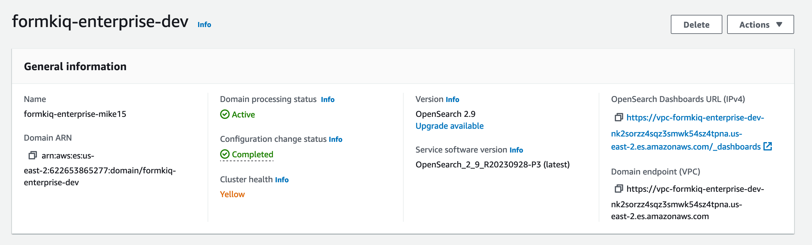
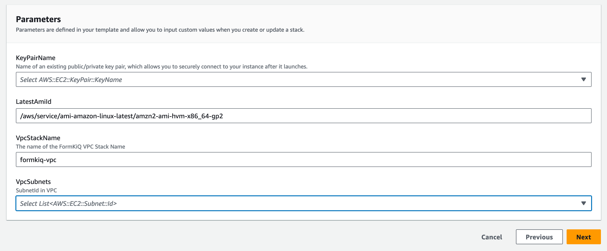
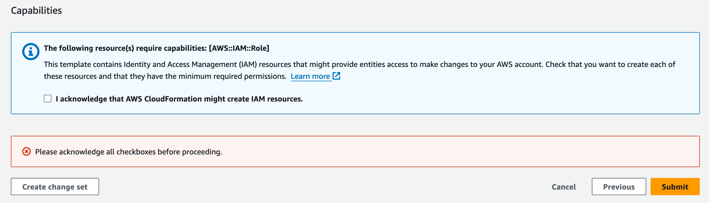
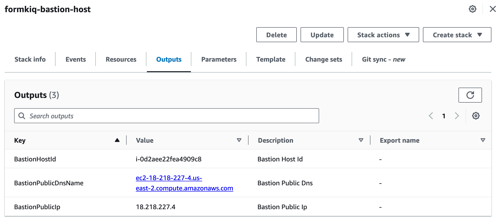
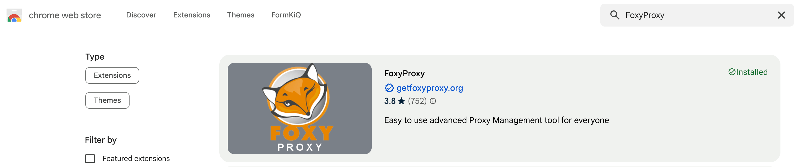
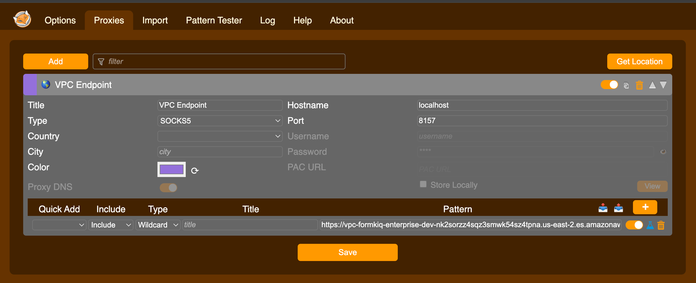

# Opensearch SSH Tunnel

Opensearch is secured by deploying it within a private subnet of a Virtual Private Cloud (VPC), ensuring limited access and heightened security measures. This setup restricts external access to [Opensearch](https://docs.aws.amazon.com/opensearch-service/latest/developerguide/vpc.html).

Access to Opensearch running in a private subnet can be achieved through several methods:

1. **VPN (Virtual Private Network)**: Establish a VPN connection between your local network and the VPC where Opensearch is hosted, allowing secure access to the resources within the private subnet.

2. **AWS Client VPN**: Deploy AWS Client VPN to provide secure remote access to resources in the VPC, including Opensearch instances within the private subnet, from authorized client devices.

3. **SSH Tunneling using a Bastion Host**: Set up a bastion host in a public subnet with SSH access allowed from specific IP addresses. Then, set up SSH tunneling to forward traffic from a local port to the Opensearch instance within the private subnet, allowing secure access over SSH.

Each of these options offers varying levels of security, flexibility, and ease of implementation depending on your specific requirements and infrastructure setup. This tutorial will walk through #3 ssh tunneling using a bastion host.

## What you’ll need

* Access to a FormKiQ PRO / Enterprise installation with Opensearch

## Opensearch Dashboard Url

Visiting the [Amazon Opensearch console](https://console.aws.amazon.com/aos/home) allow you to get the internal DNS name of your Opensearch Dashboards URL.



## AWS Access Key Pairs

An AWS Access key pair will be required to get access to the bastion host. To create an AWS key pair:

* Visit the [EC2 Dashboard Console](https://console.aws.amazon.com/ec2/home)

* In the EC2 Dashboard, locate the "Network & Security" section in the left-hand navigation pane and click on "Key Pairs."

* On the Key Pairs page, click on the "Create Key Pair" button located at the top of the screen.

* In the "Create Key Pair" dialog box:
   - Enter a name for your key pair in the "Key pair name" field.
   - Select the desired key pair type. It's recommended to choose "RSA" as the key pair type.
   - Optionally, you can specify a tag for your key pair by clicking on the "Add tag" button and entering a key-value pair.

* After entering the key pair details, click on the "Create key pair" button. This action will generate a new key pair and automatically download the private key file to your local machine. Ensure you keep this private key file secure, as it provides access to your EC2 instances.

* Once the private key file is downloaded, ensure you keep it in a secure location on your local machine. Avoid sharing this private key file with unauthorized individuals and do not expose it publicly.

* Set appropriate permissions for the private key file to enhance security. On Unix-based systems, you can use the following command:
   ```
   chmod 400 /path/to/private-key-file.pem
   ```

* Once the key pair is successfully created, you'll see a confirmation message on the EC2 Dashboard indicating that the key pair has been created and downloaded.

You've now successfully created an AWS key pair, which can be used to securely access EC2 instances launched within your AWS account. Make sure to keep the private key file safe and use it responsibly for accessing your instances.

## Setup Bastion Host

To install the Bastion host, select the installation link for the AWS region you want to deploy the Bastion Host to (it must be the same AWS Region has your FormKiQ installation):

### CloudFormation Links

| AWS Region    | Install Link |
| -------- | ------- |
| us-east-1 | https://console.aws.amazon.com/cloudformation/home?region=us-east-1#/stacks/new?stackName=formkiq-bastion-host&templateURL=https://formkiq-core-distribution-us-east-1.s3.amazonaws.com/1.13.1/opensearch-bastion.yaml|
| us-east-2 | https://console.aws.amazon.com/cloudformation/home?region=us-east-2#/stacks/new?stackName=formkiq-bastion-host&templateURL=https://formkiq-core-distribution-us-east-2.s3.amazonaws.com/1.13.1/opensearch-bastion.yaml|
| us-west-2 | https://console.aws.amazon.com/cloudformation/home?region=us-west-2#/stacks/new?stackName=formkiq-bastion-host&templateURL=https://formkiq-core-distribution-us-west-2.s3.amazonaws.com/1.13.1/opensearch-bastion.yaml|
| ca-central-1 | https://console.aws.amazon.com/cloudformation/home?region=ca-central-1#/stacks/new?stackName=formkiq-bastion-host&templateURL=https://formkiq-core-distribution-ca-central-1.s3.amazonaws.com/1.13.1/opensearch-bastion.yaml|
| eu-central-1 | https://console.aws.amazon.com/cloudformation/home?region=eu-central-1#/stacks/new?stackName=formkiq-bastion-host&templateURL=https://formkiq-core-distribution-eu-central-1.s3.amazonaws.com/1.13.1/opensearch-bastion.yaml|
| ap-south-1 | https://console.aws.amazon.com/cloudformation/home?region=ap-south-1#/stacks/new?stackName=formkiq-bastion-host&templateURL=https://formkiq-core-distribution-ap-south-1.s3.amazonaws.com/1.13.1/opensearch-bastion.yaml|
| ap-southeast-2 | https://console.aws.amazon.com/cloudformation/home?region=ap-southeast-2#/stacks/new?stackName=formkiq-bastion-host&templateURL=https://formkiq-core-distribution-ap-southeast-2.s3.amazonaws.com/1.13.1/opensearch-bastion.yaml|
| ap-northeast-2 | https://console.aws.amazon.com/cloudformation/home?region=ap-northeast-2#/stacks/new?stackName=formkiq-bastion-host&templateURL=https://formkiq-core-distribution-ap-northeast-2.s3.amazonaws.com/1.13.1/opensearch-bastion.yaml|
| sa-east-1 | https://console.aws.amazon.com/cloudformation/home?region=sa-east-1#/stacks/new?stackName=formkiq-bastion-host&templateURL=https://formkiq-core-distribution-sa-east-1.s3.amazonaws.com/1.13.1/opensearch-bastion.yaml|

### CloudFormation Parameters



* **KeyPairName**

Select from the dropdown the KeyPair created in the previous step.

* **LatestAmiId**

The EC2 AMI image that will be used to create the Bastion host

* **VpcStackName**

The name of the VPC CloudFormation stack used by FormKiQ

* **VpcSubnets**

The Bastion host needs to be deployed in the public FormKiQ VPC. Searching for the term "Public" and select 1 of the public subnets.



Click Next twice and then submit the stack to be created.

The CloudFormation outputs will contain information to configure the SSH Tunnel.

:::note

:::

## Configure the SOCKS proxy

The Foxyproxy can be used to proxy requests through the SSL tunnel and to the Opensearch dashboard.

The FoxyProxy Standard extension can be installed from the Google Chrome store.



Next, we need to configure the FoxyProxy extension. Open the FoxyProxy extension and then choose Options.



Under the `Proxies`:

* Set the title: e.g. VPC Endpoint

* Set Type: "SOCKS5"

* Set Hostname: localhost

* Set Port: 8157

* Pattern: `Opensearch Domain endpoint`

## Run SSH Tunnel

The following command will start the SSH tunnel.

```
ssh -i "mykeypair.pem" ec2-user@public_dns_name -ND 8157
```

Now, enter the Dashboards endpoint in your browser. The Amazon Cognito login page for Dashboards appears.

## Summary

And there you have it! We have shown how easy it is to connect to your Opensearch dashboard using an SSH tunnel.

This is just the tip of the iceberg when it comes to working with the FormKiQ APIs.

If you have any questions, reach out to us on our https://github.com/formkiq/formkiq-core or https://formkiq.com.
