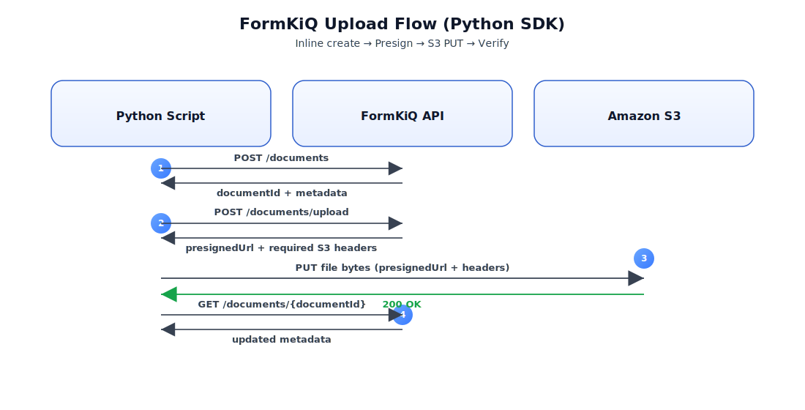

# Python SDK



## What You Will Build

This quickstart shows how to use the [FormKiQ Python Client SDK](https://github.com/formkiq/formkiq-client-sdk-python) with the FormKiQ Documents API.

You will:

- Configure a Python SDK client
- Create a small inline document
- Retrieve document metadata
- Request a presigned S3 upload URL
- Upload file bytes directly to S3
- Verify the uploaded document

This walkthrough uses JWT authentication. If you need a token, see [JWT Authentication Token](/docs/how-tos/jwt-authentication-token).

## Before You Begin

- Python 3.9 or later
- A FormKiQ API base URL
- A valid JWT access token, not an ID token
- A `siteId`, or `default` if your deployment does not use multiple sites
- Network access to the FormKiQ API and Amazon S3

## Workflow Overview

1. Install the Python SDK and supporting packages.
2. Configure the SDK client with your API URL and JWT access token.
3. Create a small inline document.
4. Retrieve document metadata.
5. Request a presigned S3 upload URL.
6. Upload file bytes to S3.
7. Verify the uploaded document metadata.

## Step 1: Install the SDK

Create and activate a virtual environment:

```bash
python3 -m venv .venv
source .venv/bin/activate
```

Install the SDK and `requests`:

```bash
python3 -m pip install --upgrade pip
python3 -m pip install requests "git+https://github.com/formkiq/formkiq-client-sdk-python.git"
```

:::tip
For repeatable production builds, pin the SDK dependency to a tag or commit instead of installing from the default branch.
:::

Set the environment variables used by the examples:

```bash
export FORMKIQ_API_URL="https://your-formkiq-api.example.com"
export JWT="REPLACE_WITH_ACCESS_TOKEN"
export SITE_ID="default"
```

:::warning
Use a JWT access token. An ID token will not authorize FormKiQ API calls.
:::

## Step 2: Configure the Client

Import the SDK and create a configured `DocumentsApi` client.

```python
from __future__ import annotations

import os
from pprint import pprint
from typing import Any, Dict, Optional

import requests

import formkiq_client
from formkiq_client.api.documents_api import DocumentsApi
from formkiq_client.rest import ApiException


FORMKIQ_API_URL = os.environ["FORMKIQ_API_URL"]
JWT_ACCESS_TOKEN = os.environ["JWT"]
SITE_ID = os.environ.get("SITE_ID", "default")


def build_documents_api() -> DocumentsApi:
    cfg = formkiq_client.Configuration(host=FORMKIQ_API_URL)
    api_client = formkiq_client.ApiClient(cfg)
    api_client.set_default_header("Authorization", f"Bearer {JWT_ACCESS_TOKEN}")
    return DocumentsApi(api_client)
```

## Step 3: Create an Inline Document

Use `add_document` for small documents where sending content through the API is appropriate.

```python
def get_field(obj: Any, snake_name: str, camel_name: str) -> Any:
    return getattr(obj, snake_name, None) or getattr(obj, camel_name, None)


def add_document_inline(api: DocumentsApi, site_id: str) -> str:
    body: Dict[str, Any] = {
        "path": "inbox/hello.txt",
        "contentType": "text/plain",
        "content": "Hello World",
    }

    response = api.add_document(add_document_request=body, site_id=site_id)
    document_id = get_field(response, "document_id", "documentId")

    if not document_id:
        raise RuntimeError("Missing documentId in add_document response")

    return document_id
```

The helper supports generated-client response naming differences. Use the naming style returned by your installed SDK version when writing production code.

## Step 4: Retrieve Document Metadata

Use `get_document` to retrieve the document record.

```python
def to_dict_safe(obj: Any) -> Any:
    if hasattr(obj, "to_dict"):
        return obj.to_dict()
    return obj


def get_document_metadata(api: DocumentsApi, site_id: str, document_id: str) -> Any:
    response = api.get_document(document_id=document_id, site_id=site_id)
    return to_dict_safe(response)
```

## Step 5: Upload a Larger File

For larger files, request a presigned S3 upload URL. This sends file bytes directly to S3 instead of sending them through the FormKiQ API.

```python
def request_presigned_upload(
    api: DocumentsApi,
    site_id: str,
    dest_path: str,
    content_type: str,
    content_length: int,
) -> Dict[str, Any]:
    upload_request = {
        "path": dest_path,
        "contentType": content_type,
        "contentLength": content_length,
    }

    response = api.add_document_upload(
        add_document_upload_request=upload_request,
        site_id=site_id,
    )

    document_id = get_field(response, "document_id", "documentId")
    presigned_url = get_field(response, "upload_url", "url")
    required_headers = getattr(response, "headers", None) or {}

    if not document_id:
        raise RuntimeError("Missing documentId in add_document_upload response")
    if not presigned_url:
        raise RuntimeError("Missing url in add_document_upload response")

    return {
        "document_id": document_id,
        "presigned_url": presigned_url,
        "required_headers": required_headers,
    }
```

:::warning
When the presigned upload response includes headers, send those headers exactly as returned. Omitting or changing required headers can cause Amazon S3 to reject the upload.
:::

Upload the file bytes with HTTP `PUT`:

```python
def s3_put_bytes(
    url: str,
    data: bytes,
    content_type: str,
    extra_headers: Optional[Dict[str, str]] = None,
) -> None:
    headers = {"Content-Type": content_type}
    if extra_headers:
        headers.update(extra_headers)

    response = requests.put(url, data=data, headers=headers)

    if response.status_code not in (200, 201):
        raise RuntimeError(
            f"S3 upload failed: {response.status_code} {response.text[:200]}"
        )
```

## Step 6: Run the Example

This example creates one inline document, uploads one local file through S3, and retrieves metadata for both documents.

```python
def main() -> None:
    print("Using API:", FORMKIQ_API_URL)
    api = build_documents_api()

    print("\nStep 1: Create an inline document")
    inline_document_id = add_document_inline(api, SITE_ID)
    print("Inline documentId:", inline_document_id)

    print("\nStep 2: Retrieve inline document metadata")
    pprint(get_document_metadata(api, SITE_ID, inline_document_id))

    upload_local_path = "example.py"
    upload_dest_path = "examples/example.py"
    upload_content_type = "text/plain"

    print("\nStep 3: Request a presigned S3 upload URL")
    with open(upload_local_path, "rb") as file_handle:
        file_bytes = file_handle.read()

    presign = request_presigned_upload(
        api=api,
        site_id=SITE_ID,
        dest_path=upload_dest_path,
        content_type=upload_content_type,
        content_length=len(file_bytes),
    )
    print("Upload documentId:", presign["document_id"])

    print("\nStep 4: Upload bytes directly to S3")
    s3_put_bytes(
        url=presign["presigned_url"],
        data=file_bytes,
        content_type=upload_content_type,
        extra_headers=presign["required_headers"],
    )
    print("Upload complete")

    print("\nStep 5: Verify uploaded document metadata")
    pprint(get_document_metadata(api, SITE_ID, presign["document_id"]))


if __name__ == "__main__":
    try:
        main()
    except ApiException as exc:
        print("FormKiQ API error:", exc)
        raise
```

The full Python example is available in the [FormKiQ Python SDK repository](https://github.com/formkiq/formkiq-client-sdk-python/blob/main/example.py).

## Verify the Result

Confirm that the script prints two document IDs and metadata for both documents. In the FormKiQ console, the uploaded document should appear at `examples/example.py` in the selected site.

## Clean Up

Delete the test documents from the FormKiQ console or API if you do not want to keep them in your environment.

## Troubleshooting

### 401 Unauthorized

The JWT is missing, expired, or is not an access token. Confirm `JWT` is set and the SDK sends `Authorization: Bearer <token>`.

### 403 Forbidden

The token is valid, but the caller does not have access to the requested `siteId` or operation. Verify the user, group, or token permissions.

### Wrong API URL

Confirm `FORMKIQ_API_URL` is the API endpoint for the authentication method you are using. A JWT token should be sent to the JWT-enabled API URL.

### S3 Upload Failed

Use the exact presigned URL returned by FormKiQ. Include any returned headers, keep the same content type, and do not reuse an expired presigned URL.

### Missing Document ID

If the SDK response shape differs from the examples, inspect the response object from your installed SDK version and use the returned `documentId` field.

## Next Steps

- Review the [API Reference](/docs/category/formkiq-api)
- Add [document attributes](/docs/features/attributes) during create or upload
- Search uploaded documents with [Search](/docs/features/search)
- Route documents with [Rulesets](/docs/features/rulesets) and [Workflows](/docs/features/workflows)
- Compare the [TypeScript SDK](/docs/tutorials/using-typescript-client-sdk)
- Compare the [Java SDK](/docs/tutorials/using-java-client-sdk)
