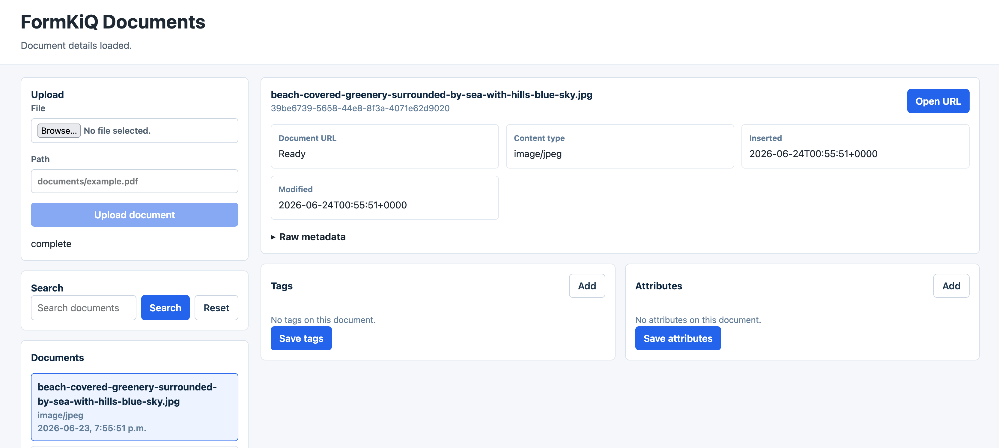

# Build a React App with Codex and the FormKiQ MCP Server

## What You Will Build

In this tutorial, you will use Codex with the FormKiQ MCP server to build a React document application that uses the FormKiQ API.



The finished application should let a user:

- List documents from a FormKiQ site
- Upload a document using the FormKiQ presigned upload flow
- Search documents
- View document metadata
- View and update document tags and attributes
- Open a document download URL

The tutorial is structured around Codex prompts and review checkpoints. Codex uses the FormKiQ MCP server to inspect supported FormKiQ API operations while building the React application.

## Before You Begin

Confirm you have:

- A deployed FormKiQ environment. See [Quick Start](/docs/getting-started/quick-start#install-formkiq).
- The FormKiQ `HttpApiUrl` CloudFormation output for JWT/Cognito authentication.
- A valid JWT access token, not an ID token. See [JWT Authentication Token](/docs/how-tos/jwt-authentication-token).
- Node.js 18 or later.
- npm or yarn.
- Codex installed and configured.
- `pipx` installed so Codex can start the FormKiQ MCP server from GitHub.

:::warning
This tutorial uses a JWT in local development so the focus stays on the FormKiQ API workflow. Do not hardcode JWTs in a production React application. For production, use an authenticated application flow such as Cognito Hosted UI, a backend token exchange, or a server-side proxy.
:::

## Variables Used

| Placeholder | Description |
| --- | --- |
| `FORMKIQ_API_ENDPOINT_URL` | FormKiQ API endpoint from the `HttpApiUrl` CloudFormation output. |
| `FORMKIQ_JWT` | JWT access token used for FormKiQ API calls. |
| `SITE_ID` | FormKiQ site ID. Use `default` unless your deployment uses multiple sites. |

## Workflow Overview

1. Configure the FormKiQ MCP server in Codex.
2. Verify Codex can see the FormKiQ MCP tools.
3. Ask Codex to create a Vite React TypeScript application and produce an implementation plan.
4. Build a small FormKiQ API client in the React app.
5. Build document list, upload, search, detail, tags, and attributes views.
6. Test the app against FormKiQ.
7. Review production hardening items.

## Step 1: Configure Codex with the FormKiQ MCP Server

Add the MCP server to `~/.codex/config.toml` or to a trusted project's `.codex/config.toml`:

```toml
[mcp_servers.formkiq]
command = "pipx"
args = ["run", "--spec", "git+https://github.com/formkiq/formkiq-mcp-server.git", "formkiq-mcp-server"]
env = { "MCP_TRANSPORT" = "stdio", "FORMKIQ_API_ENDPOINT_URL" = "https://abc123.execute-api.us-east-1.amazonaws.com", "FORMKIQ_JWT" = "eyJ..." }
startup_timeout_sec = 30
tool_timeout_sec = 60
enabled = true
```

Replace the endpoint and JWT values with your FormKiQ deployment values.

Start a new Codex session and run:

```text
/mcp
```

Verify that the `formkiq` MCP server is enabled.

## Step 2: Verify the MCP Tools

Ask Codex:

```text
Use the formkiq MCP server to list the supported FormKiQ operations. Summarize which operations are useful for a React document management UI.
```

Expected operations for this tutorial include:

- `GetDocuments`
- `AddDocumentUpload`
- `GetDocument`
- `GetDocumentUrl`
- `DocumentSearch`
- `GetDocumentTags`
- `AddDocumentTags`
- `SetDocumentTags`
- `GetDocumentAttributes`
- `AddDocumentAttributes`
- `SetDocumentAttributes`

## Step 3: Ask Codex to Create the React Application and Plan

Create an empty project folder and start Codex from that folder:

```bash
mkdir formkiq-react-documents
cd formkiq-react-documents
codex
```

Then prompt Codex:

```text
Use the formkiq MCP server to inspect the FormKiQ operations needed for a React document app.

Create a Vite React TypeScript application in this folder and build an implementation plan for:
- listing documents
- uploading a document with POST /documents/upload and the returned S3 URL
- searching documents
- viewing document metadata
- viewing and editing tags
- viewing and editing attributes
- opening the document URL

Use these environment variables in a local .env.local file:
- VITE_FORMKIQ_API_ENDPOINT_URL
- VITE_FORMKIQ_JWT
- VITE_FORMKIQ_SITE_ID

Before editing files, show the file structure, package choices, and implementation steps.
```

Review Codex's plan before allowing it to edit files.

:::warning
The `VITE_` variables are bundled into the browser application. Use this only for local tutorial work with a short-lived token.
:::

## Step 4: Build the FormKiQ API Client

Ask Codex to create a small API client:

```text
Create src/lib/formkiqClient.ts.

Use VITE_FORMKIQ_API_ENDPOINT_URL, VITE_FORMKIQ_JWT, and VITE_FORMKIQ_SITE_ID.
Implement functions for:
- listDocuments
- requestDocumentUpload
- uploadFileToPresignedUrl
- getDocument
- getDocumentUrl
- searchDocuments
- getDocumentTags
- setDocumentTags
- getDocumentAttributes
- setDocumentAttributes

Use fetch, include Authorization: Bearer <token> for FormKiQ API calls, and preserve any headers returned by the presigned upload response when uploading to S3.
```

Review the generated client for:

- Correct `Authorization` header format
- Correct `siteId` query parameter handling
- Correct presigned S3 upload behavior
- Clear error handling for non-2xx responses

## Step 5: Build the React UI Structure

Ask Codex:

```text
Create a practical document management UI using React and TypeScript.

Use these components:
- AppShell
- DocumentList
- DocumentUpload
- DocumentSearch
- DocumentDetail
- DocumentTagsEditor
- DocumentAttributesEditor

Keep styling simple and responsive. Put shared types in src/lib/types.ts.
```

Expected source structure:

```text
src/
  components/
    AppShell.tsx
    DocumentAttributesEditor.tsx
    DocumentDetail.tsx
    DocumentList.tsx
    DocumentSearch.tsx
    DocumentTagsEditor.tsx
    DocumentUpload.tsx
  lib/
    formkiqClient.ts
    types.ts
  App.tsx
  main.tsx
```

## Step 6: Implement Document Upload

The upload flow should:

1. Let the user select a file.
2. Call `POST /documents/upload` through the API client.
3. Upload bytes to the returned presigned S3 URL.
4. Refresh the document list.

Prompt Codex:

```text
Wire DocumentUpload to request a FormKiQ upload URL, upload the selected file to S3, and refresh the document list after completion.

Show upload progress states:
- idle
- requesting upload URL
- uploading file
- complete
- error
```

## Step 7: Implement Search and Detail Views

The search flow should use `DocumentSearch` and display matching documents.

Prompt Codex:

```text
Wire DocumentSearch to call the FormKiQ document search operation.
When a document is selected, load document metadata, tags, attributes, and document URL.
Show a button that opens the document URL in a new tab.
```

## Step 8: Implement Tags and Attributes Editing

Prompt Codex:

```text
Add editors for document tags and attributes.

For tags:
- load current tags
- allow adding, editing, and removing key/value rows
- save using the supported FormKiQ tags operation

For attributes:
- load current attributes
- allow adding, editing, and removing values
- save using the supported FormKiQ attributes operation
```

Review the generated request bodies against the FormKiQ OpenAPI schema before testing.

## Step 9: Test the Application

Run the app:

```bash
npm run dev
```

Test these workflows:

- Document list loads
- A file uploads successfully
- Uploaded document appears in the list
- Search returns expected documents
- Document metadata loads
- Document URL opens
- Tags can be saved
- Attributes can be saved

Ask Codex to help debug failed calls:

```text
The FormKiQ call failed with this response: <paste response>.
Use the formkiq MCP server and the current source code to identify whether the request path, query parameters, headers, or body are wrong.
```

## Step 10: Production Hardening

Before using this pattern beyond a local tutorial:

- Replace local JWT variables with real application authentication.
- Do not expose long-lived access tokens in browser code.
- Consider a backend proxy for sensitive workflows.
- Add route-level authorization.
- Add upload size limits and content-type validation.
- Add retry and timeout behavior.
- Add user-friendly API error messages.
- Add tests for the FormKiQ client functions.

## Tutorial Completion Criteria

The tutorial is complete when the reader has:

- A React TypeScript app generated with Codex assistance
- Codex configured with the FormKiQ MCP server
- A working document list
- A working presigned upload flow
- Search, detail, tags, and attributes workflows
- A clear understanding of what must change for production authentication
