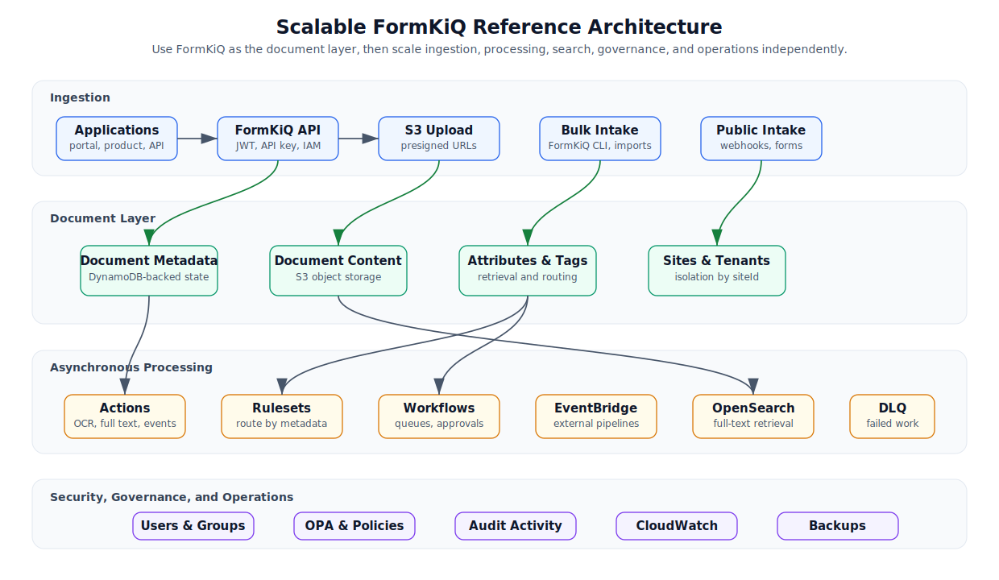
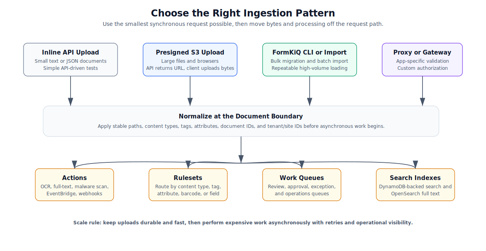
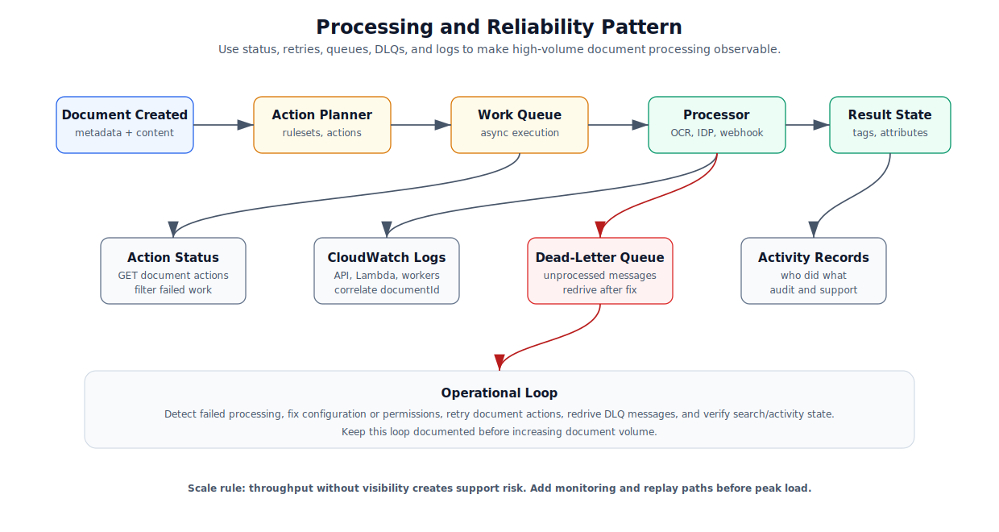

# Building Scalable Solutions Using FormKiQ

## What You Will Build

In this tutorial, you will design a scalable AWS-native document processing solution using FormKiQ as the document layer. The result is a reference architecture and implementation plan for applications that need high-volume document ingestion, metadata control, asynchronous processing, search, governance, and operational visibility.

This is an architecture tutorial rather than a single endpoint walkthrough. It shows how to combine the smaller FormKiQ workflows into a customer-ready solution pattern.



## Before You Begin

Confirm you have:

- A deployed FormKiQ environment. See [Quick Start](/docs/getting-started/quick-start#install-formkiq).
- Access to the FormKiQ API endpoint from the CloudFormation stack outputs.
- A JWT access token or API key for API testing. See [Get a JWT Authentication Token](/docs/how-tos/jwt-authentication-token).
- A basic understanding of Amazon S3, DynamoDB, Lambda, EventBridge, CloudWatch, and dead-letter queues.
- Optional: a FormKiQ Core deployment with Typesense and Tesseract enabled if you want open-source full-text search and basic OCR.
- Optional: commercial modules enabled if your solution requires Amazon Textract, Amazon OpenSearch Service, malware scanning, document generation, OPA, or document versioning.

## Variables Used

| Placeholder | Description |
| --- | --- |
| `HTTP_API_URL` | FormKiQ API endpoint from the CloudFormation stack output, including `https://`. |
| `AUTHORIZATION_TOKEN` | JWT access token or API key used in the `Authorization` header. |
| `SITE_ID` | FormKiQ site ID. Use `default` unless your deployment uses multiple sites. |
| `DOCUMENT_ID` | Document ID returned when a test document is uploaded. |

The examples below use shell variables. Replace the values before running the commands:

```bash
export HTTP_API_URL="https://your-formkiq-api.example.com"
export AUTHORIZATION_TOKEN="your-jwt-access-token-or-api-key"
export SITE_ID="default"
export DOCUMENT_ID="your-document-id"
```

## What This Tutorial Does Not Build

This tutorial does not deploy a complete application stack, benchmark your production workload, or replace environment-specific architecture review. Use it as the design baseline for a scalable implementation, then validate the design with your own document sizes, document volumes, security requirements, edition/module choices, and AWS service limits.

The examples show both Core-compatible and commercial-module patterns. FormKiQ Core can use Tesseract for OCR and Typesense for text search when those components are enabled. Commercial offerings can add Amazon Textract for advanced OCR/IDP and Amazon OpenSearch Service for enhanced full-text search and raw OpenSearch queries.

## Workflow Overview

1. Choose the document ingestion pattern.
2. Normalize documents at the FormKiQ boundary.
3. Model metadata for scale.
4. Move expensive work into asynchronous processing.
5. Add search and retrieval paths.
6. Add security and governance controls.
7. Add reliability and operating controls.
8. Validate the architecture before production traffic.

## Step 1: Choose the Document Ingestion Pattern

Start by matching the ingestion pattern to the workload. Avoid forcing every use case through the same endpoint.



| Pattern | Best for | Use when |
| --- | --- | --- |
| Inline `POST /documents` | Small text or JSON documents | The request payload is small and the application needs a simple synchronous create. |
| Presigned upload | Browser uploads, large files, mobile apps | The file can be uploaded directly to S3 after FormKiQ creates the document record. |
| FileSync CLI or batch import | Migration, high-volume loading, repeated imports | The source is a filesystem, S3 location, CSV, or migration export. |
| Server-side proxy | Custom validation, product-specific authorization, internal APIs | You need your own application API between clients and FormKiQ. |
| Public intake or webhooks | External partners, forms, integration callbacks | You need controlled intake from outside your authenticated application. |

For scalable systems, prefer presigned uploads for large files. The application asks FormKiQ for an upload URL, then the client sends bytes directly to S3. That keeps the API request path short and avoids routing large files through your own application servers.

When FormKiQ returns a presigned upload URL, send any returned S3 headers exactly as returned. Missing or changed headers are a common cause of upload failures, especially when content type, checksum, encryption, or other S3 request headers are part of the signature.

## Step 2: Normalize Documents at the Boundary

Every document should enter the platform with enough structure to make downstream processing predictable.

Capture these fields consistently:

- `path`: stable logical location, not just the original filename.
- `contentType`: accurate MIME type used for routing and processing.
- `documentId`: supplied by FormKiQ or generated by your application for idempotent imports.
- `siteId`: tenant or environment boundary.
- Tags: simple key-value routing and lightweight metadata.
- Attributes: typed, validated, searchable business metadata.
- Actions: explicit processing instructions such as OCR, full-text, malware scan, EventBridge, or webhook.

Do not rely on downstream processors to infer all business context from the file. Add the information you already know at ingestion time.

## Step 3: Model Metadata for Scale

Use metadata intentionally. Tags, attributes, schemas, and mappings solve related but different problems.

| Metadata type | Use for | Scale guidance |
| --- | --- | --- |
| Tags | Simple labels, routing flags, legacy key-value lookup | Good for lightweight filters and ruleset conditions. |
| Attributes | Typed business metadata such as customer ID, invoice date, policy number, department | Preferred for structured metadata and validation. |
| Schemas | Required attributes and allowed values | Use when teams need consistent metadata across document classes. |
| Composite keys | DynamoDB-backed multi-field search patterns | Define for high-volume exact-match access paths. |
| Full-text fields | Content indexed by Typesense or OpenSearch, depending on deployment | Use for natural-language search, content discovery, and broader filtering. |

Design metadata around the questions users and systems will ask later:

- Which documents belong to this customer, account, claim, case, or project?
- Which documents are waiting for review?
- Which documents failed processing?
- Which documents must be retained or held?
- Which documents need to be searchable by text?

If a query is business-critical and high-volume, model it explicitly. Avoid depending on broad scans or ad hoc manual filtering.

### Example Metadata Model

For an invoice archive, a scalable metadata model might use:

| Field | Type | Purpose |
| --- | --- | --- |
| `customerId` | Attribute, string | Finds all documents for a customer. |
| `documentType` | Attribute, string | Separates invoices, contracts, correspondence, and forms. |
| `documentDate` | Attribute, string or date-like string | Supports timeline and retention workflows. |
| `reviewStatus` | Attribute or tag | Tracks whether a document is pending, approved, rejected, or failed. |
| `sourceSystem` | Tag | Identifies migration, portal, API, partner, or FileSync origin. |

A high-volume exact lookup could be modeled as a composite key such as:

```json
{
  "compositeKeys": [
    {
      "key": "customerDocumentLookup",
      "attributeKeys": ["customerId", "documentType", "documentDate"]
    }
  ]
}
```

Use this pattern only for access paths that users or integrations actually need. Composite keys improve specific exact-match search patterns, but unused keys add schema complexity without improving retrieval.

## Step 4: Move Expensive Work Asynchronously

Scalable document systems should not do every task during upload. Upload should make the document durable and visible; expensive processing should happen asynchronously.

Use FormKiQ actions and workflow components for:

- OCR and text extraction.
- Full-text indexing.
- Malware scanning.
- Metadata extraction.
- Document tagging.
- EventBridge publication.
- Webhook callbacks.
- Human review queues and approvals.

Example: add an EventBridge action after upload.

```bash
curl -X POST "${HTTP_API_URL}/documents/${DOCUMENT_ID}/actions?siteId=${SITE_ID}" \
  -H "Authorization: ${AUTHORIZATION_TOKEN}" \
  -H "Content-Type: application/json" \
  -d '{
    "actions": [
      {
        "type": "EVENTBRIDGE",
        "parameters": {
          "eventBusName": "formkiq-document-pipeline"
        }
      }
    ]
  }'
```

Example: add Core-compatible OCR and full-text actions during document creation. This uses Tesseract for OCR and the configured full-text engine, such as Typesense in a Core deployment.

```bash
curl -X POST "${HTTP_API_URL}/documents?siteId=${SITE_ID}" \
  -H "Authorization: ${AUTHORIZATION_TOKEN}" \
  -H "Content-Type: application/json" \
  -d '{
    "path": "intake/invoice-1001.pdf",
    "contentType": "application/pdf",
    "content": "Sample invoice content",
    "actions": [
      {
        "type": "OCR",
        "parameters": {
          "ocrEngine": "TESSERACT",
          "ocrNumberOfPages": "-1"
        }
      },
      {
        "type": "FULLTEXT"
      }
    ],
    "attributes": [
      {
        "key": "documentType",
        "stringValues": ["invoice"],
        "valueType": "STRING"
      }
    ]
  }'
```

For commercial deployments with Textract enabled, use `TEXTRACT` when you need forms, tables, queries, handwriting, or higher-accuracy structured extraction.

```json
{
  "type": "OCR",
  "parameters": {
    "ocrEngine": "TEXTRACT",
    "ocrParseTypes": "TEXT,FORMS,TABLES",
    "ocrNumberOfPages": "-1"
  }
}
```

OCR and full-text actions are asynchronous. Full-text search may lag behind upload and OCR completion, and behavior depends on installed modules and processing configuration. For user-facing applications, expose processing status separately from upload status and make search availability eventually consistent.

## Step 5: Add Rulesets and Workflows for Business Routing

Use rulesets when documents should be routed based on content type, tags, attributes, barcode values, or extracted fields. Use workflows and queues when humans or downstream systems need to make decisions.

Common scalable routing patterns:

- Route invoices to finance review.
- Route failed OCR documents to an exception queue.
- Route high-value claims to a specialist queue.
- Route documents with missing attributes to a metadata cleanup queue.
- Trigger EventBridge for documents that require external enrichment.

Rulesets and workflows make routing declarative. That helps avoid burying business routing rules inside custom Lambda code.

## Step 6: Add Search and Retrieval Paths

Use the simplest search path that satisfies the product requirement.

| Search need | Recommended path |
| --- | --- |
| Find by document ID | `GET /documents/{documentId}` |
| Find by exact tag or attribute | `POST /search` |
| Find by modeled multi-field key | Composite keys in the site schema |
| Search extracted text in Core with Typesense enabled | `POST /search` with `query.text` |
| Search extracted text with enhanced OpenSearch module | `POST /searchFulltext` |
| Advanced OpenSearch filtering, sorting, and aggregations | `POST /queryFulltext` |

Typesense-backed search can be a good Core option for straightforward full-text search. OpenSearch-backed full-text search is available through commercial offerings and is a better fit when you need richer filtering, raw query DSL, advanced tuning, or OpenSearch operations. Neither search engine is the right answer for every lookup. Keep exact operational lookups modeled through attributes, tags, schemas, and composite keys.

## Step 7: Add Reliability Controls

High-volume systems need observable failure paths. A scalable solution should make it clear whether a document is uploaded, processed, indexed, failed, retried, or waiting for review.



Build these controls early:

- Inspect document action status with `GET /documents/{documentId}/actions`.
- Retry failed actions with `POST /documents/{documentId}/actions/retry`.
- Monitor CloudWatch logs for API, Lambda, and processing failures.
- Monitor DLQs and configure alerts.
- Use idempotent document IDs for imports and retries where possible.
- Track document processing state with tags or attributes when your application needs a user-facing status.
- Reindex documents after metadata or search configuration changes.

Operational visibility is part of the architecture, not an afterthought.

## Step 8: Add Security and Governance

Scale also means scaling access control and governance. Decide these boundaries before production rollout.

| Concern | FormKiQ capability |
| --- | --- |
| User authentication | JWT authentication through Cognito or SSO |
| Server-side integrations | API keys or IAM-authorized API access |
| Tenant isolation | Sites and `siteId`-aware requests |
| Role-based access | Users, groups, site permissions, folder permissions |
| Fine-grained policy | Open Policy Agent module |
| Retention and recovery | Soft delete, purge, backup and recovery |
| Version control | Document versioning module |
| Legal preservation | Legal hold |
| Audit review | User activity and document activity endpoints |
| Encryption | AWS-managed or customer-managed KMS keys, with full encryption options where required |
| Network boundary | Customer AWS account deployment, VPC patterns, private access, and controlled integration paths |
| Data residency | AWS Region selection and tenant/site placement aligned to residency requirements |

For multi-tenant applications, make `siteId` part of the application model rather than a late-stage query parameter. Tenant-aware code should set the site boundary before it calls FormKiQ.

For regulated or enterprise deployments, clarify early who controls the AWS account, keys, regions, backups, and operational access. These decisions affect security review, procurement, implementation timelines, and support responsibilities.

## Step 9: Validate the Architecture

Before increasing traffic, validate the design with a realistic test batch.

Use this checklist:

- Upload small and large documents.
- Confirm presigned upload flows work from the client environment.
- Confirm required metadata is present immediately after upload.
- Confirm rulesets route documents to the expected workflows or queues.
- Confirm OCR, full-text, malware scan, or EventBridge actions complete for the engine/module you installed.
- Confirm failed actions can be retried.
- Confirm DLQ alerts are configured and actionable.
- Confirm search results appear after indexing delay.
- Confirm users without permissions cannot access restricted documents.
- Confirm activity records support the audit questions your customer will ask.
- Confirm expected request rates against API Gateway, Lambda, S3, Typesense or OpenSearch, Tesseract or Textract, and any downstream services.
- Confirm throttling, retry, and backoff behavior under representative batch sizes.

Document the expected timing for each asynchronous stage. Customers are more successful when they know which steps are immediate and which are eventually consistent.

## Step 10: Production Readiness Checklist

Use this as the final review before launch.

| Area | Production question |
| --- | --- |
| Ingestion | Are large files uploaded directly to S3 instead of through app servers? |
| Metadata | Are required fields validated through schemas or application logic? |
| Search | Are exact-match and full-text search paths intentionally separated? |
| Processing | Are expensive tasks asynchronous and retryable? |
| Reliability | Are DLQs, logs, and action failures monitored? |
| Security | Are user, group, API key, and folder permissions documented? |
| Tenancy | Is every request scoped to the correct `siteId`? |
| Governance | Are legal hold, delete, purge, and audit policies understood? |
| Cost | Are OCR, search engine, storage, Lambda, and transfer costs expected at target volume? |
| Limits | Have AWS service quotas and FormKiQ module limits been reviewed for expected peak load? |
| Load testing | Has the architecture been tested with representative file sizes, metadata volume, and search patterns? |
| Support | Can operators answer "where is this document and what happened to it?" |

## Common Architecture Decisions

| Decision | Prefer this when | Watch for |
| --- | --- | --- |
| Core vs commercial modules | Core covers the document API, storage, metadata, Tesseract OCR, and Typesense search when enabled. | Textract, OpenSearch, antivirus, OPA, versioning, document generation, and support needs may require commercial modules. |
| Single site vs multi-site | One business boundary can share users, permissions, and metadata conventions. | Use multiple sites when tenant isolation, data residency, or operational separation matters. |
| Tags vs attributes | Tags are enough for lightweight labels and routing. | Use attributes for typed, validated, and schema-driven business metadata. |
| DynamoDB-backed search vs Typesense vs OpenSearch | Exact tag/attribute lookups are the main retrieval path. | Use Typesense for Core text search; use OpenSearch for enhanced full-text, flexible filtering, and advanced query patterns. |
| JWT vs API key vs IAM | Users are interacting through an application or console. | Use API keys or IAM for trusted server-side automation; avoid exposing API keys in browsers. |
| Synchronous API vs async actions | The task must complete immediately and is fast. | Move OCR, malware scan, full-text, webhooks, and external enrichment into async actions. |

## Reference Implementation Paths

| If you need to build... | Start with |
| --- | --- |
| A human approval process | [Build a Document Review and Approval Workflow](/docs/tutorials/solution-patterns/build-document-review-approval-workflow) |
| A searchable archive for scanned documents | [Build an OCR Searchable Archive](/docs/tutorials/solution-patterns/build-ocr-searchable-archive) |
| An external processing pipeline | [Build an Event-Driven Document Processing Pipeline](/docs/tutorials/event-and-integration-patterns/build-event-driven-document-processing-pipeline) |
| A tenant-aware application | [Multi-Tenant Users](/docs/tutorials/solution-patterns/multitenant) and [Multi-Tenant and Multi-Instance Deployments](/docs/platform/multi-tenant-vs-multi-instance) |
| A server-owned integration layer | [Using a Server-Side Proxy](/docs/tutorials/event-and-integration-patterns/using-a-server-side-proxy) and [Manage API Keys](/docs/how-tos/manage-api-keys) |

## Verify the Result

You have a scalable design when:

- Uploads remain fast as file size and volume increase.
- Processing can continue even when OCR, search indexing, or external systems are slower than uploads.
- Failed work is visible and retryable.
- Metadata supports the most important user and system queries.
- Security boundaries are explicit and testable.
- Operators can inspect document status without reading application code.

## Clean Up

This tutorial creates an architecture plan rather than a fixed stack. Clean up any resources you created while validating the pattern:

- Test documents and uploaded files.
- Document actions used for OCR, full-text, malware scan, EventBridge, or webhooks.
- Test rulesets, rules, workflows, and queues.
- EventBridge buses, rules, targets, Lambda functions, and Lambda permissions.
- Test API keys, users, groups, folder permissions, and webhook configurations.
- OpenSearch test indexes, snapshots, or restore jobs.
- Temporary CloudWatch alarms, log exports, and DLQ redrive tests.

## Troubleshooting

| Problem | Likely cause | What to check |
| --- | --- | --- |
| Uploads slow down under load | Files are being proxied through application servers or expensive processing is synchronous. | Use presigned uploads and move processing into actions or event-driven workers. |
| Search results are missing | Indexing is asynchronous or the wrong search path is used. | Wait for indexing, reindex if needed, and use `/search` for DynamoDB/Typesense or `/searchFulltext`/`/queryFulltext` for OpenSearch. |
| Processing status is unclear | Actions and logs are not part of the operating model. | Add action inspection, CloudWatch log review, DLQ alerts, and retry runbooks. |
| Metadata becomes inconsistent | Different ingestion paths use different field names or value formats. | Normalize metadata at the boundary and use schemas for required attributes. |
| Tenants can see wrong data | Requests are not consistently scoped by `siteId`. | Treat `siteId` as part of the application tenancy model and test cross-tenant access. |
| Costs grow unexpectedly | OCR engine, search engine, storage, or retries are higher than expected. | Review [Costs & AWS Usage](/docs/platform/costs) and test with representative document volume. |

## Next Steps

- [Build a Document Review and Approval Workflow](/docs/tutorials/solution-patterns/build-document-review-approval-workflow)
- [Build an OCR Searchable Archive](/docs/tutorials/solution-patterns/build-ocr-searchable-archive)
- [Build an Event-Driven Document Processing Pipeline](/docs/tutorials/event-and-integration-patterns/build-event-driven-document-processing-pipeline)
- [Status Monitoring and Alerting](/docs/how-tos/set-up-status-monitoring-and-alerting)
- [Dead-Letter Queue](/docs/platform/error_handling/dlq)
- [Costs & AWS Usage](/docs/platform/costs)
