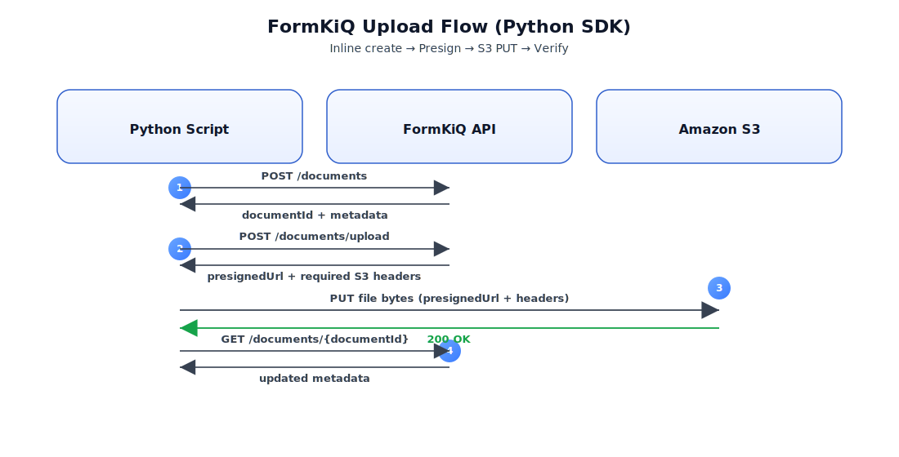

# Using TypeScript Client SDK



## Overview

This tutorial explains how to use the [**FormKiQ TypeScript Client SDK**](https://github.com/formkiq/formkiq-client-sdk-typescript) to interact with the FormKiQ Documents API. It walks through creating a document, retrieving its metadata, requesting a presigned S3 upload URL, uploading file contents directly to S3, and verifying the document after upload.

Using the TypeScript SDK simplifies API integration by providing strongly typed clients generated from the FormKiQ OpenAPI specification. This approach reduces boilerplate code and ensures consistent request and response handling.

The full TypeScript example can be found [here](https://github.com/formkiq/formkiq-client-sdk-typescript/blob/main/example.ts).

---

## Prerequisites

- Node.js 18 or later
- npm or yarn
- Access to a FormKiQ deployment
- A valid **JWT access token** for your FormKiQ API
- A **siteId** (use `"default"` if not using multi-site)
- Network access to your FormKiQ API and AWS S3

---

## Setup

Install dependencies

Install the FormKiQ TypeScript Client SDK and Axios:

```bash
npm install axios @formkiq/client-sdk-typescript
```

## Set Environment Variables

Configure the API endpoint and authentication token:

```bash
export FORMKIQ_API_URL="https://your-formkiq-api.example.com"
export JWT="REPLACE_WITH_ACCESS_TOKEN"
export SITE_ID="default"
```

:::warning
The JWT must be an access token, not an ID token.
:::

## Step-by-step walkthrough

### Create the API client configuration

Create a configuration object that defines the FormKiQ API endpoint and automatically injects the Authorization header into every request.

```typescript
import { Configuration, DocumentsApi } from "@formkiq/client-sdk-typescript";

const cfg = new Configuration({
  basePath: process.env.FORMKIQ_API_URL,
  baseOptions: {
    headers: {
      Authorization: `Bearer ${process.env.JWT}`,
    },
  },
});
```

### Initialize the Documents API

Use the configuration to create a DocumentsApi client.

```
const api = new DocumentsApi(cfg);
const siteId = process.env.SITE_ID || "default";
```

### Create a document inline

Create a small document directly using the POST /documents endpoint.

```typescript
const addResp = await api.addDocument(
  {
    path: "inbox/hello.txt",
    contentType: "text/plain",
    content: "Hello World",
  },
  siteId
);

const documentId = addResp.data.documentId;
console.log("Added documentId:", documentId);
```

### Retrieve document metadata

Fetch the document metadata to verify that the document was created successfully.

```
const getResp = await api.getDocument(documentId, siteId);
console.log("Document metadata:", getResp.data);
```

### Request a presigned S3 upload URL

For larger files, request a presigned S3 URL using POST /documents/upload.

```
import fs from "node:fs";

const fileBytes = fs.readFileSync("example.ts");
const uploadResp = await api.addDocumentUpload(
  {
    path: "example.ts",
    contentType: "text/plain",
    contentLength: fileBytes.length,
  },
  siteId
);

const presignedUrl = uploadResp.data.url;
```

:::tip
Presigned uploads are recommended for files larger than a few megabytes.
:::

### Upload file bytes directly to S3

Upload the file contents directly to Amazon S3 using the presigned URL.

```typescript
import axios from "axios";

await axios.put(presignedUrl, fileBytes, {
  maxBodyLength: Infinity,
});

console.log("Upload complete");
```

## Common errors and troubleshooting

### 401 Unauthorized
Ensure the JWT is valid and included as a Bearer token in the Authorization header.

### 403 Forbidden
Verify that the token has access to the specified siteId.

### Large file upload failures
Ensure maxBodyLength is set to Infinity when uploading large files with Axios

## Next steps

- Add document attributes and metadata during upload
- Use document search and query APIs
- Integrate document workflows and rulesets
- Explore additional FormKiQ SDKs for Java and Python
