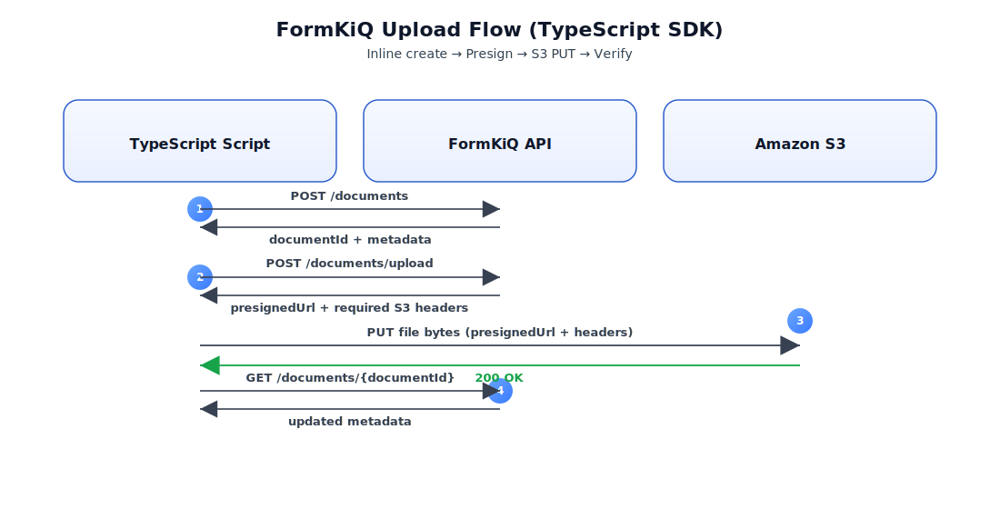

# TypeScript SDK



## Overview

This quickstart shows how to use the [FormKiQ TypeScript Client SDK](https://github.com/formkiq/formkiq-client-sdk-typescript) with the FormKiQ Documents API.

You will:

- Configure a TypeScript SDK client
- Create a small inline document
- Retrieve document metadata
- Request a presigned S3 upload URL
- Upload file bytes directly to S3
- Verify the uploaded document

This walkthrough uses JWT authentication. If you need a token, see [JWT Authentication Token](/docs/how-tos/jwt-authentication-token).

## Prerequisites

- Node.js 18 or later
- npm or yarn
- A FormKiQ API base URL
- A valid JWT access token, not an ID token
- A `siteId`, or `default` if your deployment does not use multiple sites
- Network access to the FormKiQ API and Amazon S3

## Install the SDK

Create a project if you do not already have one:

```bash
mkdir formkiq-typescript-example
cd formkiq-typescript-example
npm init -y
```

Install the SDK, Axios, and TypeScript runtime tooling:

```bash
npm install axios @formkiq/client-sdk-typescript
npm install --save-dev typescript tsx @types/node
```

Set the environment variables used by the examples:

```bash
export FORMKIQ_API_URL="https://your-formkiq-api.example.com"
export JWT="REPLACE_WITH_ACCESS_TOKEN"
export SITE_ID="default"
```

:::warning
Use a JWT access token. An ID token will not authorize FormKiQ API calls.
:::

## Configure the Client

Import the SDK and create a configured `DocumentsApi` client.

```typescript
import fs from "node:fs";
import axios from "axios";
import { Configuration, DocumentsApi } from "@formkiq/client-sdk-typescript";

const formkiqApiUrl = process.env.FORMKIQ_API_URL;
const jwtAccessToken = process.env.JWT;
const siteId = process.env.SITE_ID || "default";

if (!formkiqApiUrl) {
  throw new Error("FORMKIQ_API_URL is required");
}

if (!jwtAccessToken) {
  throw new Error("JWT is required");
}

const configuration = new Configuration({
  basePath: formkiqApiUrl,
  baseOptions: {
    headers: {
      Authorization: `Bearer ${jwtAccessToken}`,
    },
  },
});

const documentsApi = new DocumentsApi(configuration);
```

## Create an Inline Document

Use `addDocument` for small documents where sending content through the API is appropriate.

```typescript
async function addInlineDocument(api: DocumentsApi, currentSiteId: string): Promise<string> {
  const response = await api.addDocument(
    {
      path: "inbox/hello.txt",
      contentType: "text/plain",
      content: "Hello World",
    },
    currentSiteId
  );

  const documentId = response.data.documentId;

  if (!documentId) {
    throw new Error("Missing documentId in addDocument response");
  }

  return documentId;
}
```

## Retrieve Document Metadata

Use `getDocument` to retrieve the document record.

```typescript
async function getDocumentMetadata(
  api: DocumentsApi,
  currentSiteId: string,
  documentId: string
): Promise<unknown> {
  const response = await api.getDocument(documentId, currentSiteId);
  return response.data;
}
```

## Upload a Larger File

For larger files, request a presigned S3 upload URL. This sends file bytes directly to S3 instead of sending them through the FormKiQ API.

```typescript
type PresignedUpload = {
  documentId: string;
  url: string;
  headers: Record<string, string>;
};

async function requestPresignedUpload(
  api: DocumentsApi,
  currentSiteId: string,
  path: string,
  contentType: string,
  contentLength: number
): Promise<PresignedUpload> {
  const response = await api.addDocumentUpload(
    {
      path,
      contentType,
      contentLength,
    },
    currentSiteId
  );

  const documentId = response.data.documentId;
  const url = response.data.url;
  const headers = (response.data.headers || {}) as Record<string, string>;

  if (!documentId) {
    throw new Error("Missing documentId in addDocumentUpload response");
  }

  if (!url) {
    throw new Error("Missing url in addDocumentUpload response");
  }

  return { documentId, url, headers };
}
```

:::warning
When the presigned upload response includes headers, send those headers exactly as returned. Omitting or changing required headers can cause Amazon S3 to reject the upload.
:::

Upload the file bytes with HTTP `PUT`:

```typescript
async function s3PutBytes(
  url: string,
  data: Buffer,
  contentType: string,
  returnedHeaders: Record<string, string>
): Promise<void> {
  await axios.put(url, data, {
    headers: {
      "Content-Type": contentType,
      ...returnedHeaders,
    },
    maxBodyLength: Infinity,
  });
}
```

## Run the Example

This example creates one inline document, uploads one local file through S3, and retrieves metadata for both documents.

```typescript
async function main(): Promise<void> {
  console.log("Using API:", formkiqApiUrl);

  console.log("\nStep 1: Create an inline document");
  const inlineDocumentId = await addInlineDocument(documentsApi, siteId);
  console.log("Inline documentId:", inlineDocumentId);

  console.log("\nStep 2: Retrieve inline document metadata");
  console.log(await getDocumentMetadata(documentsApi, siteId, inlineDocumentId));

  const uploadLocalPath = "example.ts";
  const uploadDestPath = "examples/example.ts";
  const uploadContentType = "text/plain";
  const fileBytes = fs.readFileSync(uploadLocalPath);

  console.log("\nStep 3: Request a presigned S3 upload URL");
  const presign = await requestPresignedUpload(
    documentsApi,
    siteId,
    uploadDestPath,
    uploadContentType,
    fileBytes.length
  );
  console.log("Upload documentId:", presign.documentId);

  console.log("\nStep 4: Upload bytes directly to S3");
  await s3PutBytes(presign.url, fileBytes, uploadContentType, presign.headers);
  console.log("Upload complete");

  console.log("\nStep 5: Verify uploaded document metadata");
  console.log(await getDocumentMetadata(documentsApi, siteId, presign.documentId));
}

main().catch((error) => {
  console.error("Example failed:", error);
  process.exitCode = 1;
});
```

Run the example:

```bash
npx tsx example.ts
```

The full TypeScript example is available in the [FormKiQ TypeScript SDK repository](https://github.com/formkiq/formkiq-client-sdk-typescript/blob/main/example.ts).

## Troubleshooting

### 401 Unauthorized

The JWT is missing, expired, or is not an access token. Confirm `JWT` is set and the SDK sends `Authorization: Bearer <token>`.

### 403 Forbidden

The token is valid, but the caller does not have access to the requested `siteId` or operation. Verify the user, group, or token permissions.

### Wrong API URL

Confirm `FORMKIQ_API_URL` is the API endpoint for the authentication method you are using. A JWT token should be sent to the JWT-enabled API URL.

### S3 Upload Failed

Use the exact presigned URL returned by FormKiQ. Include any returned headers, keep the same content type, set `maxBodyLength` for larger uploads, and do not reuse an expired presigned URL.

### Missing Document ID

If the SDK response shape differs from the examples, inspect the response object from your installed SDK version and use the returned `documentId` field.

## Next Steps

- Review the [API Reference](/docs/category/formkiq-api)
- Add [document attributes](/docs/features/attributes) during create or upload
- Search uploaded documents with [Search](/docs/features/search)
- Route documents with [Rulesets](/docs/features/rulesets) and [Workflows](/docs/features/workflows)
- Compare the [Python SDK](/docs/tutorials/using-python-client-sdk)
- Compare the [Java SDK](/docs/tutorials/using-java-client-sdk)
