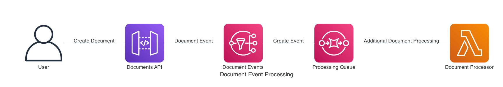
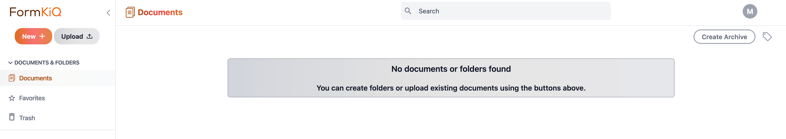
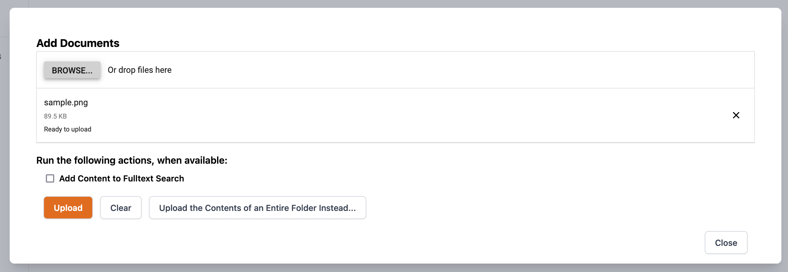
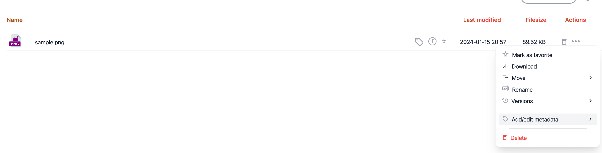
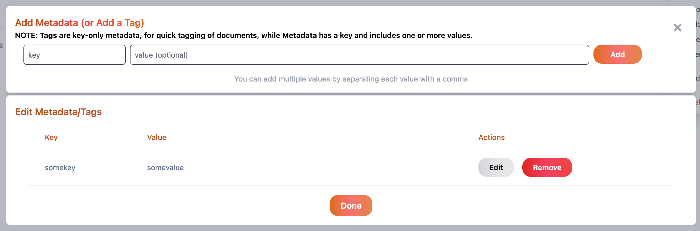

# Document Event Processing

FormKiQ's [document events](/docs/platform/overview#document-events) allow you to easily extend the document processing functionality in FormKiQ and to automatically perform tasks when documents are created, updated or deleted.

This example will show how to create a serverless application that will listen for when a document is created and add custom tags to it.



We are going to build an application using the [AWS Serverless Application Model](https://docs.aws.amazon.com/serverless-application-model/latest/developerguide/what-is-sam.html). The AWS Serverless Application Model (AWS SAM) is an open source framework that you can use to build serverless applications on AWS. 

All code can be found in tutorials [GitHub repository](https://github.com/formkiq/tutorials/tree/master/java/document-events).

## Prerequisite

- Download and install [AWS CLI](https://aws.amazon.com/cli)
- Download and install [AWS SAM CLI](https://docs.aws.amazon.com/serverless-application-model/latest/developerguide/serverless-sam-cli-install.html)

## Sam init

Creating a SAM project is easy using the SAM CLI. In any directory, run the sam project initialization.
```
sam init
```

This will initialize your SAM project. The SAM CLI will ask you a number of questions on how to configure your project. SAM provides a number of templates for different types of projects. This will help you to get up and running quickly. In general, you should pick all the options shown below (including leaving certain fields blank for the default values), though you may choose a different option in your project for **Which runtime would you like to use?**. This tutorial will be done in Java17, but you can adapt this tutorial easily for any language, so you can select the language you are most familiar with, especially if you choose to add your own custom functionality.

```
Which template source would you like to use?
	1 - AWS Quick Start Templates
	2 - Custom Template Location
Choice: 1

Choose an AWS Quick Start application template
	1 - Hello World Example
	...
Template: 1

Use the most popular runtime and package type? (Python and zip) [y/N]:
Choice: N

Which runtime would you like to use?
	1 - aot.dotnet7 (provided.al2)
	2 - dotnet6
	3 - go1.x
	4 - go (provided.al2)
	5 - graalvm.java11 (provided.al2)
	6 - graalvm.java17 (provided.al2)
	7 - java17
	...
Runtime: 7

What package type would you like to use?
	1 - Zip (artifact is a zip uploaded to S3)
	2 - Image (artifact is an image uploaded to an ECR image repository)
Package type: 1

Which dependency manager would you like to use?
	1 - gradle
	2 - maven
Dependency manager: 1

Project name [sam-app]: document-events

    -----------------------
    Generating application:
    -----------------------
    Name: document-events
    Runtime: java17
    Dependency Manager: gradle
    Application Template: hello-world
```

The `document-events` project has now been created. It is a basic project as it only contains a single [AWS Lambda](https://aws.amazon.com/lambda/) based on the **Quick Start:** template.

## Java Update

We will now update the Java Lambda code to process FormKiQ's document events that come through [Amazon SNS](https://aws.amazon.com/sns/).

We need to update the `HelloWorldFunction/src/build.gradle` file and update the `repositories` to add the maven snapshots repository.

```
repositories {
    mavenCentral()
    maven {
      url "https://oss.sonatype.org/content/repositories/snapshots/"
    }
}
```

We also need to add 2 dependencies we will need as shown below.

```
dependencies {
  	...  

    implementation group: 'com.google.code.gson', name: 'gson', version: '2.10.1'
    implementation group: 'com.formkiq', name: 'client', version:'1.13.0-SNAPSHOT'

    ...
}
```

Next, we will update the `HelloWorldFunction/src/main/java/helloworld/App.java` lambda function to process the document event SQS messages.

Change
```
public class App implements RequestHandler<APIGatewayProxyRequestEvent, APIGatewayProxyResponseEvent> {
```
to
```
import com.amazonaws.services.lambda.runtime.events.SQSEvent;
import com.amazonaws.services.lambda.runtime.events.SQSEvent.SQSMessage;

public class App implements RequestHandler<SQSEvent, Void> {
```

Using the FormKiQ client library create a DocumentTagsApi instance which will allow us to use Java code to call the `POST /documents/{documentId}/tags` API endpoint.

```
import com.formkiq.client.api.DocumentTagsApi;
import com.formkiq.client.invoker.ApiClient;
import com.formkiq.client.invoker.ApiException;
import com.formkiq.client.model.AddDocumentTag;
import com.formkiq.client.model.AddDocumentTagsRequest;

private DocumentTagsApi getDocumentTagsApi() {
    // Environment Variable Defining the FormKiQ API URL 
    // that uses IAM authorization
    String url = System.getenv("IAM_API_URL");
    
    // Create API Client and set the signing credentials
    ApiClient apiClient = new ApiClient().setReadTimeout(0).setBasePath(url);
    apiClient.setAWS4Configuration(System.getenv("AWS_ACCESS_KEY_ID"),
        System.getenv("AWS_SECRET_ACCESS_KEY"), System.getenv("AWS_SESSION_TOKEN"),
        System.getenv("AWS_REGION"), "execute-api");

    // Create FormKiQ DocumentTags API
    return new DocumentTagsApi(apiClient);
}
```

Lastly, add update the handleRequest method to process SQS messages and add a new tag for every document that is created.

```
public Void handleRequest(final SQSEvent input, final Context context) {

    DocumentTagsApi documentTagsApi = getDocumentTagsApi();

    // Loop through all the SQS Messages
    for(SQSMessage msg : input.getRecords()){

      String body = msg.getBody();

      Gson gson = new GsonBuilder().setPrettyPrinting().create();

      Map<String, String> bodyMap = gson.fromJson(body, Map.class);
      Map<String, String> documentEvent = gson.fromJson(bodyMap.get("Message"), Map.class);

      String siteId = documentEvent.get("siteId");
      String documentId = documentEvent.get("documentId");

      context.getLogger().log("processing siteId: " + siteId + " documentId: " + documentId);

      AddDocumentTagsRequest req = new AddDocumentTagsRequest();
      req.addTagsItem(new AddDocumentTag().key("somekey").value("somevalue"));
        
      try {
					documentTagsApi.addDocumentTags(documentId, req, siteId, null);
			} catch (ApiException e) {
				e.printStackTrace();
			}
    }

    return null;
}
```

Finally, since we've rewrote the Lambda function the `AppTest.java` is no longer valid and can be removed.

```
rm HelloWorldFunction/src/test/java/helloworld/AppTest.java
```

## CloudFormation Update

Next, we will update the [CloudFormation](https://aws.amazon.com/cloudformation/) contained in the `template.yaml` to setup the AWS infrastructure.  

We will:

* Create a new SQS queue that will hold the messages the Lambda function will process

* Connect the Lambda function to the SQS queue

* Connect the SQS queue to the FormKiQ SNS Document Event topic

Edit the `template.yaml`

Below the `Globals:` element, add the following block which will require the FormKiQ a `AppEnvironment` parameter when we deploy this function.

```
Parameters:

  AppEnvironment:
    Type: String
    Description: Unique Application Environment Identifier, IE dev/staging/prod
    AllowedPattern: "[a-zA-Z0-9_.-/]+"
    Default: prod
```

Add the following block under the `Resources:` element which add a SQS queue and a policy that allows the SNS service to send messages to the queue.

```
  ProcessorQueue:
    Type: "AWS::SQS::Queue"
    Properties:
      VisibilityTimeout: 900
      ReceiveMessageWaitTimeSeconds: 20
      Tags:
        - Key: "StackName"
          Value: 
            Fn::Sub: "${AWS::StackName}"

  ProcessorQueuePolicy:
    Type: AWS::SQS::QueuePolicy
    DependsOn: 
    - ProcessorQueue
    Properties:
      PolicyDocument:
        Version: '2012-10-17'
        Id: QueuePolicy
        Statement:
        - Sid: snsSendMessagesToQueue
          Effect: Allow
          Principal:
            Service: sns.amazonaws.com
          Action: 
            - sqs:SendMessage
          Resource: 
            Fn::GetAtt: 
            - ProcessorQueue
            - Arn
          Condition:
            StringEquals:
              aws:SourceAccount: 
                Ref: AWS::AccountId
      Queues:
      - Ref: ProcessorQueue
```

This next block, connects the SQS queue added above to the FormKiQ SNS Document Events topic. It uses the FilterPolicy to only accept document "create" events.

```
  SnsDocumentsCreateSubscriptionSqs:
    Type: AWS::SNS::Subscription
    DependsOn:
    - ProcessorQueue
    Properties:
      Protocol: sqs
      Endpoint: 
        Fn::GetAtt:
        - ProcessorQueue
        - Arn
      TopicArn:
        Fn::Sub: '{{resolve:ssm:/formkiq/${AppEnvironment}/sns/DocumentEventArn}}'
      FilterPolicy: '{"type": ["create"]}'
```

Next, replace the `HelloWorldFunction:` element with the block below. We need to add an environment variable and connect the SQS queue to the Lambda function. We also will add the `AmazonAPIGatewayInvokeFullAccess` policy to the function which will allow it to call the FormKiQ API.

```
  HelloWorldFunction:
    Type: AWS::Serverless::Function
    Properties:
      CodeUri: HelloWorldFunction
      Handler: helloworld.App::handleRequest
      Runtime: java17
      Architectures:
        - x86_64
      MemorySize: 512
      Policies:
      - AmazonAPIGatewayInvokeFullAccess
      Environment:
        Variables:
          IAM_API_URL:
            Fn::Sub: '{{resolve:ssm:/formkiq/${AppEnvironment}/api/DocumentsIamUrl}}'
      Events:
        CreateSQSEvent:
          Type: SQS
          Properties:
            Queue: 
              Fn::GetAtt: 
              - ProcessorQueue
              - Arn
            BatchSize: 1
```

Finally remove the `HelloWorldApi:` block under the `Outputs:` as it is no longer needed with our changes.

## Sam Build

Now that the SAM project has been updated, let's try deploy it to AWS. This step assumes you have configured your AWS CLI with an `Access key ID` and `Secret access key`. Instructions for configuring can be found [here](https://docs.aws.amazon.com/cli/latest/userguide/cli-chap-configure.html). We are also assuming you have access to deploy SAM projects as well, which is expected unless you are working within an organization that has various roles within AWS.

Before you can deploy a SAM project to AWS, you need to first build the project. You can do this by running the following command in the project directory:
```
sam build
```

Building the sam project will generate the following output:
```
Building codeuri: . runtime: nodejs12.x metadata: {} functions: ['SNSPayloadLogger']
...

Build Succeeded

Built Artifacts  : .aws-sam/build
Built Template   : .aws-sam/build/template.yaml

Commands you can use next
=========================
[*] Invoke Function: sam local invoke
[*] Deploy: sam deploy --guided
```

## Sam Deploy

Now that the project has been built successfully, the project can be deployed using the following command:
```
sam deploy --guided 
```

Running this deploy command will ask a number of deployment questions. Use the defaults, as shown below, as a guided response.

:::note
Make sure you pick the same `AWS Region` and `Parameter AppEnvironment` to match your FormKiQ installation.
:::

```
Configuring SAM deploy
======================

	Setting default arguments for 'sam deploy'
	=========================================
	Stack Name [document-events]:
	AWS Region [us-east-1]: 
	Parameter AppEnvironment [prod]: 
	#Shows you resources changes to be deployed and require a 'Y' to initiate deploy
	Confirm changes before deploy [Y/n]:
	#SAM needs permission to be able to create roles to connect to the resources in your template
	Allow SAM CLI IAM role creation [Y/n]:
	#Preserves the state of previously provisioned resources when an operation fails
	Disable rollback [y/N]:
	Save arguments to configuration file [Y/n]:
	SAM configuration file [samconfig.toml]:
	SAM configuration environment [default]:

Initiating deployment
=====================
...

CloudFormation events from changeset
-----------------------------------------------------------------------------------------------------------------
ResourceStatus               ResourceType                 LogicalResourceId            ResourceStatusReason
-----------------------------------------------------------------------------------------------------------------
CREATE_IN_PROGRESS           AWS::SNS::Topic              SimpleTopic                  -
...
CREATE_COMPLETE              AWS::CloudFormation::Stack   sam-app                      -
-----------------------------------------------------------------------------------------------------------------

Successfully created/updated stack - document-events in us-east-1
```

## Test Integration

To test the integration of the Lambda function with FormKiQ document events. Log into the FormKiQ console.



Upload a new document.



Once the document has been uploaded, select the Add/edit metadata button.



When viewing the document's metadata, you should see the `somekey` tag.



## Summary

And there you have it! We have shown how easy it is to add custom document processing using FormKiQ's Document Events.

This is just the tip of the iceberg when it comes to working with the FormKiQ APIs.

If you have any questions, reach out to us on our https://github.com/formkiq/formkiq-core or https://formkiq.com.
