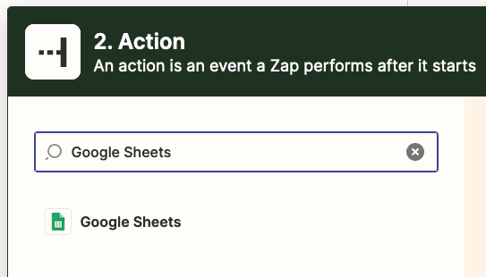
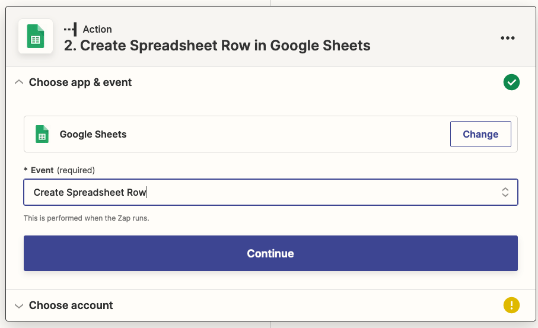
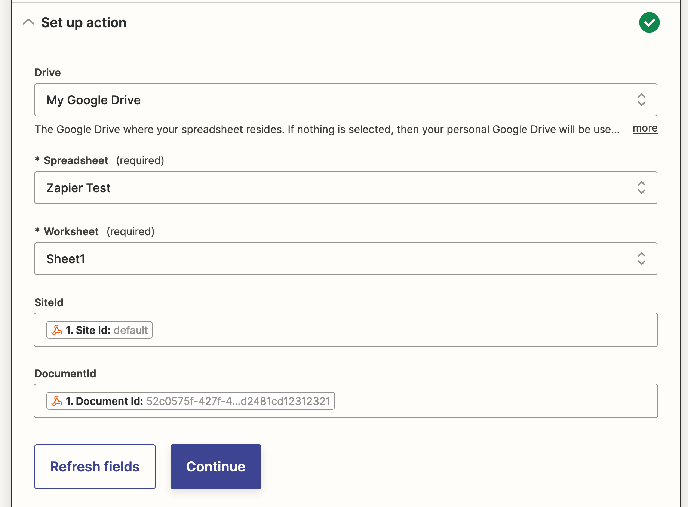
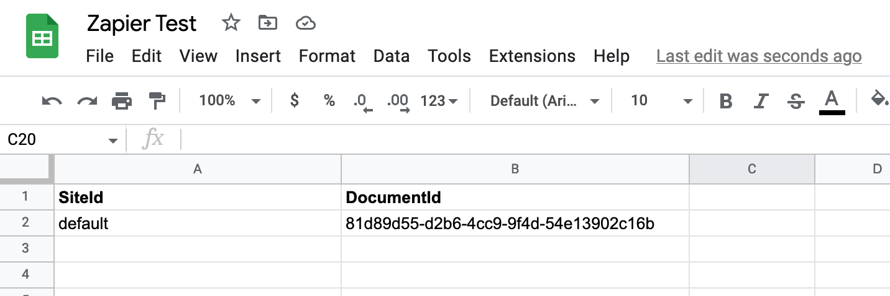

# Zapier Integration

This tutorial will take you through how to use the FormKiQ Webhook API with https://zapier.com.

## Prerequisite

* You have installed FormKiQ; see the <a href="/docs/getting-started/quick-start">Quick Start</a>
* You have a Zapier account - [it's free to sign up](https://zapier.com/sign-up)
* You have a [Google Sheet](https://docs.google.com/spreadsheets) account
* Install either: cURL or your favorite API Client, like https://www.postman.com.

## Overview

When adding a document using the FormKiQ API, you can specify one or more actions to be perform after the document has been saved. One of the supported actions is calling a Webhook. In this tutorial we will build a Zapier Zap which will use the Webhook trigger and insert rows into a Google Sheet for documents added to FormKiQ.

## Create Google Sheet

The first thing we need to do is create the Google Sheet that will store the list of created documents.

To start:

* Visit [sheet.new](https://sheet.new) to create your Google Sheet.
* Add columns *SiteId* and *DocumentId*

image::google-sheet-zapier.png[Zapier Google Sheet]

The Webhook contains the SiteId the document was created in, as well as the documentId assigned to the document. When we create the Zapier integration we will use these columns to map the Webhook payload to the Google Sheet.

Now that our Google Sheet is created, it's time to setup Zapier.

## Create Zap

. To create a new Zap in Zapier,

* Visit https://zap.new
* Click `Webhooks by Zapier`
* Under `Event`, choose `Catch Hook`
* Click Continue


The FormKiQ Webhook request's body looks like:
```
{
  "documents":[{...}]
}
```

* Under `Set up Trigger`:
* Set the `Pick off a Child Key` as `documents`
* Click Continue


Zapier will now display the Webhook URL that was created for your Zap. This is the URL you will use for your FormKiQ Webhook action.


* The last step is to send the webhook a sample of the expected request the FormKiQ Webhook will send. Using an API Client send the following request body to the `Zapier Webhool Url` using a POST request.

```
{
  "documents":[
     {
        "siteId":"default",
        "documentId":"52c0575f-427f-47e1-9028-3021ad2481cd12312321"
     }
  ]
}
```

## Google Sheet Action

* Next, click on the `Action` and select `Google Sheets`.



* Under `Event` select `Create Spreadsheet Row`. This will insert a new row in your Google Sheet for every document created.

* Click Continue and follow the prompts to configure Zapier to have access to the Google Sheet you created in the `Create Google Sheet` step.



* After your Google Sheet is configured, set the `SiteId` and `DocumentId` from the drop down as shown below. Then click Continue.



The last step is to click the `Publish Zap` button. Once your Zap is published your Webhook is ready.

## FormKiQ Actions API

* Following the https://docs.formkiq.com/docs/latest/api/index.html#tag/Documents/operation/AddDocument[FormKiQ Add Document API], we can create a request to create a new document and send it to the FormKiQ API endpoint. For the request, we will use the `actions` section in the request to specify the Zapier Webhook URL we want to be called after the document is created.

```
{
  "path": "test.txt",
  "contentType": "text/plain",
  "isBase64": false,
  "content": "This is sample data",
  "actions": [
    {
      "type": "webhook",
      "parameters": {
        "url":"https://hooks.zapier.com/hooks/catch/.../"
      }
    }
  ]
}
```

* After sending the request to the FormKiQ API, check your Google Sheet and you should see the sheet has been updated with your newly added document.



## Summary

And there you have it! We have shown how easy it is to connect the FormKiQ API to a Zapier Webhook.

This is just the tip of the iceberg when it comes to working with the FormKiQ APIs.

If you have any questions, reach out to us on our https://github.com/formkiq/formkiq-core or https://formkiq.com.
