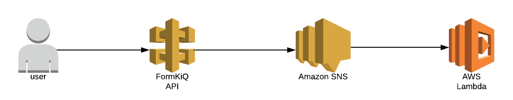

# FormKiQ Document Events

FormKiQ is built to be extended and customized to be whatever you want it to be. Using FormKiQ's [Document Events](/docs/platform/overview#document-events) makes it really easy to automatically perform tasks when documents are created, updated or deleted.

Our example will show how you can quickly and easily create a serverless application that will install FormKiQ and add a Lambda that will listen for when a document is added, updated, or removed via Amazon Simple Notification Service (SNS).



We are going to build this plugin using the [AWS Serverless Application Model](https://docs.aws.amazon.com/serverless-application-model/latest/developerguide/what-is-sam.html). The AWS Serverless Application Model (AWS SAM) is an open source framework that you can use to build serverless applications on AWS. Using AWS SAM isn't a requirement for creating a plugin; you can use anything as long as it can subscribe to the document event's [AWS SNS Topic](https://docs.aws.amazon.com/sns/). AWS provides a ton of [developer documentation](https://docs.aws.amazon.com/sns/latest/dg/index.html), and it's really easy to integrate this into your existing application.

All code can be found in [GitHub repository](https://github.com/formkiq/formkiq-core-sam-app).

## Requirements

- Download and install [AWS CLI](https://aws.amazon.com/cli)
- Download and install [AWS SAM CLI](https://docs.aws.amazon.com/serverless-application-model/latest/developerguide/serverless-sam-cli-install.html)

## Create New Project

Creating a SAM project is easy using the SAM CLI. In any directory, run the sam project initialization.
```
sam init
```

This will initialize your SAM project. The SAM CLI will ask you a number of questions on how to configure your project. SAM provides a number of templates for different types of projects. This will help you to get up and running quickly. In general, you should pick all the options shown below (including leaving certain fields blank for the default values), though you may choose a different option in your project for **Which runtime would you like to use?**. This tutorial will be done in NodeJS, but you can adapt this tutorial easily for any language, so you can select the language you are most familiar with, especially if you choose to add your own custom functionality once we're done. Because we are connecting this project to FormKiQ's document event SNS topic, it's important to use the **Quick Start: SNS** template.

```
Which template source would you like to use?
	1 - AWS Quick Start Templates
	2 - Custom Template Location
Choice: 1
What package type would you like to use?
	1 - Zip (artifact is a zip uploaded to S3)
	2 - Image (artifact is an image uploaded to an ECR image repository)
Package type: 1

Which runtime would you like to use?
	1 - nodejs12.x
	2 - python3.8
	3 - ruby2.7
	4 - go1.x
	5 - java11
	6 - dotnetcore3.1
	7 - nodejs10.x
	8 - python3.7
	9 - python3.6
	10 - python2.7
	11 - ruby2.5
	12 - java8.al2
	13 - java8
	14 - dotnetcore2.1
Runtime: 1

Project name [sam-app]:

Cloning app templates from https://github.com/aws/aws-sam-cli-app-templates

AWS quick start application templates:
	1 - Hello World Example
	2 - Step Functions Sample App (Stock Trader)
	3 - Quick Start: From Scratch
	4 - Quick Start: Scheduled Events
	5 - Quick Start: S3
	6 - Quick Start: SNS
	7 - Quick Start: SQS
	8 - Quick Start: Web Backend
Template selection: 6

    -----------------------
    Generating application:
    -----------------------
    Name: sam-app
    Runtime: nodejs12.x
    Dependency Manager: npm
    Application Template: quick-start-sns
    Output Directory: .

    Next steps can be found in the README file at ./sam-app/README.md
```

The `sam-app` project has now been created. It is a basic project as it only contains a single [AWS Lambda](https://aws.amazon.com/lambda/) based on the **Quick Start: SNS** template. This lambda function will execute when it receives a message from an SNS topic and will print out the SNS message.

## Building and Deploying

Now that the SAM project has been created, let's try deploy it to AWS. This step assumes you have configured your AWS CLI with an `Access key ID` and `Secret access key`. Instructions for configuring can be found [here](https://docs.aws.amazon.com/cli/latest/userguide/cli-chap-configure.html). We are also assuming you have access to deploy SAM projects as well, which is expected unless you are working within an organization that has various roles within AWS.

Before you can deploy a SAM project to AWS, you need to first build the project. You can do this by running the following command in the project directory:
```
sam build
```

Building the sam project will generate the following output:
```
Building codeuri: . runtime: nodejs12.x metadata: {} functions: ['SNSPayloadLogger']
...

Build Succeeded

Built Artifacts  : .aws-sam/build
Built Template   : .aws-sam/build/template.yaml

Commands you can use next
=========================
[*] Invoke Function: sam local invoke
[*] Deploy: sam deploy --guided
```

Now that the project has been built successfully, the project can be deployed using the following command:
```
sam deploy --guided 
```

Running this deploy command will ask a number of deployment questions. Use the defaults, as shown below, as a guided response.
```
Configuring SAM deploy
======================

	Looking for config file [samconfig.toml] :  Not found

	Setting default arguments for 'sam deploy'
	=========================================
	Stack Name [sam-app]:
	AWS Region [us-east-1]:
	#Shows you resources changes to be deployed and require a 'Y' to initiate deploy
	Confirm changes before deploy [y/N]:
	#SAM needs permission to be able to create roles to connect to the resources in your template
	Allow SAM CLI IAM role creation [Y/n]:
	Save arguments to configuration file [Y/n]:
	SAM configuration file [samconfig.toml]:
	SAM configuration environment [default]:

	Looking for resources needed for deployment: Found!

		Managed S3 bucket: aws-sam-cli-managed-default-samclisourcebucket-1bskr8g39amsn
		A different default S3 bucket can be set in samconfig.toml

	Saved arguments to config file
	Running 'sam deploy' for future deployments will use the parameters saved above.
	The above parameters can be changed by modifying samconfig.toml
	Learn more about samconfig.toml syntax at
	https://docs.aws.amazon.com/serverless-application-model/latest/developerguide/serverless-sam-cli-config.html

Uploading to sam-app/6f21042ca6c0c6260c7cba7403387aa8  8724 / 8724.0  (100.00%)

	Deploying with following values
	===============================
	Stack name                   : sam-app
	Region                       : us-east-1
	Confirm changeset            : False
	Deployment s3 bucket         : aws-sam-cli-managed-default-samclisourcebucket-1bskr8g39amsn
	Capabilities                 : ["CAPABILITY_IAM"]
	Parameter overrides          : {}
	Signing Profiles             : {}

Initiating deployment
=====================
...

CloudFormation events from changeset
-----------------------------------------------------------------------------------------------------------------
ResourceStatus               ResourceType                 LogicalResourceId            ResourceStatusReason
-----------------------------------------------------------------------------------------------------------------
CREATE_IN_PROGRESS           AWS::SNS::Topic              SimpleTopic                  -
...
CREATE_COMPLETE              AWS::CloudFormation::Stack   sam-app                      -
-----------------------------------------------------------------------------------------------------------------

Successfully created/updated stack - sam-app in us-east-1
```

## Add FormKiQ to Project

Now that `sam-app` has been successfully deployed, let's add FormKiQ to the project.

1. download the latest version of formkiq-core-X.X.X.zip from https://github.com/formkiq/formkiq-core/releases
2. unzip formkiq-core-x.x.x.zip into a directory named `formkiq-core`, under the `sam-app` project folder; this name and location, `./sam-app/formkiq-core` needs to be exact for our SAM project to find the files it needs

Inside the `sam-app` project folder, you'll find the template.yml file. This file is used by SAM to deploy resources to your AWS account. If you look inside the template.yml file, you'll see that there are two resources currently deployed, a Lambda function and an SNS topic. We are going to add FormKiQ as a resource, and then change the SNS topic used by default to the Document Event SNS topic that is triggered by FormKiQ.

First, edit the `template.yml` file and replace the following `SimpleTopic` block:

```
  SimpleTopic:
    Type: AWS::SNS::Topic
```

with the FormKiQ resource block show below:

```
  FormKiQ:
    Type: AWS::Serverless::Application
    Properties:
      Location: formkiq-core/template.yaml
      Parameters:
        AdminEmail: <YOUR_EMAIL_ADDRESS>
```

be sure to replace <YOUR_EMAIL_ADDRESS> with your email address), and make sure the indentation is the same. This block will import the template.yaml file that comes with FormKiQ, which was added to the `sam-app` project when you extracted the `formkiq-core-X.X.X.zip` into the `formkiq-core` folder inside your project.

Next, adjust the Lambda function instructions to use FormKiQ's Document Event SNS topic, instead of SimpleTopic:

```
  Topic: !Ref SimpleTopic
```
changes to:
```
  Topic: !GetAtt FormKiQ.Outputs.SnsDocumentEventArn
```

The next change we need is to make sure that the FormKiQ resource is created *before* our lambda; if not, SAM will try and attach the Lambda function to the SNS topic before the topic has been created. We can set the order by adding a `DependsOn` block to the Lambda function as shown below, within the `SNSPayloadLogger` block:
```
  SNSPayloadLogger:
    Type: AWS::Serverless::Function
    DependsOn: FormKiQ
```

The last change we need to make in the template file is a way of retrieving the FormKiQ API URL we'll need for testing our plugin. The easiest way to get that URL is by adding an `Outputs` at the bottom of the template.yml file. At the bottom of the file, add the following:
```
Outputs:
  HttpApiUrl:
    Description: "The URL for the API endpoint that uses Cognito authorization"
    Value: !GetAtt FormKiQ.Outputs.HttpApiUrl
```

Now that the template.yml has been updated, the project needs to be built again by running this command:
```
sam build
```

Once the build has completed successfully, we can deploy the changes to AWS:

```
sam deploy --capabilities CAPABILITY_IAM CAPABILITY_AUTO_EXPAND CAPABILITY_NAMED_IAM
```

Now FormKiQ has been added to the project, and the Lambda has been connected to receive all document events. Now we are ready to test it.

## Test Plugin

To test the integration of the Lambda function with FormKiQ, our first step is to create a document using the FormKiQ API. We will then be able to look at the Lambda logs to see the Document Event executing in our Lambda.

In order to call the FormKiQ API, we first need to retrieve the API URL. Since the API URL was added to the Outputs of the `template.yml` file, running the following command will display the configuration information of the `sam-app` project, and within that you will see the FormKiQ API URL under the `HttpApiUrl` key.

```
aws cloudformation describe-stacks --stack-name sam-app --region us-east-1
```

This should return the following:
```
{
    "Stacks": [
        {
            "StackName": "sam-app",
            ...
            "Outputs": [
                {
                    "OutputKey": "HttpApiUrl",
                    "OutputValue": "https://XXXXXXXXXX.execute-api.us-east-1.amazonaws.com",
                    "Description": "The URL for the API endpoint that uses Cognito authorization"
                }
            ]
        }
    ]
}
```

As you can see, the FormKiQ API url is something like https://XXXXXXXXXX.execute-api.us-east-1.amazonaws.com; using the URL from the output along with the `curl` command, we can use FormKiQ's `/public/documents` API to create a JSON document:

```
curl -X POST -H "Content-Type: application/json" \
-d '{ "content":"{\"name\":\"John Smith\"}"}' \
"https://XXXXXXXXXX.execute-api.us-east-1.amazonaws.com/public/documents"
```

You should receive a response that contains the `documentId` of the document that was created, much like this:
```
{"documentId":"52b1ce4b-3ae7-4b3c-8a9e-4f6451293a7e"}
```

Now that the document has been added, we need to verify that the Lambda function received the Document Event message. Using the SAM CLI, you can easily see the logs produced by the Lambda function, using the following command:
```
sam logs -n SNSPayloadLogger --stack-name sam-app --region us-east-1
```

You should see information similar to this:

```
[...]
INFO	{"Records":[{"EventSource":"aws:sns","EventVersion":"1.0","EventSubscriptionArn":"arn:aws:sns:us-east-1:622653865277:sam-app-FormKiQ-VFZO4JRVW32O-CoreStorage-15CU1GQ019S6X-SnsDocumentEvent-GJB32BVSTTCP:4052fb08-1a84-4c08-aa3c-5de11ac80848","Sns":{"Type":"Notification","MessageId":"cf14f4ee-5f25-5be2-bb95-ac62191ea4bc","TopicArn":"arn:aws:sns:us-east-1:622653865277:sam-app-FormKiQ-VFZO4JRVW32O-CoreStorage-15CU1GQ019S6X-SnsDocumentEvent-GJB32BVSTTCP","Subject":null,"Message":"{\"siteId\":\"default\",\"documentId\":\"52b1ce4b-3ae7-4b3c-8a9e-4f6451293a7e\",\"s3key\":\"52b1ce4b-3ae7-4b3c-8a9e-4f6451293a7e\",\"s3bucket\":\"formkiq-core-prod-documents-622653865277\",\"type\":\"create\",\"userId\":\"public\",\"content\":\"{\\\"name\\\":\\\"John Smith\\\"}\"}","Timestamp":"2021-01-28T04:56:27.825Z","SignatureVersion":"1","Signature":"NL6asm/0AVxW7fMarzrfoJBbTKww7evZRNnIpigeKGMGRnyjm4UQmMw+ZntudE+VXRjSEhB6DTElT/6rz0/Io4O3aVN9TieoaiEBePThSq939mhrlBQ4Ns84Zqvq/kF3mLHSKJNk676uI1dt4lgVQsRvjPmgWGTeAlxCHBk8f9f38W5MIT0CgP5y+DyMihGtZcK0h474giBmThV3DpbJpgjetgtQuRGsOmfign9KYeGOzjiMqufgoAzoYL7nC7IZFWUZkgbQ2kxJAo0QUyE69z5pFY2BfZCXKY6V9imKwm9kgyDj+padKS6ToMZ5ipt6y5btkT8aDWaoSivO8zcrzA==","SigningCertUrl":"https://sns.us-east-1.amazonaws.com/SimpleNotificationService-010a507c1833636cd94bdb98bd93083a.pem","UnsubscribeUrl":"https://sns.us-east-1.amazonaws.com/?Action=Unsubscribe&SubscriptionArn=arn:aws:sns:us-east-1:622653865277:sam-app-FormKiQ-VFZO4JRVW32O-CoreStorage-15CU1GQ019S6X-SnsDocumentEvent-GJB32BVSTTCP:4052fb08-1a84-4c08-aa3c-5de11ac80848","MessageAttributes":{"siteId":{"Type":"String","Value":"default"},"type":{"Type":"String","Value":"create"},"userId":{"Type":"String","Value":"public"}}}}]}`
[...]
```

Extracting the `Message` payload you can see the document event information:
```
{
  "siteId": "default",
  "documentId": "52b1ce4b-3ae7-4b3c-8a9e-4f6451293a7e",
  "s3key": "52b1ce4b-3ae7-4b3c-8a9e-4f6451293a7e",
  "s3bucket": "formkiq-core-prod-documents-622653865277",
  "type": "create",
  "userId": "public",
  "content": "{\"name\":\"John Smith\"}"
}
```

From the Message object, you can see that this was a *create* type of message and you can see the documentId along with the contents of the message we sent. Our sample plugin simply logs the receipt of the message, but you have full control over what your Lambda can do. For instance, you can take that information and POST it to a third-party webhook, sending the data to one or more downstream applications. You could also take the content of the message and send it to another service within AWS.

With SAM CLI's easy-to-use process and FormKiQ's robust document management, the only limitation for custom workflows and integrations is your imagination!