# Multi-Tenant Users

FormKiQ supports multi-tenant environments where you can set up multiple groups of users and provide each group of users access to their specific documents. This is done through a `siteId`. In this tutorial we are going to create two different siteIds, and then add both users and documents to each siteId.

## Cognito Groups

To create a `SiteId`, start by visiting the [Amazon Cognito Console](https://console.aws.amazon.com/cognito) and select the `User pool name` matching your naming of your FormKiQ installation.

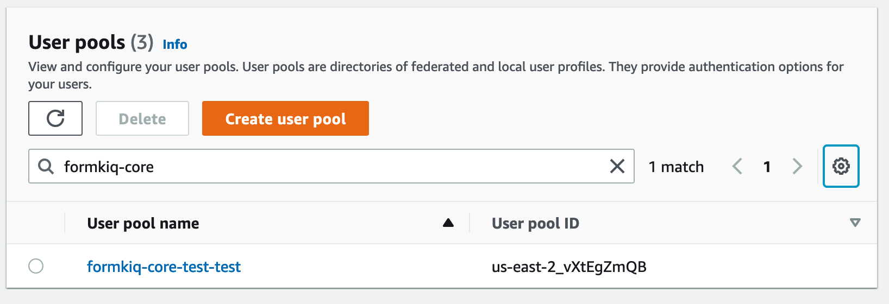

Select the `Groups` tab and you'll see the Cognito groups that FormKiQ creates during installation. Each group is a `siteId` (except for the Admins) group.

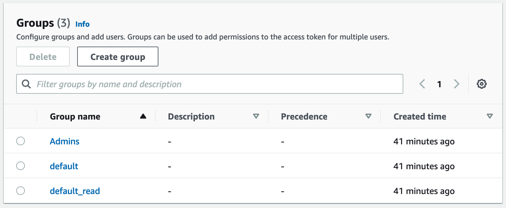

### Create Tenant

We are now going to create a siteId named `site1`. This involves creating two Cognito groups.

Select the `Create group` button. 

The first group will be called `site1`. This group will give users read/write access to documents in the `site1` siteId. 

Enter the Group name of `site1` and click `Create group` button.

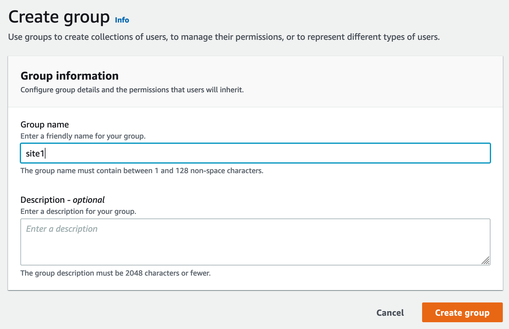

The second group will be called `site1_read`. This group will give users read-only access to documents in the `site1` siteId. 

Enter the Group name of `site1_read` and click `Create group` button.

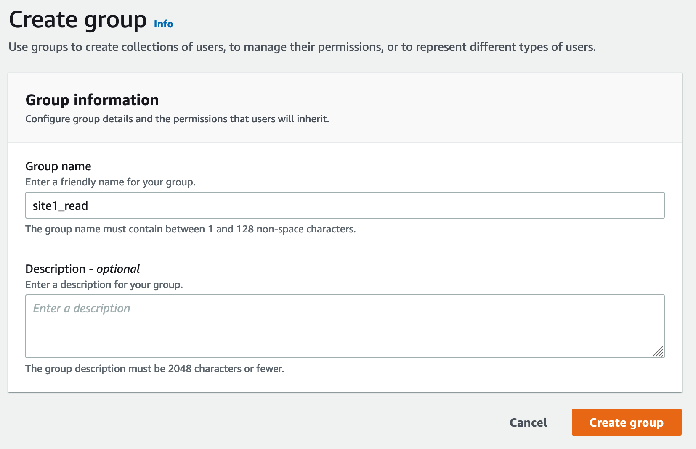

Now you'll see the `site1` and `site1_read` Cognito groups listed in the Cognito User Pool.

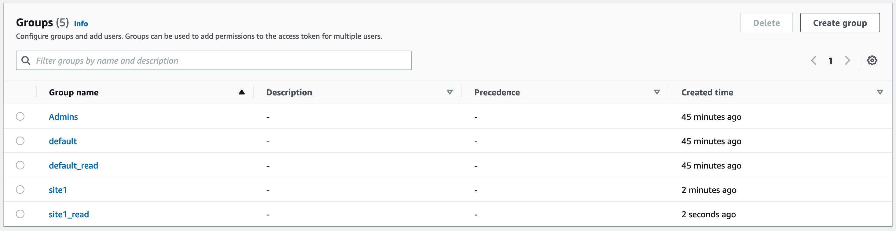

## Cognito Users

The administrator created during the FormKiQ installation was placed in the `default` siteId. Now that the `site1` Cognito group has been created, we are now going to create a new user and add that user to the `site1` Cognito group. This means we will end up with two users, each in their own `siteId` group.

Click the `Create user` button to add a new user.

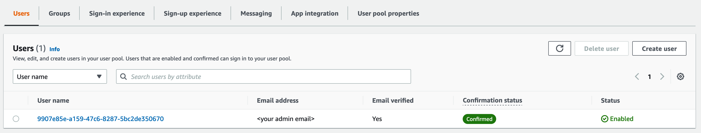

On the *Create User* page, 

* enter the `Email Address` of the user to create 
* select `Send an email invitation`
* click `Mark email address as verified`
* select `Generate a password`

Click the `Create user` button to finish creating the new user. The user receive an email at the specified email address, with a link to finalize setting up their account.

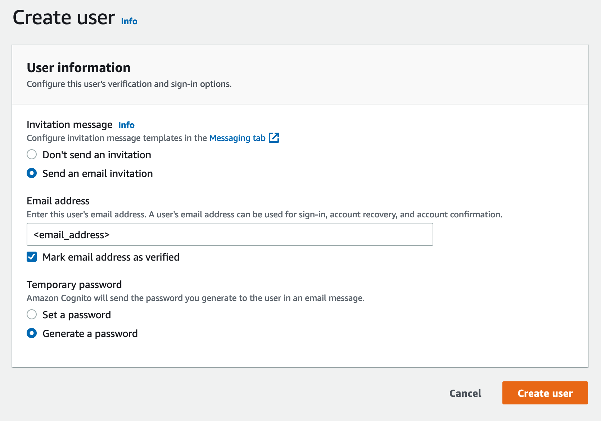

You'll now see both the user you just created and the administration user listed.

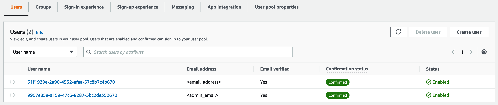

Click your newly-created user and scroll down to the `User Group Membership`. At this point, the user does not belong to any groups/siteIds.

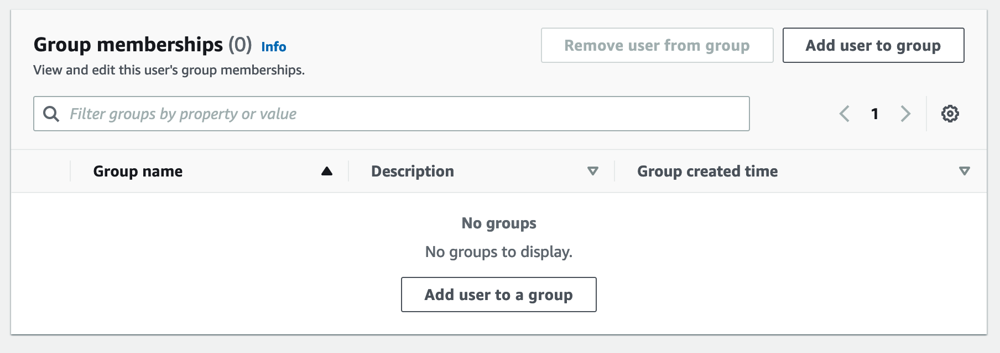

Click `Add user to group` and select `site1`. Click the `Add` button.

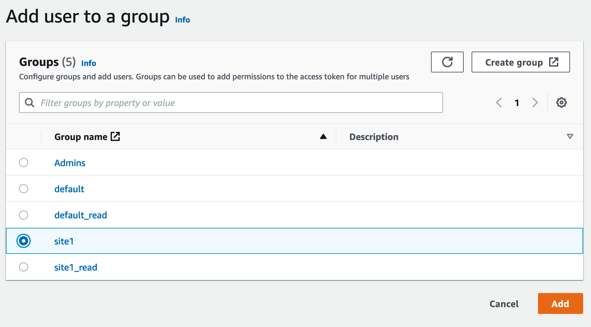

The user is now a member of `site1`.

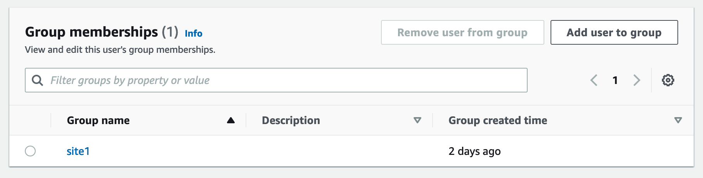

Lastly, ask your newly-created user to check their inbox for the `Welcome to FormKiQ` email. They can click the link within the email to finalize their account; this link will open the FormKiQ Console and will allow the newly-created user to set a password for their account.

````
Welcome to FormKiQ

Your account has been created. *Click this link to finalize your account*.
`````

## Adding a New Document as the Site User

Once logged into the FormKiQ Console, the user can click `Add Documents` from the menu on the left side of the screen. They can drag and drop a file into the `Upload New` box. Once the document has been uploaded, it will be displayed in the *Documents Added* table.

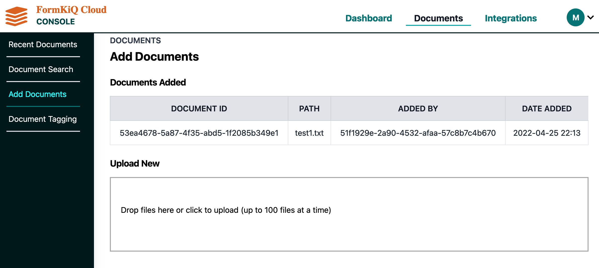

Clicking on `Recent Documents` from the left menu will display the newly-added document.

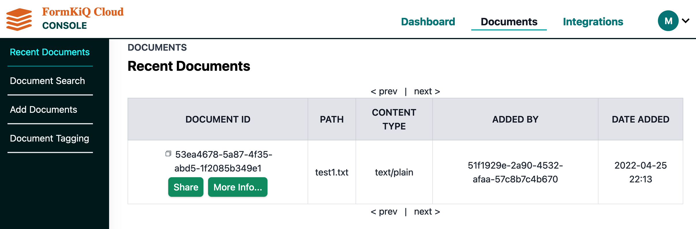

## Summary

Throughout this tutorial, you have successfully created a new FormKiQ user in Cognito. The newly created user was attached to a new siteId and was able to successfully add a document to this newly created siteId.
