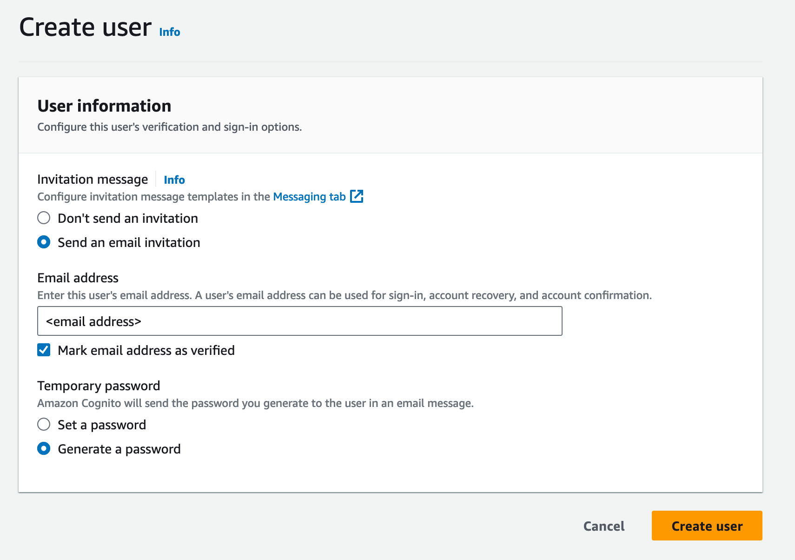
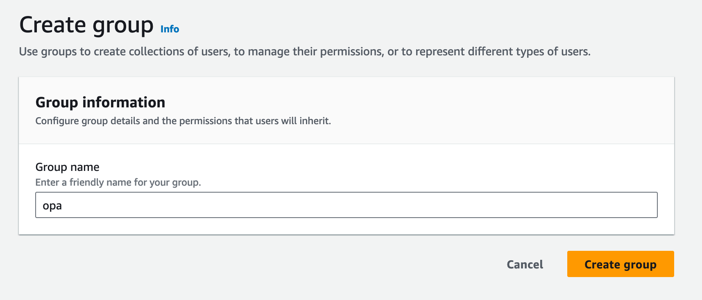
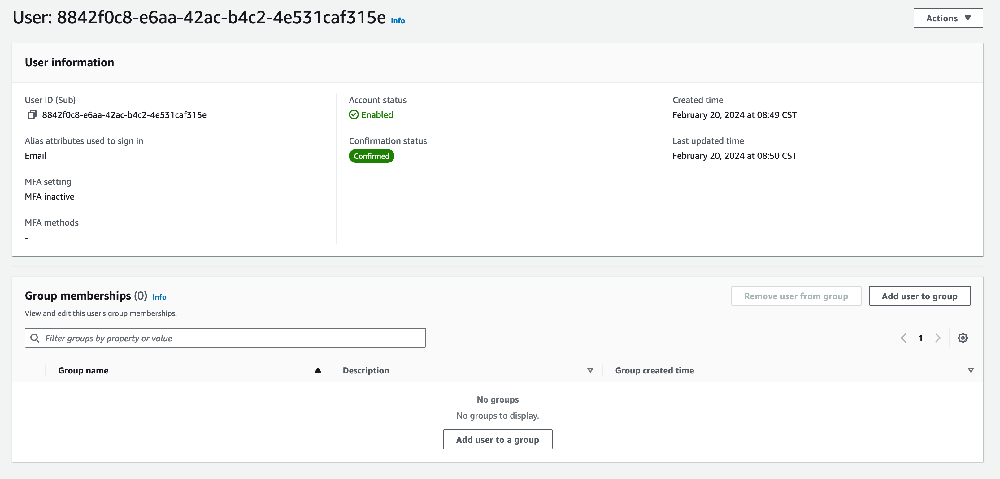
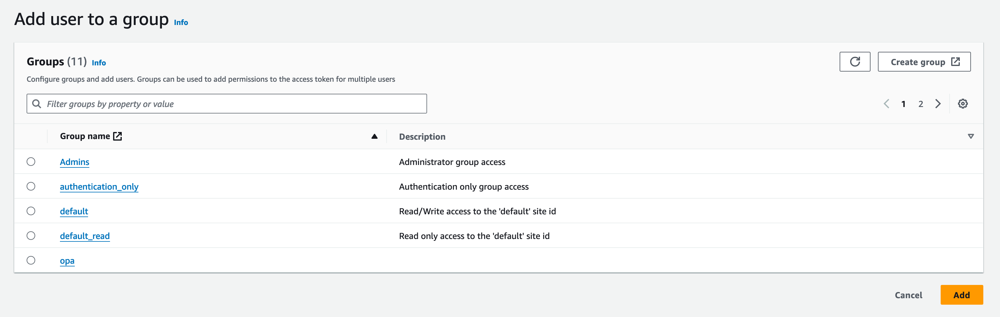
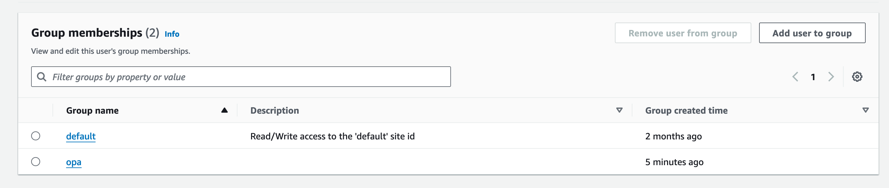

# Open Policy Agent

This tutorial uses the FormKiQ [Open Policy Agent module](/docs/pro-and-enterprise/modules/open_policy_agent) to demonstrate how to protect documents using access attributes.

We will be:

* Adding three documents with different access attributes (two with, and one without)

* Add an OPA policy that restricts access to documents

* Attempt document access with both an admin role and a user role

The code for the tutorial can be found within the [FormKiQ Github Tutorials](https://github.com/formkiq/tutorials/tree/master/java/opa)

## What you’ll need

* A text editor or IDE - for example [IntelliJ IDEA](https://www.jetbrains.com/idea/download)

* Access to a FormKiQ PRO / Enterprise installation

* The `HttpApiUrl` found on the CloudFormation Outputs tab

* A User [JWT Authentication Token](/docs/how-tos/jwt-authentication-token)

* An Admin [JWT Authentication Token](/docs/how-tos/jwt-authentication-token)

## Create User

Goto the [Cognito Console](https://console.aws.amazon.com/cognito) and find your FormKiQ user pool and click the `Create user` button.

Filling create user form and clicking and click the `Create user` button will send a welcome email with a link that will allow you to set the password for the user. 



Next, we will create a Cognito group that will be used in our OPA policy to restrict access to certain documents.

Clicking the `Groups` tab and then clicking the `Create group` button will allow us to create a group called `opa`.



Next we will add the `default` and `opa` group the newly created user.

You will find the newly created user in the `Users` tab and clicking on the user will show the groups the user belongs to.



Clicking the `Add user to group` will show a list of groups you can add the user to. Add the user to the `default` and `opa` group.



You should now see the `default` and `opa` group listed under the user's membership.



## FormKiQ Client Library

FormKiQ has a client library available in [Java](https://github.com/formkiq/formkiq-client-sdk-java/) and [Python](https://github.com/formkiq/formkiq-client-sdk-python) which makes communicating with the FormKiQ application easier.

:::note
This tutorial will be using the Java API and requires a client of version 1.14.0 or greater, but we will also reference the REST API endpoints used.
:::

## Setup API

The Java API requires the creation of a `ApiClient` which requires a JWT `AccessToken` and the `FormKiQ url` of the FormKiQ instances to use.

* The HTTP_API_URL can be found from the "Outputs" tab of the CloudFormation console 

* A JWT Authentication Token can be aquired using this [how-to](/docs/how-tos/jwt-authentication-token).

The code sample supports ADMIN and USER access token, so the step above should be repeated for both a USER and an ADMIN user.

```
private static final String ADMIN_ACCESS_TOKEN = "<ADMIN_ACCESS_TOKEN>";
private static final String USER_ACCESS_TOKEN = "<USER_ACCESS_TOKEN>";
private static final String HTTP_API_URL = "<CloudFormation Outputs HttpApiUrl>";
```

The API is broken into sections. In this case, we will need to use the DocumentWorkflowsApi, RulesetApi, and DocumentsApi. These APIs can be instantiated as follows:

```
/**
 * Setup API classes.
 */
public void setUpApi() {

  // Setup User API access
  ApiClient userClient = (new ApiClient()).setReadTimeout(0).setBasePath(HTTP_API_URL);
  userClient.addDefaultHeader("Authorization", USER_ACCESS_TOKEN);
  userDocumentsApi = new DocumentsApi(userClient);

  // Setup Admin API access
  ApiClient adminClient = (new ApiClient()).setReadTimeout(0).setBasePath(HTTP_API_URL);
  adminClient.addDefaultHeader("Authorization", ADMIN_ACCESS_TOKEN);

  adminDocumentsApi = new DocumentsApi(adminClient);
  adminControlApi = new AccessControlApi(adminClient);
}
```


## OPA Policy

We will now configure an OPA policy that will restrict users with the "opa" role to only be able to access documents that have an access attribute of "documentType" = "invoice".

The following policy shows how this can be implemented using OPA.

```
package formkiq

import future.keywords.if
import future.keywords.in

default allow := false

allow if {
  "opa" in input.user.roles 
  data.documents.documentType = "invoice"
}
```

By converting the policy above to a String object, you can use the `AccessControlApi` to set the OpaConfiguration.

```
String policy = "...";
adminControlApi.setOpaConfiguration(new SetOpaConfigurationRequest().siteId(siteId).policy(policy));
```

:::note
The REST API endpoint `PUT /sites/opa/accessPolicies` can be used to set the OPA policy
:::

## Add Documents

Finally, we will add three documents:

* one document will have a access attribute of "documentType" and string value of "invoice"

* one document will have no access attributes

* one document will have a access attribute of "documentType" and string value of "bill"

```
private String addDocument(String siteId, String path, String content, String contentType,
      List<AddAccessAttribute> accessAttributes) throws ApiException {

    AddDocumentRequest req = new AddDocumentRequest().path(path).content(content).contentType(contentType)
        .accessAttributes(accessAttributes);
    String documentId = adminDocumentsApi.addDocument(req, siteId, null).getDocumentId();

    if (accessAttributes == null || accessAttributes.isEmpty()) {
      System.out.println("added document " + documentId + " without access attributes");
    } else {
      System.out.println("added document " + documentId + " with access attributes");
    }

    return documentId;
  }

// Create document with Access Attribute 'documentType'
AddAccessAttribute accessAttribute0 = new AddAccessAttribute().key("documentType").stringValue("invoice");
String documentId0 = app.addDocument(siteId, "protected.txt", "my protected content", "text/plain",
    Arrays.asList(accessAttribute0));

// Create document without Access Attributes
String documentId1 = app.addDocument(siteId, "unprotected.txt", "my unprotected content", "text/plain",
    null);

// Create document with different value for Access Attribute 'documentType'
AddAccessAttribute accessAttribute2 = new AddAccessAttribute().key("documentType").stringValue("bill");
String documentId2 = app.addDocument(siteId, "protected2.txt", "my protected content2", "text/plain",
    Arrays.asList(accessAttribute2));
```

## Application Output

Running the application, you will receive an output similar to the following, expect the documentIds will change.

```
added document e234f1eb-33a7-46a1-aa1c-aaeb54e823ff with access attributes
added document 467a0982-85a7-4b3b-bfda-8e85ab9107fc without access attributes
added document 68e787a5-c745-4168-ab7c-def8ea53c911 with access attributes

document e234f1eb-33a7-46a1-aa1c-aaeb54e823ff has access attributes
document 467a0982-85a7-4b3b-bfda-8e85ab9107fc has NO access attributes
document 68e787a5-c745-4168-ab7c-def8ea53c911 has access attributes

user has access to document e234f1eb-33a7-46a1-aa1c-aaeb54e823ff
user access denied to document 467a0982-85a7-4b3b-bfda-8e85ab9107fc
user access denied to document 68e787a5-c745-4168-ab7c-def8ea53c911

admin has access to document e234f1eb-33a7-46a1-aa1c-aaeb54e823ff
admin access denied to document 467a0982-85a7-4b3b-bfda-8e85ab9107fc
admin access denied to document 68e787a5-c745-4168-ab7c-def8ea53c911
```

As you can see, first we created document `e234f1eb-33a7-46a1-aa1c-aaeb54e823ff` that has the access attribute documentType=invoice, while document `467a0982-85a7-4b3b-bfda-8e85ab9107fc` has no access attributes, and document `68e787a5-c745-4168-ab7c-def8ea53c911` has access attribute of documentType = bill.

The user we created in first step has access to document `e234f1eb-33a7-46a1-aa1c-aaeb54e823ff` because their roles and access attributes match the OPA policy.

The user does not have access to document `467a0982-85a7-4b3b-bfda-8e85ab9107fc` because the document has no access attributes. The user also does not have access to document `68e787a5-c745-4168-ab7c-def8ea53c911` because the documentType is "bill" and not "invoice", following our OPA policy.

The admin will have access to all three documents, regardless of the OPA policy.

## Summary

And there you have it! We have shown how easy it is to use the power of OPA policies and access attributes to secure documents.

This is just the tip of the iceberg when it comes to working with the FormKiQ APIs.

If you have any questions, reach out to us on our https://github.com/formkiq/formkiq-core or https://formkiq.com.
