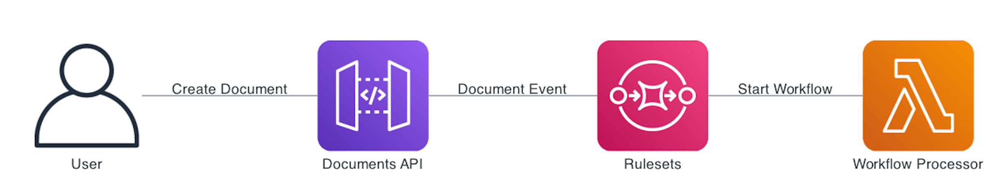

# Ruleset Processing



This guide demonstrates how to use `Rulesets` and `Rules` to automatically put documents with different content-types into different `Queues`. 

We will be:

* Creating two document queues

* Creating two workflows that place the document in one of the queues.

* Creating a ruleset rule that will place documents in each queue based on the document's content-type

The code for the tutorial can be found on the [FormKiQ Github Tutorials](https://github.com/formkiq/tutorials/tree/master/java/ruleset)

## What you’ll need

* A text editor or IDE - for example [IntelliJ IDEA](https://www.jetbrains.com/idea/download)

* Access to a FormKiQ PRO / Enterprise installation

* The `HttpApiUrl` found on the CloudFormation Outputs tab

* A [JWT Authentication Token](/docs/how-tos/jwt-authentication-token)

## FormKiQ Client Library

FormKiQ has a client library available in [java](https://github.com/formkiq/formkiq-client-sdk-java/) and [python](https://github.com/formkiq/formkiq-client-sdk-python) which makes communicating with the FormKiQ application easier.

:::note
This tutorial will be using the Java API and required the client 1.14.0 or greater, but will reference the REST API endpoints used.
:::

## Setup API

The Java API requires the creation of a `ApiClient` which requires a JWT `AccessToken` and the `FormKiQ url` of the FormKiQ instances to use.

* A JWT Authentication Token can be aquired using this [how-to](/docs/how-tos/jwt-authentication-token).

* The HTTP_API_URL can be found from the "Outputs" tab of the CloudFormation console 

```
private static final String ACCESS_TOKEN = "<ACCESS_TOKEN>";
private static final String HTTP_API_URL = "<CloudFormation Outputs HttpApiUrl>";
```

The API is broken into sections. In this case, we will need to use the DocumentWorkflowsApi, RulesetApi, and DocumentsApi. These APIs can be instantiated as follows:

```
/**
 * Setup API classes.
 */
public void setUpApi() {

  ApiClient client = (new ApiClient()).setReadTimeout(0).setBasePath(HTTP_API_URL);
  client.addDefaultHeader("Authorization", ACCESS_TOKEN);
  workflowsApi = new DocumentWorkflowsApi(client);
  rulesetsApi = new RulesetsApi(client);
  documentsApi = new DocumentsApi(client);
}
```


## Create Queues

Using the DocumentWorkflowsApi, create 2 queues

```
String queueAId = workflowsApi.addQueue(new AddQueueRequest().name(QUEUE_A), siteId).getQueueId();
String queueBId = workflowsApi.addQueue(new AddQueueRequest().name(QUEUE_B), siteId).getQueueId();
```

:::note
The REST API endpoint `POST /queues` can be used to create a document queue
:::

## Create Workflows

Using the DocumentWorkflowsApi, create two workflows, one workflow will put documents into QUEUE_A and the other into QUEUE_B.

```
String workflowAId = app.createQueueWorkflow(siteId, queueAId, QUEUE_A, "finance");
String workflowBId = app.createQueueWorkflow(siteId, queueBId, QUEUE_B, "management");

String createQueueWorkflow(String siteId, String queueId, String queueName, String approvalRole) throws ApiException {

  // Create Workflow Step
  AddWorkflowStep step0 = new AddWorkflowStep().stepId(UUID.randomUUID().toString())
      .queue(new AddWorkflowStepQueue().queueId(queueId).addApprovalGroupsItem(approvalRole));

  // Create Add Workflow Request
  AddWorkflowRequest req = new AddWorkflowRequest().name("Queue " + queueName).description("Queue " + queueName)
      .status(WorkflowStatus.ACTIVE).addStepsItem(step0);

  return workflowsApi.addWorkflow(req, siteId).getWorkflowId();
}
```

:::note
The rest api: `POST /workflows` can be used to create a document workflow
:::

## Create Ruleset

Using the RulesetsApi, create a ruleset that will hold both of our rules.

```
AddRulesetRequest req = new AddRulesetRequest().ruleset(new AddRuleset().description("Ruleset 1").priority(new BigDecimal(1)).version(new BigDecimal(1)).status(RulesetStatus.ACTIVE));

AddRulesetResponse addRuleset = api.addRuleset(req, siteId);

String rulesetId = addRuleset.getRulesetId();
```

:::note
The REST API endpoint `POST /rulesets` can be used to create the ruleset
:::

## Create Rules

Using the RulesetsApi, create 2 rules. One rule will place all documents with a content-type of "text/plain" into one queue and documents with a content-type of "application/json" into a second queue.

```
createContentTypeRule(siteId, rulesetId, workflowAId, "application/json");
createContentTypeRule(siteId, rulesetId, workflowBId, "text/plain");

void createContentTypeRule(final String siteId, String rulesetId, final String workflowId,
      final String contentType) throws ApiException {
    AddRule addRule = new AddRule().description("Workflow " + workflowId).workflowId(workflowId)
        .status(RulesetStatus.ACTIVE)
        .conditions(new RuleCondition()
            .addMustItem(new RuleConditionMust().attribute(RuleConditionAttribute.CONTENT_TYPE)
                .value(contentType).operation(RuleConditionOperation.EQ)));
    AddRuleRequest req = new AddRuleRequest().rule(addRule);

    rulesetsApi.addRule(rulesetId, req, siteId);
}
```

:::note
The REST API endpoint `POST /rulesets/{rulesetId}/rule` can be used to add rules to a ruleset.
:::

## Add Documents

Finally, we will add two documents, one with the content-type of "text/plain" and the other with "application/json".

```
AddDocumentRequest req0 = new AddDocumentRequest().content("test data").contentType("text/plain");
documentsApi.addDocument(req0, siteId, null).getDocumentId();

AddDocumentRequest req1 = new AddDocumentRequest().content("{\"content\":\"test data\"}").contentType("application/json");
documentsApi.addDocument(req1, siteId, null).getDocumentId();
```

## Check Queues

After the documents are added, it will take between 5-10 seconds for the documents to be placed into the correct queue. You can use the following code to check the queues for each document.

```
GetWorkflowQueueDocumentsResponse response = workflowsApi.getWorkflowQueueDocuments(queueId, siteId, null, null);
List<WorkflowDocument> documents = response.getDocuments();
```

The "text/plain" document will be in QueueA and the "application/json" document will be in QueueB.

## Summary

And there you have it! We have shown how easy it is to add custom rulesets to allow for the processing of documents based on their content-type.

This is just the tip of the iceberg when it comes to working with the FormKiQ APIs. d

If you have any questions, reach out to us on our https://github.com/formkiq/formkiq-core or https://formkiq.com.
