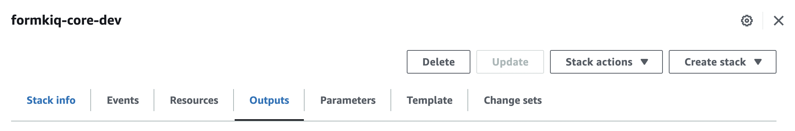

# Using a Server-Side Proxy
## Use Case: submitting documents for review

While most of these tutorials access FormKiQ's API directly from a client application, many use cases for FormKiQ involve a server that proxies client calls to FormKiQ.

Sometimes this is because you have your own API that will have other functionality, and you'd prefer to have one API for your client to consume.

But that's not the only reason you'd want a server between your client and FormKiQ's API; FormKiQ Core is powerful and flexible, but there will always be room for extending the functionality available.

In this tutorial, we look at how you can implement more granular permissions using a server-side proxy, allowing your end users to submit documents to be reviewed and approved by users who have been granted additional permissions.

## Prerequisite

* You have installed FormKiQ; see the <a href="/docs/getting-started/quick-start#install-formkiq">FormKiQ One-Click Installation Links</a> for more information
* Install [npm](https://www.npmjs.com/), as we will be using Node.js with Express
* Install either: cURL or your favorite API Client, like https://www.postman.com.
* All shell commands are shown for Unix-based systems. Windows has analogous commands for each.

## Step 1: Create a Node.js app

We will be using Node.js with Express for our proxy application. You can run this on your local machine for easy development and testing.

**NOTE:** the full source code is available as part of our FormKiQ Tutorials repository: https://github.com/formkiq/tutorials/tree/master/server-side-proxy

```
// importing the dependencies
const express = require('express');
const bodyParser = require('body-parser');
const cors = require('cors');
const helmet = require('helmet');
const morgan = require('morgan');
const fs = require('fs');
const multer = require('multer');
const path = require('path');
const axios = require('axios');

// defining the Express app
const app = express();

// adding Helmet to enhance your API's security
app.use(helmet());

// using bodyParser to parse JSON bodies into JS objects
app.use(bodyParser.json());

// enabling CORS for all requests
app.use(cors());

// adding morgan to log HTTP requests
app.use(morgan('combined'));

// defining an endpoint to return a "hello, world" message (in an array)
app.get('/', (req, res) => {
  res.send([
    {title: 'Hello, world!'}
  ]);
});

// starting the server
app.listen(3001, () => {
  console.log('listening on port 3001');
});
```

To run this app, you should first ensure you have the dependencies needed by running `npm install` in your application's root directory.
Once the installation has completed, you can serve the application:
```
node src/app.js
```

You should then see the message `listening on port 3001`.

You can test if the app is working by running the following cURL command:
```
curl localhost:3001
```

You should receive the following response:
```
[{"title":"Hello, world!"}]
```

## Step 2: Create a FormKiQ API key

The easiest way for your server to authenticate with FormKiQ is via an API key. You can add a key with optional Read, Write, and Delete permissions using the FormKiQ Console, under the Integrations section. (It's also possible to use the API directly, as long as you are authenticated.)


Be sure to copy the key, as you will not be able to view it in its entirety again.


## Step 3: Retrieve the FormKiQ Key Authentication API URL




## Step 4: Add your API key and your Key Auth API URL to the Node.js app

In your application code, immediately below importing the dependencies (i.e., after "const axios..."), add the following:

```
const apiKey = "<API_KEY>";
const keyApiUrl = "<KEY_API_URL>";
```

Of course, instead of <API_KEY> and <KEY_API_URL>, use the values from your newly-created FormKiQ Key and the CloudFormation Outputs value for "KeyApiUrl".

## Step 5: Create an uploads folder

This application requires a place to store the file before uploading to FormKiQ. This differs from the client-side, where the upload is stored by the browser automatically before uploading to FormKiQ.

Run the following code from your root project directory:
```
mkdir uploads
```

## Step 6: Add an endpoint for uploading documents to FormKiQ

Below the endpoint for '/' with "Hello, World!", add the following code:

```

const axiosConfig = {
  headers: {
    'Authorization': `${apiKey}`,
    'Content-Type': 'application/json',
  },
};

// define an endpoint for file uploads
app.post('/upload', upload.single('document'), (req, res) => {

  // TODO: is this user authorized to upload documents?

  // Handle the uploaded file
  if (!req.file) {
    return res.status(400).json({ message: 'No file uploaded' });
  }

  const fileName = req.file.filename;
  const filePath = path.join(__dirname, '../uploads', fileName);
  const fileBuffer = fs.readFileSync(filePath);

  const uploadMetadata = {
    tags: [
      {
        "key":"approvalRequired",
        "value":"true"
      },
      {
        "key":"submittedByUser",
        "value":"user@mycompany.com"
      },
    ]
  };

  axios.post(keyApiUrl + "/documents/upload", uploadMetadata, axiosConfig)
  .then((response) => {
    // Handle the response from the API
    console.log('Response from the API:');

    const awsPresignedUrl = response.data.url;

    const putConfig = {
      headers: {
        'Content-Type': req.file.mimetype,
      },
    };

    // upload document content
    axios.put(awsPresignedUrl, fileBuffer, putConfig)
    .then((response) => {
      console.log('File uploaded to FormKiQ.');
      console.log('Response:', response);
    })
    .catch((error) => {
      console.error('Error uploading file:', error.message);
    });

    res.json({ message: 'File uploaded successfully!', documentId: response.data.documentId});

    // delete temporary file from uploads
    fs.unlinkSync(filePath)
    
  })
  .catch((error) => {
    // Handle any errors that occurred during the request
    console.error('Error sending POST request:', error.message);
  });
});
```

There are three components to this code:
1. we send a request for an upload URL ("/documents/upload")
2. we set up the metadata (or key/value tags) that we want to associate with the document; in this use case, we want to indicate that a review is required and specify the user who submitted
3. we send the file to the upload URL we've retrieved, along with the metadata; this completes the document upload

Now obviously, we would want to include authentication in a real-world app. Since we already have a Cognito User Pool that was created during our FormKiQ installation, we could use that same user pool to handle authentication. But we aren't limited to using Cognito, and if you're using an application framework or an authentication service, you may not want to use Cognito at all for your users.

For simplicity, we assume you are handling authentication either client- or server-side already, that you would add an authorization check, and that you have the user's email address available to add as metadata, since unlike with JWT, FormKiQ API will not be aware which client-side user initiated the upload.

**NOTE:** we are deleting the file after a successful upload, but you could look into using [Node.js streams](https://dev.to/tqbit/how-to-use-node-js-streams-for-fileupload-4m1n) instead to avoid storing the file at all.

Once you have added this code, stop and restart your application and try to upload a file:

```
curl -F "document=@<DOCUMENT_PATH>" http://localhost:3001/upload
```

<DOCUMENT_PATH> should be a relative path from your root project directory, e.g., `document=@./test.pdf`, assuming a path of "/server-side-proxy/test.pdf"

On a successful request, you should see something like the following response:
```
{"message":"File uploaded successfully!","documentId":"60325617-8988-4344-bccf-ef73b7472b1d"}
```

## Step 7: Add an endpoint to retrieve documents sent for review

The task for this first user has now completed. It's up to our power user to find and review the document.

We could have a power user who reviews all documents, or power users who review only for specific users, or any other rule based on the metadata created for the document.

**NOTE:** One limitation of searching in FormKiQ Core is that you can only search on one metadata (tag) key/value pair at a time. This is due to how DynamoDB is being used in a highly scalable and performant way. It's possible to run one search and then use the document IDs retrieved from that first search to conduct a second search, e.g., search for all documents that require approval, and then take the document ids returned and search for documents matching those ids and a specific user.

Assuming that you have authenticated your power user, you can add this endpoint to search for all documents that require approval:

```
app.get('/documents', (req, res) => {
  const searchData = {
    query:
    {
      "tag":{
        "eq": "true",
        "key": "approvalRequired"
      }
    }
  };
  axios.post(keyApiUrl + "/search", searchData, axiosConfig)
  .then((response) => {
    // Handle the response from the API
    res.send(response.data);
  })
  .catch((error) => {
    // Handle any errors that occurred during the request
    console.error('Error sending POST request:', error.message);
  });
});
```
You can test this new endpoint:

```
curl "http://localhost:3001/documents"
```

If you have installed jq, you should consider using it for this request:

```
curl "http://localhost:3001/documents" | jq
```

A successful response should include all of the documents you've uploaded so far:

```
{
  [
    {
      "path": "10fbd9d5-dc6a-4673-b5e7-24430c71905d",
      "insertedDate": "2023-09-28T00:50:53+0000",
      "lastModifiedDate": "2023-09-28T00:50:53+0000",
      "checksum": "\"43d98e79f7b33528530a0933341f087a\"",
      "contentLength": 248105,
      "documentId": "10fbd9d5-dc6a-4673-b5e7-24430c71905d",
      "matchedTag": {
        "type": "USERDEFINED",
        "value": "true",
        "key": "approvalRequired"
      },
      "contentType": "application/pdf",
      "userId": "server-side-proxy"
    }
  ]
}
```

## Next Steps

From here, you can add an endpoint to retrieve the content URL for downloading the file to your client, and a further endpoint to approve or reject the document by adding additional metadata and possibly updating or removing existing metadata.

You can learn more about the various endpoints available in the [FormKiQ API Reference](/docs/api-reference/formkiq-http-api/).


