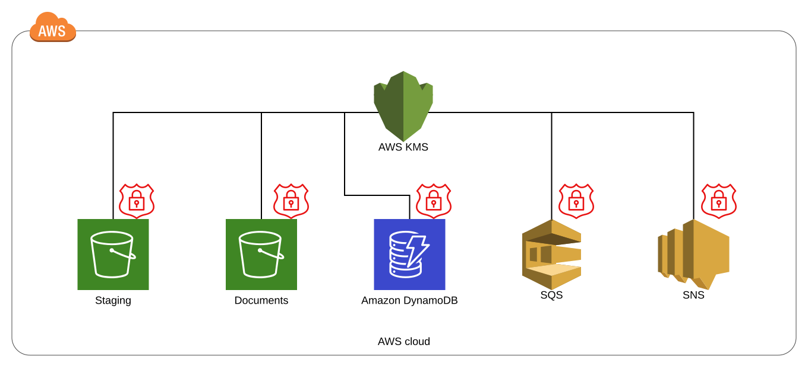

# Full Encryption

Full Encryption is a FormKiQ Module that enables both in-transit and at-rest encryption for the AWS services used by FormKiQ.

The module uses the [AWS Key Management Service (AWS KMS)](https://aws.amazon.com/kms) service to create and manage cryptographic keys and control the use of the keys. AWS KMS integrates with all of the services used by FormKiQ:

* [Amazon DynamoDB](https://aws.amazon.com/dynamodb)

* [Amazon S3](https://aws.amazon.com/s3)

* [Amazon Simple Queue Service](https://aws.amazon.com/sqs)

* [Amazon Simple Notification Service](https://aws.amazon.com/sns)

As an option, FormKiQ provides AWS KMS integration with AWS CloudTrail, which delivers log files to your designated Amazon S3 bucket. By using CloudTrail, you can monitor and investigate how and when your KMS keys have been used and by which service or user. This integration if turned off by default, to avoid unexpected CloudTrail costs.

## Use Case
 
* If you have received certain compliance goals that require encryption of all documents used by the organization, this module can meet those goals without any additional effort